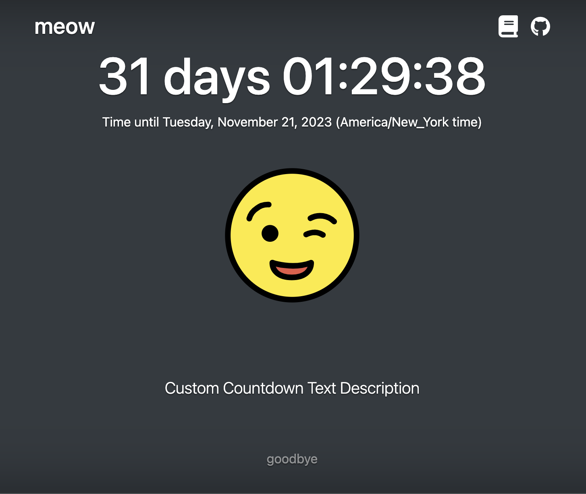

<p align="center">
  
</p>

# ⏳ Countdown

Simple, customizable countdown with shareable short URLs, admin review tools, and theming.

## Usage

Create a countdown by visiting the editor (root path) and filling in the form, or by providing URL parameters:

- `time` (required, ISO UTC like `2025-01-01T00:00:00Z`)
- `title`, `description`, `footer`, `complete`
- `color` (text color), `bgcolor` (background color)
- `image` (`provider:id`, e.g., `openverse:<uuid>` or `tenor:<id>`)

Publishing generates a short URL `/v/:slug` that can be viewed without loading the editor. Protected slugs require a password to edit or delete. Admins can review reports and clear/delete via privileged headers.

## Samples




## Project structure

- `src/` — React app (editor/viewer, theming, UI components)
- `netlify/functions/` — API endpoints (`/publish`, `/v/:slug`, `/admin-stats`, `/api/admin/reports`, `/api/admin/reports/:slug`, `/report`, etc.)
- `cypress/` — E2E tests
- `docs/design/` — feature designs
- `docs/pr/` — PR plans derived from designs

## Scripts

- `pnpm start` — Vite dev server + Netlify functions (`PORT` default 8080, `FUNCTIONS_PORT` default 8888 via `scripts/serve-functions.js`)
- `pnpm dev` — Vite dev server only
- `pnpm build` — Build app to `dist/`
- `pnpm preview` — Preview production build
- `pnpm test` — Unit/integration tests (Vitest)
- `pnpm lint` — ESLint
- `pnpm types` — Typecheck
- `pnpm test:e2e` — Cypress against local dev + functions (requires available ports 4173/8889)

## Environment

- `ADMIN_SECRET` — Required for admin endpoints (`/api/admin/reports`, `/api/admin/reports/:slug`, `/admin-stats`, admin override delete)
- `VITE_TENOR_CLIENT_KEY`, `VITE_IMAGE_API_KEY_TENOR` — Tenor image search
- `VITE_OPENVERSE_BASE` — OpenVerse API base (for image search)
- `COUNTDOWN_STORAGE_DIR` — Override local blob shim root (defaults to `.netlify/published-data`, used in tests)

## API endpoints (Netlify functions)

- `POST /publish` — Create/update countdowns (short slugs)
- `GET /v/:slug` — Fetch published payload + metadata
- `DELETE /v/:slug` — Delete published countdown (owner password or `x-admin-override`)
- `POST /v/:slug/report` — Submit a report (rate limited)
- `GET /api/admin/reports` — List reported slugs (requires `x-admin-secret`)
- `PATCH /api/admin/reports/:slug` — Mark reviewed
- `DELETE /api/admin/reports/:slug` — Clear reports (optional `purgeBlobs=true`)
- `GET /admin/stats` — Admin stats (requires `x-admin-secret`)

Admin UI lives at `/admin/reports` and calls the `/api/admin/reports*` endpoints.

## Dev setup

Requires Node 25.2.x (see `.nvmrc`) and pnpm 10+.

```sh
pnpm install
# Optional helpers used in scripts on Linux/macOS
sudo apt-get install jq  # Ubuntu/Debian
brew install jq          # macOS
```

Local dev with functions:

```sh
pnpm start
# App: http://localhost:8080 (or PORT)
# Functions: http://localhost:8888/.netlify/functions (or FUNCTIONS_PORT)
```

Tests:

```sh
pnpm types
pnpm lint
pnpm test
npm run test:e2e   # requires free ports 4173/8889
```

## Deployment

Build output lives in `dist/`. Netlify Functions reside in `netlify/functions/`. Set `ADMIN_SECRET` and image API keys in your deploy environment. The project uses a local blob shim at `.netlify/published-data` when running locally. Refer to design docs in `docs/design/` and PR briefs in `docs/pr/` for feature-specific details.
