| Emoji | Name | Tags |
|:-----:|:----:|:----:|
|  | grinning_face | face, grin |
|  | grinning_face_with_big_eyes | face, mouth, open, smile |
|  | grinning_face_with_smiling_eyes | eye, face, mouth, open, smile |
|  | beaming_face_with_smiling_eyes | eye, face, grin, smile |
|  | grinning_squinting_face | face, laugh, mouth, satisfied, smile |
|  | grinning_face_with_sweat | cold, face, open, smile, sweat |
|  | rolling_on_the_floor_laughing | face, floor, laugh, rofl, rolling, rotfl |
|  | face_with_tears_of_joy | face, joy, laugh, tear |
|  | slightly_smiling_face | face, smile |
|  | upsidedown_face | face, upside-down |
|  | melting_face | disappear, dissolve, liquid, melt |
|  | winking_face | face, wink |
|  | smiling_face_with_smiling_eyes | blush, eye, face, smile |
|  | smiling_face_with_halo | angel, face, fantasy, halo, innocent |
|  | smiling_face_with_hearts | adore, crush, hearts, in love |
|  | smiling_face_with_hearteyes | eye, face, love, smile |
|  | starstruck | eyes, face, grinning, star |
|  | face_blowing_a_kiss | face, kiss |
|  | kissing_face | face, kiss |
|  | smiling_face | face, outlined, relaxed, smile |
|  | kissing_face_with_closed_eyes | closed, eye, face, kiss |
|  | kissing_face_with_smiling_eyes | eye, face, kiss, smile |
|  | smiling_face_with_tear | grateful, proud, relieved, smiling, tear, touched |
|  | face_savoring_food | delicious, face, savouring, smile, yum |
|  | face_with_tongue | face, tongue |
|  | winking_face_with_tongue | eye, face, joke, tongue, wink |
|  | zany_face | eye, goofy, large, small |
|  | squinting_face_with_tongue | eye, face, horrible, taste, tongue |
|  | moneymouth_face | face, money, mouth |
|  | smiling_face_with_open_hands | face, hug, hugging, open hands, smiling face |
|  | face_with_hand_over_mouth | whoops |
|  | face_with_open_eyes_and_hand_over_mouth | amazement, awe, disbelief, embarrass, scared, surprise |
|  | face_with_peeking_eye | captivated, peep, stare |
|  | shushing_face | quiet, shush |
|  | thinking_face | face, thinking |
|  | saluting_face | ok, salute, sunny, troops, yes |
|  | zippermouth_face | face, mouth, zipper |
|  | face_with_raised_eyebrow | distrust, skeptic |
|  | neutral_face | deadpan, face, meh, neutral |
|  | expressionless_face | expressionless, face, inexpressive, meh, unexpressive |
|  | face_without_mouth | face, mouth, quiet, silent |
|  | dotted_line_face | depressed, disappear, hide, introvert, invisible |
| 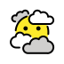 | face_in_clouds | absentminded, face in the fog, head in clouds |
|  | smirking_face | face, smirk |
|  | unamused_face | face, unamused, unhappy |
|  | face_with_rolling_eyes | eyeroll, eyes, face, rolling |
|  | grimacing_face | face, grimace |
|  | face_exhaling | exhale, gasp, groan, relief, whisper, whistle |
|  | lying_face | face, lie, pinocchio |
|  | relieved_face | face, relieved |
|  | pensive_face | dejected, face, pensive |
|  | sleepy_face | face, good night, sleep |
|  | drooling_face | drooling, face |
|  | sleeping_face | face, good night, sleep, zzz |
|  | face_with_medical_mask | cold, doctor, face, mask, sick |
|  | face_with_thermometer | face, ill, sick, thermometer |
|  | face_with_headbandage | bandage, face, hurt, injury |
|  | nauseated_face | face, nauseated, vomit |
|  | face_vomiting | puke, sick, vomit |
|  | sneezing_face | face, gesundheit, sneeze |
|  | hot_face | feverish, heat stroke, hot, red-faced, sweating |
|  | cold_face | blue-faced, cold, freezing, frostbite, icicles |
|  | woozy_face | dizzy, intoxicated, tipsy, uneven eyes, wavy mouth |
|  | face_with_crossedout_eyes | crossed-out eyes, dead, face, knocked out |
|  | face_with_spiral_eyes | dizzy, hypnotized, spiral, trouble, whoa |
|  | exploding_head | mind blown, shocked |
|  | cowboy_hat_face | cowboy, cowgirl, face, hat |
|  | partying_face | celebration, hat, horn, party |
|  | disguised_face | disguise, face, glasses, incognito, nose |
|  | smiling_face_with_sunglasses | bright, cool, face, sun, sunglasses |
|  | nerd_face | face, geek, nerd |
|  | face_with_monocle | face, monocle, stuffy |
|  | confused_face | confused, face, meh |
|  | face_with_diagonal_mouth | disappointed, meh, skeptical, unsure |
|  | worried_face | face, worried |
|  | slightly_frowning_face | face, frown |
|  | frowning_face | face, frown |
|  | face_with_open_mouth | face, mouth, open, sympathy |
|  | hushed_face | face, hushed, stunned, surprised |
|  | astonished_face | astonished, face, shocked, totally |
|  | flushed_face | dazed, face, flushed |
|  | pleading_face | begging, mercy, puppy eyes |
|  | face_holding_back_tears | angry, cry, proud, resist, sad |
|  | frowning_face_with_open_mouth | face, frown, mouth, open |
|  | anguished_face | anguished, face |
|  | fearful_face | face, fear, fearful, scared |
|  | anxious_face_with_sweat | blue, cold, face, rushed, sweat |
|  | sad_but_relieved_face | disappointed, face, relieved, whew |
|  | crying_face | cry, face, sad, tear |
|  | loudly_crying_face | cry, face, sad, sob, tear |
|  | face_screaming_in_fear | face, fear, munch, scared, scream |
|  | confounded_face | confounded, face |
|  | persevering_face | face, persevere |
|  | disappointed_face | disappointed, face |
|  | downcast_face_with_sweat | cold, face, sweat |
|  | weary_face | face, tired, weary |
|  | tired_face | face, tired |
|  | yawning_face | bored, tired, yawn |
|  | face_with_steam_from_nose | face, triumph, won |
|  | enraged_face | angry, enraged, face, mad, pouting, rage, red |
|  | angry_face | anger, angry, face, mad |
|  | face_with_symbols_on_mouth | swearing |
|  | smiling_face_with_horns | face, fairy tale, fantasy, horns, smile |
|  | angry_face_with_horns | demon, devil, face, fantasy, imp |
|  | skull | death, face, fairy tale, monster |
|  | skull_and_crossbones | crossbones, death, face, monster, skull |
|  | pile_of_poo | dung, face, monster, poo, poop |
|  | clown_face | clown, face |
|  | ogre | creature, face, fairy tale, fantasy, monster |
|  | goblin | creature, face, fairy tale, fantasy, monster |
|  | ghost | creature, face, fairy tale, fantasy, monster |
|  | alien | creature, extraterrestrial, face, fantasy, ufo |
|  | alien_monster | alien, creature, extraterrestrial, face, monster, ufo |
|  | robot | face, monster |
|  | grinning_cat | cat, face, grinning, mouth, open, smile |
|  | grinning_cat_with_smiling_eyes | cat, eye, face, grin, smile |
|  | cat_with_tears_of_joy | cat, face, joy, tear |
|  | smiling_cat_with_hearteyes | cat, eye, face, heart, love, smile |
|  | cat_with_wry_smile | cat, face, ironic, smile, wry |
|  | kissing_cat | cat, eye, face, kiss |
|  | weary_cat | cat, face, oh, surprised, weary |
|  | crying_cat | cat, cry, face, sad, tear |
|  | pouting_cat | cat, face, pouting |
|  | seenoevil_monkey | evil, face, forbidden, monkey, see |
|  | hearnoevil_monkey | evil, face, forbidden, hear, monkey |
|  | speaknoevil_monkey | evil, face, forbidden, monkey, speak |
|  | love_letter | heart, letter, love, mail |
|  | heart_with_arrow | arrow, cupid |
|  | heart_with_ribbon | ribbon, valentine |
|  | sparkling_heart | excited, sparkle |
|  | growing_heart | excited, growing, nervous, pulse |
|  | beating_heart | beating, heartbeat, pulsating |
|  | revolving_hearts | revolving |
|  | two_hearts | love |
|  | heart_decoration | heart |
|  | heart_exclamation | exclamation, mark, punctuation |
|  | broken_heart | break, broken |
|  | heart_on_fire | burn, heart, love, lust, sacred heart |
|  | mending_heart | healthier, improving, mending, recovering, recuperating, well |
|  | red_heart | heart |
|  | orange_heart | orange |
|  | yellow_heart | yellow |
|  | green_heart | green |
|  | blue_heart | blue |
|  | purple_heart | purple |
|  | brown_heart | brown, heart |
|  | black_heart | black, evil, wicked |
|  | white_heart | heart, white |
|  | kiss_mark | kiss, lips |
|  | hundred_points | 100, full, hundred, score |
|  | anger_symbol | angry, comic, mad |
|  | collision | boom, comic |
|  | dizzy | comic, star |
|  | sweat_droplets | comic, splashing, sweat |
|  | dashing_away | comic, dash, running |
|  | hole | hole |
|  | speech_balloon | balloon, bubble, comic, dialog, speech |
|  | eye_in_speech_bubble | balloon, bubble, eye, speech, witness |
|  | left_speech_bubble | balloon, bubble, dialog, speech |
|  | right_anger_bubble | angry, balloon, bubble, mad |
|  | thought_balloon | balloon, bubble, comic, thought |
|  | zzz | comic, good night, sleep, zzz |
|  | waving_hand | hand, wave, waving |
|  | waving_hand_light_skin_tone |  |
|  | waving_hand_mediumlight_skin_tone |  |
|  | waving_hand_medium_skin_tone |  |
|  | waving_hand_mediumdark_skin_tone |  |
|  | waving_hand_dark_skin_tone |  |
|  | raised_back_of_hand | backhand, raised |
|  | raised_back_of_hand_light_skin_tone |  |
|  | raised_back_of_hand_mediumlight_skin_tone |  |
|  | raised_back_of_hand_medium_skin_tone |  |
|  | raised_back_of_hand_mediumdark_skin_tone |  |
|  | raised_back_of_hand_dark_skin_tone |  |
|  | hand_with_fingers_splayed | finger, hand, splayed |
|  | hand_with_fingers_splayed_light_skin_tone |  |
|  | hand_with_fingers_splayed_mediumlight_skin_tone |  |
|  | hand_with_fingers_splayed_medium_skin_tone |  |
|  | hand_with_fingers_splayed_mediumdark_skin_tone |  |
|  | hand_with_fingers_splayed_dark_skin_tone |  |
|  | raised_hand | hand, high 5, high five |
|  | raised_hand_light_skin_tone |  |
|  | raised_hand_mediumlight_skin_tone |  |
|  | raised_hand_medium_skin_tone |  |
|  | raised_hand_mediumdark_skin_tone |  |
|  | raised_hand_dark_skin_tone |  |
|  | vulcan_salute | finger, hand, spock, vulcan |
|  | vulcan_salute_light_skin_tone |  |
|  | vulcan_salute_mediumlight_skin_tone |  |
|  | vulcan_salute_medium_skin_tone |  |
|  | vulcan_salute_mediumdark_skin_tone |  |
|  | vulcan_salute_dark_skin_tone |  |
|  | rightwards_hand | hand, right, rightward |
|  | rightwards_hand_light_skin_tone |  |
|  | rightwards_hand_mediumlight_skin_tone |  |
|  | rightwards_hand_medium_skin_tone |  |
|  | rightwards_hand_mediumdark_skin_tone |  |
|  | rightwards_hand_dark_skin_tone |  |
|  | leftwards_hand | hand, left, leftward |
|  | leftwards_hand_light_skin_tone |  |
|  | leftwards_hand_mediumlight_skin_tone |  |
|  | leftwards_hand_medium_skin_tone |  |
|  | leftwards_hand_mediumdark_skin_tone |  |
|  | leftwards_hand_dark_skin_tone |  |
|  | palm_down_hand | dismiss, drop, shoo |
|  | palm_down_hand_light_skin_tone |  |
|  | palm_down_hand_mediumlight_skin_tone |  |
|  | palm_down_hand_medium_skin_tone |  |
|  | palm_down_hand_mediumdark_skin_tone |  |
|  | palm_down_hand_dark_skin_tone |  |
|  | palm_up_hand | beckon, catch, come, offer |
|  | palm_up_hand_light_skin_tone |  |
|  | palm_up_hand_mediumlight_skin_tone |  |
|  | palm_up_hand_medium_skin_tone |  |
|  | palm_up_hand_mediumdark_skin_tone |  |
|  | palm_up_hand_dark_skin_tone |  |
|  | ok_hand | hand, ok |
|  | ok_hand_light_skin_tone |  |
|  | ok_hand_mediumlight_skin_tone |  |
|  | ok_hand_medium_skin_tone |  |
|  | ok_hand_mediumdark_skin_tone |  |
|  | ok_hand_dark_skin_tone |  |
|  | pinched_fingers | fingers, hand gesture, interrogation, pinched, sarcastic |
|  | pinched_fingers_light_skin_tone |  |
|  | pinched_fingers_mediumlight_skin_tone |  |
|  | pinched_fingers_medium_skin_tone |  |
|  | pinched_fingers_mediumdark_skin_tone |  |
|  | pinched_fingers_dark_skin_tone |  |
|  | pinching_hand | small amount |
|  | pinching_hand_light_skin_tone |  |
|  | pinching_hand_mediumlight_skin_tone |  |
|  | pinching_hand_medium_skin_tone |  |
|  | pinching_hand_mediumdark_skin_tone |  |
|  | pinching_hand_dark_skin_tone |  |
|  | victory_hand | hand, v, victory |
|  | victory_hand_light_skin_tone |  |
|  | victory_hand_mediumlight_skin_tone |  |
|  | victory_hand_medium_skin_tone |  |
|  | victory_hand_mediumdark_skin_tone |  |
|  | victory_hand_dark_skin_tone |  |
|  | crossed_fingers | cross, finger, hand, luck |
|  | crossed_fingers_light_skin_tone |  |
|  | crossed_fingers_mediumlight_skin_tone |  |
|  | crossed_fingers_medium_skin_tone |  |
|  | crossed_fingers_mediumdark_skin_tone |  |
|  | crossed_fingers_dark_skin_tone |  |
|  | hand_with_index_finger_and_thumb_crossed | expensive, heart, love, money, snap |
|  | hand_with_index_finger_and_thumb_crossed_light_skin_tone |  |
|  | hand_with_index_finger_and_thumb_crossed_mediumlight_skin_tone |  |
|  | hand_with_index_finger_and_thumb_crossed_medium_skin_tone |  |
|  | hand_with_index_finger_and_thumb_crossed_mediumdark_skin_tone |  |
|  | hand_with_index_finger_and_thumb_crossed_dark_skin_tone |  |
|  | loveyou_gesture | hand, ily |
|  | loveyou_gesture_light_skin_tone |  |
|  | loveyou_gesture_mediumlight_skin_tone |  |
|  | loveyou_gesture_medium_skin_tone |  |
|  | loveyou_gesture_mediumdark_skin_tone |  |
|  | loveyou_gesture_dark_skin_tone |  |
|  | sign_of_the_horns | finger, hand, horns, rock-on |
|  | sign_of_the_horns_light_skin_tone |  |
|  | sign_of_the_horns_mediumlight_skin_tone |  |
|  | sign_of_the_horns_medium_skin_tone |  |
|  | sign_of_the_horns_mediumdark_skin_tone |  |
|  | sign_of_the_horns_dark_skin_tone |  |
|  | call_me_hand | call, hand, hang loose, shaka |
|  | call_me_hand_light_skin_tone |  |
|  | call_me_hand_mediumlight_skin_tone |  |
|  | call_me_hand_medium_skin_tone |  |
|  | call_me_hand_mediumdark_skin_tone |  |
|  | call_me_hand_dark_skin_tone |  |
|  | backhand_index_pointing_left | backhand, finger, hand, index, point |
|  | backhand_index_pointing_left_light_skin_tone |  |
|  | backhand_index_pointing_left_mediumlight_skin_tone |  |
|  | backhand_index_pointing_left_medium_skin_tone |  |
|  | backhand_index_pointing_left_mediumdark_skin_tone |  |
|  | backhand_index_pointing_left_dark_skin_tone |  |
|  | backhand_index_pointing_right | backhand, finger, hand, index, point |
|  | backhand_index_pointing_right_light_skin_tone |  |
|  | backhand_index_pointing_right_mediumlight_skin_tone |  |
|  | backhand_index_pointing_right_medium_skin_tone |  |
|  | backhand_index_pointing_right_mediumdark_skin_tone |  |
|  | backhand_index_pointing_right_dark_skin_tone |  |
|  | backhand_index_pointing_up | backhand, finger, hand, point, up |
|  | backhand_index_pointing_up_light_skin_tone |  |
|  | backhand_index_pointing_up_mediumlight_skin_tone |  |
|  | backhand_index_pointing_up_medium_skin_tone |  |
|  | backhand_index_pointing_up_mediumdark_skin_tone |  |
|  | backhand_index_pointing_up_dark_skin_tone |  |
|  | middle_finger | finger, hand |
|  | middle_finger_light_skin_tone |  |
|  | middle_finger_mediumlight_skin_tone |  |
|  | middle_finger_medium_skin_tone |  |
|  | middle_finger_mediumdark_skin_tone |  |
|  | middle_finger_dark_skin_tone |  |
|  | backhand_index_pointing_down | backhand, down, finger, hand, point |
|  | backhand_index_pointing_down_light_skin_tone |  |
|  | backhand_index_pointing_down_mediumlight_skin_tone |  |
|  | backhand_index_pointing_down_medium_skin_tone |  |
|  | backhand_index_pointing_down_mediumdark_skin_tone |  |
|  | backhand_index_pointing_down_dark_skin_tone |  |
|  | index_pointing_up | finger, hand, index, point, up |
|  | index_pointing_up_light_skin_tone |  |
|  | index_pointing_up_mediumlight_skin_tone |  |
|  | index_pointing_up_medium_skin_tone |  |
|  | index_pointing_up_mediumdark_skin_tone |  |
|  | index_pointing_up_dark_skin_tone |  |
|  | index_pointing_at_the_viewer | point, you |
|  | index_pointing_at_the_viewer_light_skin_tone |  |
|  | index_pointing_at_the_viewer_mediumlight_skin_tone |  |
|  | index_pointing_at_the_viewer_medium_skin_tone |  |
|  | index_pointing_at_the_viewer_mediumdark_skin_tone |  |
|  | index_pointing_at_the_viewer_dark_skin_tone |  |
|  | thumbs_up | +1, hand, thumb, up |
|  | thumbs_up_light_skin_tone |  |
|  | thumbs_up_mediumlight_skin_tone |  |
|  | thumbs_up_medium_skin_tone |  |
|  | thumbs_up_mediumdark_skin_tone |  |
|  | thumbs_up_dark_skin_tone |  |
|  | thumbs_down | -1, down, hand, thumb |
|  | thumbs_down_light_skin_tone |  |
|  | thumbs_down_mediumlight_skin_tone |  |
|  | thumbs_down_medium_skin_tone |  |
|  | thumbs_down_mediumdark_skin_tone |  |
|  | thumbs_down_dark_skin_tone |  |
|  | raised_fist | clenched, fist, hand, punch |
|  | raised_fist_light_skin_tone |  |
|  | raised_fist_mediumlight_skin_tone |  |
|  | raised_fist_medium_skin_tone |  |
|  | raised_fist_mediumdark_skin_tone |  |
|  | raised_fist_dark_skin_tone |  |
|  | oncoming_fist | clenched, fist, hand, punch |
|  | oncoming_fist_light_skin_tone |  |
|  | oncoming_fist_mediumlight_skin_tone |  |
|  | oncoming_fist_medium_skin_tone |  |
|  | oncoming_fist_mediumdark_skin_tone |  |
|  | oncoming_fist_dark_skin_tone |  |
|  | leftfacing_fist | fist, leftwards |
|  | leftfacing_fist_light_skin_tone |  |
|  | leftfacing_fist_mediumlight_skin_tone |  |
|  | leftfacing_fist_medium_skin_tone |  |
|  | leftfacing_fist_mediumdark_skin_tone |  |
|  | leftfacing_fist_dark_skin_tone |  |
|  | rightfacing_fist | fist, rightwards |
|  | rightfacing_fist_light_skin_tone |  |
|  | rightfacing_fist_mediumlight_skin_tone |  |
|  | rightfacing_fist_medium_skin_tone |  |
|  | rightfacing_fist_mediumdark_skin_tone |  |
|  | rightfacing_fist_dark_skin_tone |  |
|  | clapping_hands | clap, hand |
|  | clapping_hands_light_skin_tone |  |
|  | clapping_hands_mediumlight_skin_tone |  |
|  | clapping_hands_medium_skin_tone |  |
|  | clapping_hands_mediumdark_skin_tone |  |
|  | clapping_hands_dark_skin_tone |  |
|  | raising_hands | celebration, gesture, hand, hooray, raised |
|  | raising_hands_light_skin_tone |  |
|  | raising_hands_mediumlight_skin_tone |  |
|  | raising_hands_medium_skin_tone |  |
|  | raising_hands_mediumdark_skin_tone |  |
|  | raising_hands_dark_skin_tone |  |
|  | heart_hands | love |
|  | heart_hands_light_skin_tone |  |
|  | heart_hands_mediumlight_skin_tone |  |
|  | heart_hands_medium_skin_tone |  |
|  | heart_hands_mediumdark_skin_tone |  |
|  | heart_hands_dark_skin_tone |  |
|  | open_hands | hand, open |
|  | open_hands_light_skin_tone |  |
|  | open_hands_mediumlight_skin_tone |  |
|  | open_hands_medium_skin_tone |  |
|  | open_hands_mediumdark_skin_tone |  |
|  | open_hands_dark_skin_tone |  |
|  | palms_up_together | prayer |
|  | palms_up_together_light_skin_tone |  |
|  | palms_up_together_mediumlight_skin_tone |  |
|  | palms_up_together_medium_skin_tone |  |
|  | palms_up_together_mediumdark_skin_tone |  |
|  | palms_up_together_dark_skin_tone |  |
|  | handshake | agreement, hand, meeting, shake |
|  | handshake_light_skin_tone |  |
|  | handshake_mediumlight_skin_tone |  |
|  | handshake_medium_skin_tone |  |
|  | handshake_mediumdark_skin_tone |  |
|  | handshake_dark_skin_tone |  |
|  | handshake_light_skin_tone_mediumlight_skin_tone |  |
|  | handshake_light_skin_tone_medium_skin_tone |  |
|  | handshake_light_skin_tone_mediumdark_skin_tone |  |
|  | handshake_light_skin_tone_dark_skin_tone |  |
|  | handshake_mediumlight_skin_tone_light_skin_tone |  |
|  | handshake_mediumlight_skin_tone_medium_skin_tone |  |
|  | handshake_mediumlight_skin_tone_mediumdark_skin_tone |  |
|  | handshake_mediumlight_skin_tone_dark_skin_tone |  |
|  | handshake_medium_skin_tone_light_skin_tone |  |
|  | handshake_medium_skin_tone_mediumlight_skin_tone |  |
|  | handshake_medium_skin_tone_mediumdark_skin_tone |  |
|  | handshake_medium_skin_tone_dark_skin_tone |  |
|  | handshake_mediumdark_skin_tone_light_skin_tone |  |
|  | handshake_mediumdark_skin_tone_mediumlight_skin_tone |  |
|  | handshake_mediumdark_skin_tone_medium_skin_tone |  |
|  | handshake_mediumdark_skin_tone_dark_skin_tone |  |
|  | handshake_dark_skin_tone_light_skin_tone |  |
|  | handshake_dark_skin_tone_mediumlight_skin_tone |  |
|  | handshake_dark_skin_tone_medium_skin_tone |  |
|  | handshake_dark_skin_tone_mediumdark_skin_tone |  |
|  | folded_hands | ask, hand, high 5, high five, please, pray, thanks |
|  | folded_hands_light_skin_tone |  |
|  | folded_hands_mediumlight_skin_tone |  |
|  | folded_hands_medium_skin_tone |  |
|  | folded_hands_mediumdark_skin_tone |  |
|  | folded_hands_dark_skin_tone |  |
|  | writing_hand | hand, write |
| 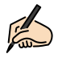 | writing_hand_light_skin_tone |  |
|  | writing_hand_mediumlight_skin_tone |  |
|  | writing_hand_medium_skin_tone |  |
|  | writing_hand_mediumdark_skin_tone |  |
| 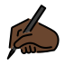 | writing_hand_dark_skin_tone |  |
|  | nail_polish | care, cosmetics, manicure, nail, polish |
|  | nail_polish_light_skin_tone |  |
| 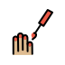 | nail_polish_mediumlight_skin_tone |  |
| 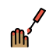 | nail_polish_medium_skin_tone |  |
|  | nail_polish_mediumdark_skin_tone |  |
|  | nail_polish_dark_skin_tone |  |
| 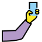 | selfie | camera, phone |
|  | selfie_light_skin_tone |  |
| 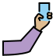 | selfie_mediumlight_skin_tone |  |
|  | selfie_medium_skin_tone |  |
| 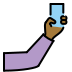 | selfie_mediumdark_skin_tone |  |
| 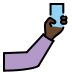 | selfie_dark_skin_tone |  |
|  | flexed_biceps | biceps, comic, flex, muscle |
|  | flexed_biceps_light_skin_tone |  |
|  | flexed_biceps_mediumlight_skin_tone |  |
|  | flexed_biceps_medium_skin_tone |  |
|  | flexed_biceps_mediumdark_skin_tone |  |
| 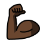 | flexed_biceps_dark_skin_tone |  |
|  | mechanical_arm | accessibility, prosthetic |
|  | mechanical_leg | accessibility, prosthetic |
|  | leg | kick, limb |
|  | leg_light_skin_tone |  |
|  | leg_mediumlight_skin_tone |  |
|  | leg_medium_skin_tone |  |
|  | leg_mediumdark_skin_tone |  |
|  | leg_dark_skin_tone |  |
|  | foot | kick, stomp |
|  | foot_light_skin_tone |  |
| 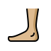 | foot_mediumlight_skin_tone |  |
|  | foot_medium_skin_tone |  |
|  | foot_mediumdark_skin_tone |  |
| 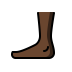 | foot_dark_skin_tone |  |
|  | ear | body |
|  | ear_light_skin_tone |  |
|  | ear_mediumlight_skin_tone |  |
| 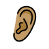 | ear_medium_skin_tone |  |
| 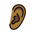 | ear_mediumdark_skin_tone |  |
|  | ear_dark_skin_tone |  |
|  | ear_with_hearing_aid | accessibility, hard of hearing |
|  | ear_with_hearing_aid_light_skin_tone |  |
|  | ear_with_hearing_aid_mediumlight_skin_tone |  |
| 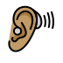 | ear_with_hearing_aid_medium_skin_tone |  |
| 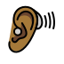 | ear_with_hearing_aid_mediumdark_skin_tone |  |
| 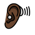 | ear_with_hearing_aid_dark_skin_tone |  |
|  | nose | body |
|  | nose_light_skin_tone |  |
|  | nose_mediumlight_skin_tone |  |
|  | nose_medium_skin_tone |  |
|  | nose_mediumdark_skin_tone |  |
|  | nose_dark_skin_tone |  |
|  | brain | intelligent |
|  | anatomical_heart | anatomical, cardiology, heart, organ, pulse |
| 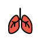 | lungs | breath, exhalation, inhalation, organ, respiration |
|  | tooth | dentist |
|  | bone | skeleton |
|  | eyes | eye, face |
|  | eye | body |
|  | tongue | body |
|  | mouth | lips |
|  | biting_lip | anxious, fear, flirting, nervous, uncomfortable, worried |
|  | baby | young |
|  | baby_light_skin_tone |  |
|  | baby_mediumlight_skin_tone |  |
|  | baby_medium_skin_tone |  |
|  | baby_mediumdark_skin_tone |  |
|  | baby_dark_skin_tone |  |
|  | child | gender-neutral, unspecified gender, young |
|  | child_light_skin_tone |  |
|  | child_mediumlight_skin_tone |  |
|  | child_medium_skin_tone |  |
|  | child_mediumdark_skin_tone |  |
|  | child_dark_skin_tone |  |
|  | boy | young |
|  | boy_light_skin_tone |  |
|  | boy_mediumlight_skin_tone |  |
|  | boy_medium_skin_tone |  |
|  | boy_mediumdark_skin_tone |  |
|  | boy_dark_skin_tone |  |
|  | girl | virgo, young, zodiac |
|  | girl_light_skin_tone |  |
|  | girl_mediumlight_skin_tone |  |
|  | girl_medium_skin_tone |  |
|  | girl_mediumdark_skin_tone |  |
|  | girl_dark_skin_tone |  |
|  | person | adult, gender-neutral, unspecified gender |
|  | person_light_skin_tone |  |
|  | person_mediumlight_skin_tone |  |
|  | person_medium_skin_tone |  |
|  | person_mediumdark_skin_tone |  |
|  | person_dark_skin_tone |  |
|  | person_blond_hair | blond, blond-haired person, hair |
|  | person_light_skin_tone_blond_hair |  |
|  | person_mediumlight_skin_tone_blond_hair |  |
|  | person_medium_skin_tone_blond_hair |  |
|  | person_mediumdark_skin_tone_blond_hair |  |
|  | person_dark_skin_tone_blond_hair |  |
|  | man | adult |
|  | man_light_skin_tone |  |
|  | man_mediumlight_skin_tone |  |
|  | man_medium_skin_tone |  |
|  | man_mediumdark_skin_tone |  |
|  | man_dark_skin_tone |  |
|  | person_beard | beard, person |
|  | person_light_skin_tone_beard |  |
|  | person_mediumlight_skin_tone_beard |  |
|  | person_medium_skin_tone_beard |  |
|  | person_mediumdark_skin_tone_beard |  |
|  | person_dark_skin_tone_beard |  |
|  | man_beard | beard, man |
|  | man_light_skin_tone_beard |  |
|  | man_mediumlight_skin_tone_beard |  |
|  | man_medium_skin_tone_beard |  |
|  | man_mediumdark_skin_tone_beard |  |
|  | man_dark_skin_tone_beard |  |
|  | woman_beard | beard, woman |
|  | woman_light_skin_tone_beard |  |
|  | woman_mediumlight_skin_tone_beard |  |
|  | woman_medium_skin_tone_beard |  |
|  | woman_mediumdark_skin_tone_beard |  |
|  | woman_dark_skin_tone_beard |  |
|  | man_red_hair | adult, man, red hair |
|  | man_light_skin_tone_red_hair |  |
|  | man_mediumlight_skin_tone_red_hair |  |
|  | man_medium_skin_tone_red_hair |  |
|  | man_mediumdark_skin_tone_red_hair |  |
|  | man_dark_skin_tone_red_hair |  |
|  | man_curly_hair | adult, curly hair, man |
|  | man_light_skin_tone_curly_hair |  |
|  | man_mediumlight_skin_tone_curly_hair |  |
|  | man_medium_skin_tone_curly_hair |  |
|  | man_mediumdark_skin_tone_curly_hair |  |
|  | man_dark_skin_tone_curly_hair |  |
|  | man_white_hair | adult, man, white hair |
|  | man_light_skin_tone_white_hair |  |
|  | man_mediumlight_skin_tone_white_hair |  |
|  | man_medium_skin_tone_white_hair |  |
|  | man_mediumdark_skin_tone_white_hair |  |
|  | man_dark_skin_tone_white_hair |  |
|  | man_bald | adult, bald, man |
|  | man_light_skin_tone_bald |  |
|  | man_mediumlight_skin_tone_bald |  |
|  | man_medium_skin_tone_bald |  |
|  | man_mediumdark_skin_tone_bald |  |
|  | man_dark_skin_tone_bald |  |
|  | woman | adult |
|  | woman_light_skin_tone |  |
|  | woman_mediumlight_skin_tone |  |
|  | woman_medium_skin_tone |  |
|  | woman_mediumdark_skin_tone |  |
|  | woman_dark_skin_tone |  |
|  | woman_red_hair | adult, red hair, woman |
|  | woman_light_skin_tone_red_hair |  |
|  | woman_mediumlight_skin_tone_red_hair |  |
|  | woman_medium_skin_tone_red_hair |  |
|  | woman_mediumdark_skin_tone_red_hair |  |
|  | woman_dark_skin_tone_red_hair |  |
|  | person_red_hair | adult, gender-neutral, person, red hair, unspecified gender |
|  | person_light_skin_tone_red_hair |  |
|  | person_mediumlight_skin_tone_red_hair |  |
|  | person_medium_skin_tone_red_hair |  |
|  | person_mediumdark_skin_tone_red_hair |  |
|  | person_dark_skin_tone_red_hair |  |
|  | woman_curly_hair | adult, curly hair, woman |
|  | woman_light_skin_tone_curly_hair |  |
|  | woman_mediumlight_skin_tone_curly_hair |  |
|  | woman_medium_skin_tone_curly_hair |  |
|  | woman_mediumdark_skin_tone_curly_hair |  |
|  | woman_dark_skin_tone_curly_hair |  |
|  | person_curly_hair | adult, curly hair, gender-neutral, person, unspecified gender |
|  | person_light_skin_tone_curly_hair |  |
|  | person_mediumlight_skin_tone_curly_hair |  |
|  | person_medium_skin_tone_curly_hair |  |
|  | person_mediumdark_skin_tone_curly_hair |  |
|  | person_dark_skin_tone_curly_hair |  |
|  | woman_white_hair | adult, white hair, woman |
|  | woman_light_skin_tone_white_hair |  |
|  | woman_mediumlight_skin_tone_white_hair |  |
|  | woman_medium_skin_tone_white_hair |  |
|  | woman_mediumdark_skin_tone_white_hair |  |
|  | woman_dark_skin_tone_white_hair |  |
|  | person_white_hair | adult, gender-neutral, person, unspecified gender, white hair |
|  | person_light_skin_tone_white_hair |  |
|  | person_mediumlight_skin_tone_white_hair |  |
|  | person_medium_skin_tone_white_hair |  |
|  | person_mediumdark_skin_tone_white_hair |  |
|  | person_dark_skin_tone_white_hair |  |
|  | woman_bald | adult, bald, woman |
|  | woman_light_skin_tone_bald |  |
|  | woman_mediumlight_skin_tone_bald |  |
|  | woman_medium_skin_tone_bald |  |
|  | woman_mediumdark_skin_tone_bald |  |
|  | woman_dark_skin_tone_bald |  |
|  | person_bald | adult, bald, gender-neutral, person, unspecified gender |
|  | person_light_skin_tone_bald |  |
|  | person_mediumlight_skin_tone_bald |  |
|  | person_medium_skin_tone_bald |  |
|  | person_mediumdark_skin_tone_bald |  |
|  | person_dark_skin_tone_bald |  |
|  | woman_blond_hair | blond-haired woman, blonde, hair, woman |
|  | woman_light_skin_tone_blond_hair |  |
|  | woman_mediumlight_skin_tone_blond_hair |  |
|  | woman_medium_skin_tone_blond_hair |  |
|  | woman_mediumdark_skin_tone_blond_hair |  |
|  | woman_dark_skin_tone_blond_hair |  |
|  | man_blond_hair | blond, blond-haired man, hair, man |
|  | man_light_skin_tone_blond_hair |  |
|  | man_mediumlight_skin_tone_blond_hair |  |
|  | man_medium_skin_tone_blond_hair |  |
|  | man_mediumdark_skin_tone_blond_hair |  |
|  | man_dark_skin_tone_blond_hair |  |
|  | older_person | adult, gender-neutral, old, unspecified gender |
|  | older_person_light_skin_tone |  |
|  | older_person_mediumlight_skin_tone |  |
|  | older_person_medium_skin_tone |  |
|  | older_person_mediumdark_skin_tone |  |
|  | older_person_dark_skin_tone |  |
|  | old_man | adult, man, old |
|  | old_man_light_skin_tone |  |
|  | old_man_mediumlight_skin_tone |  |
|  | old_man_medium_skin_tone |  |
|  | old_man_mediumdark_skin_tone |  |
|  | old_man_dark_skin_tone |  |
|  | old_woman | adult, old, woman |
|  | old_woman_light_skin_tone |  |
|  | old_woman_mediumlight_skin_tone |  |
|  | old_woman_medium_skin_tone |  |
|  | old_woman_mediumdark_skin_tone |  |
|  | old_woman_dark_skin_tone |  |
|  | person_frowning | frown, gesture |
|  | person_frowning_light_skin_tone |  |
|  | person_frowning_mediumlight_skin_tone |  |
|  | person_frowning_medium_skin_tone |  |
|  | person_frowning_mediumdark_skin_tone |  |
|  | person_frowning_dark_skin_tone |  |
|  | man_frowning | frowning, gesture, man |
|  | man_frowning_light_skin_tone |  |
|  | man_frowning_mediumlight_skin_tone |  |
|  | man_frowning_medium_skin_tone |  |
|  | man_frowning_mediumdark_skin_tone |  |
|  | man_frowning_dark_skin_tone |  |
|  | woman_frowning | frowning, gesture, woman |
|  | woman_frowning_light_skin_tone |  |
|  | woman_frowning_mediumlight_skin_tone |  |
|  | woman_frowning_medium_skin_tone |  |
|  | woman_frowning_mediumdark_skin_tone |  |
|  | woman_frowning_dark_skin_tone |  |
|  | person_pouting | gesture, pouting |
|  | person_pouting_light_skin_tone |  |
|  | person_pouting_mediumlight_skin_tone |  |
|  | person_pouting_medium_skin_tone |  |
|  | person_pouting_mediumdark_skin_tone |  |
|  | person_pouting_dark_skin_tone |  |
|  | man_pouting | gesture, man, pouting |
|  | man_pouting_light_skin_tone |  |
|  | man_pouting_mediumlight_skin_tone |  |
|  | man_pouting_medium_skin_tone |  |
|  | man_pouting_mediumdark_skin_tone |  |
|  | man_pouting_dark_skin_tone |  |
|  | woman_pouting | gesture, pouting, woman |
|  | woman_pouting_light_skin_tone |  |
|  | woman_pouting_mediumlight_skin_tone |  |
|  | woman_pouting_medium_skin_tone |  |
|  | woman_pouting_mediumdark_skin_tone |  |
|  | woman_pouting_dark_skin_tone |  |
|  | person_gesturing_no | forbidden, gesture, hand, person gesturing no, prohibited |
|  | person_gesturing_no_light_skin_tone |  |
|  | person_gesturing_no_mediumlight_skin_tone |  |
|  | person_gesturing_no_medium_skin_tone |  |
|  | person_gesturing_no_mediumdark_skin_tone |  |
|  | person_gesturing_no_dark_skin_tone |  |
|  | man_gesturing_no | forbidden, gesture, hand, man, man gesturing no, prohibited |
|  | man_gesturing_no_light_skin_tone |  |
|  | man_gesturing_no_mediumlight_skin_tone |  |
|  | man_gesturing_no_medium_skin_tone |  |
|  | man_gesturing_no_mediumdark_skin_tone |  |
|  | man_gesturing_no_dark_skin_tone |  |
|  | woman_gesturing_no | forbidden, gesture, hand, prohibited, woman, woman gesturing no |
|  | woman_gesturing_no_light_skin_tone |  |
|  | woman_gesturing_no_mediumlight_skin_tone |  |
|  | woman_gesturing_no_medium_skin_tone |  |
|  | woman_gesturing_no_mediumdark_skin_tone |  |
|  | woman_gesturing_no_dark_skin_tone |  |
|  | person_gesturing_ok | gesture, hand, ok, person gesturing ok |
|  | person_gesturing_ok_light_skin_tone |  |
|  | person_gesturing_ok_mediumlight_skin_tone |  |
|  | person_gesturing_ok_medium_skin_tone |  |
|  | person_gesturing_ok_mediumdark_skin_tone |  |
|  | person_gesturing_ok_dark_skin_tone |  |
|  | man_gesturing_ok | gesture, hand, man, man gesturing ok, ok |
|  | man_gesturing_ok_light_skin_tone |  |
|  | man_gesturing_ok_mediumlight_skin_tone |  |
|  | man_gesturing_ok_medium_skin_tone |  |
|  | man_gesturing_ok_mediumdark_skin_tone |  |
|  | man_gesturing_ok_dark_skin_tone |  |
|  | woman_gesturing_ok | gesture, hand, ok, woman, woman gesturing ok |
|  | woman_gesturing_ok_light_skin_tone |  |
|  | woman_gesturing_ok_mediumlight_skin_tone |  |
|  | woman_gesturing_ok_medium_skin_tone |  |
|  | woman_gesturing_ok_mediumdark_skin_tone |  |
|  | woman_gesturing_ok_dark_skin_tone |  |
|  | person_tipping_hand | hand, help, information, sassy, tipping |
|  | person_tipping_hand_light_skin_tone |  |
|  | person_tipping_hand_mediumlight_skin_tone |  |
|  | person_tipping_hand_medium_skin_tone |  |
|  | person_tipping_hand_mediumdark_skin_tone |  |
|  | person_tipping_hand_dark_skin_tone |  |
|  | man_tipping_hand | man, sassy, tipping hand |
|  | man_tipping_hand_light_skin_tone |  |
|  | man_tipping_hand_mediumlight_skin_tone |  |
|  | man_tipping_hand_medium_skin_tone |  |
|  | man_tipping_hand_mediumdark_skin_tone |  |
|  | man_tipping_hand_dark_skin_tone |  |
|  | woman_tipping_hand | sassy, tipping hand, woman |
|  | woman_tipping_hand_light_skin_tone |  |
|  | woman_tipping_hand_mediumlight_skin_tone |  |
|  | woman_tipping_hand_medium_skin_tone |  |
|  | woman_tipping_hand_mediumdark_skin_tone |  |
|  | woman_tipping_hand_dark_skin_tone |  |
|  | person_raising_hand | gesture, hand, happy, raised |
|  | person_raising_hand_light_skin_tone |  |
|  | person_raising_hand_mediumlight_skin_tone |  |
|  | person_raising_hand_medium_skin_tone |  |
|  | person_raising_hand_mediumdark_skin_tone |  |
|  | person_raising_hand_dark_skin_tone |  |
|  | man_raising_hand | gesture, man, raising hand |
|  | man_raising_hand_light_skin_tone |  |
|  | man_raising_hand_mediumlight_skin_tone |  |
|  | man_raising_hand_medium_skin_tone |  |
|  | man_raising_hand_mediumdark_skin_tone |  |
|  | man_raising_hand_dark_skin_tone |  |
|  | woman_raising_hand | gesture, raising hand, woman |
|  | woman_raising_hand_light_skin_tone |  |
|  | woman_raising_hand_mediumlight_skin_tone |  |
|  | woman_raising_hand_medium_skin_tone |  |
|  | woman_raising_hand_mediumdark_skin_tone |  |
|  | woman_raising_hand_dark_skin_tone |  |
|  | deaf_person | accessibility, deaf, ear, hear |
|  | deaf_person_light_skin_tone |  |
|  | deaf_person_mediumlight_skin_tone |  |
|  | deaf_person_medium_skin_tone |  |
|  | deaf_person_mediumdark_skin_tone |  |
|  | deaf_person_dark_skin_tone |  |
|  | deaf_man | deaf, man |
|  | deaf_man_light_skin_tone |  |
|  | deaf_man_mediumlight_skin_tone |  |
|  | deaf_man_medium_skin_tone |  |
|  | deaf_man_mediumdark_skin_tone |  |
|  | deaf_man_dark_skin_tone |  |
|  | deaf_woman | deaf, woman |
|  | deaf_woman_light_skin_tone |  |
|  | deaf_woman_mediumlight_skin_tone |  |
|  | deaf_woman_medium_skin_tone |  |
|  | deaf_woman_mediumdark_skin_tone |  |
|  | deaf_woman_dark_skin_tone |  |
|  | person_bowing | apology, bow, gesture, sorry |
|  | person_bowing_light_skin_tone |  |
|  | person_bowing_mediumlight_skin_tone |  |
|  | person_bowing_medium_skin_tone |  |
|  | person_bowing_mediumdark_skin_tone |  |
|  | person_bowing_dark_skin_tone |  |
|  | man_bowing | apology, bowing, favor, gesture, man, sorry |
|  | man_bowing_light_skin_tone |  |
|  | man_bowing_mediumlight_skin_tone |  |
|  | man_bowing_medium_skin_tone |  |
|  | man_bowing_mediumdark_skin_tone |  |
|  | man_bowing_dark_skin_tone |  |
|  | woman_bowing | apology, bowing, favor, gesture, sorry, woman |
|  | woman_bowing_light_skin_tone |  |
|  | woman_bowing_mediumlight_skin_tone |  |
|  | woman_bowing_medium_skin_tone |  |
| 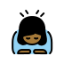 | woman_bowing_mediumdark_skin_tone |  |
| 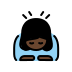 | woman_bowing_dark_skin_tone |  |
|  | person_facepalming | disbelief, exasperation, face, palm |
|  | person_facepalming_light_skin_tone |  |
|  | person_facepalming_mediumlight_skin_tone |  |
|  | person_facepalming_medium_skin_tone |  |
|  | person_facepalming_mediumdark_skin_tone |  |
|  | person_facepalming_dark_skin_tone |  |
|  | man_facepalming | disbelief, exasperation, facepalm, man |
|  | man_facepalming_light_skin_tone |  |
|  | man_facepalming_mediumlight_skin_tone |  |
|  | man_facepalming_medium_skin_tone |  |
|  | man_facepalming_mediumdark_skin_tone |  |
|  | man_facepalming_dark_skin_tone |  |
|  | woman_facepalming | disbelief, exasperation, facepalm, woman |
|  | woman_facepalming_light_skin_tone |  |
|  | woman_facepalming_mediumlight_skin_tone |  |
|  | woman_facepalming_medium_skin_tone |  |
|  | woman_facepalming_mediumdark_skin_tone |  |
|  | woman_facepalming_dark_skin_tone |  |
|  | person_shrugging | doubt, ignorance, indifference, shrug |
|  | person_shrugging_light_skin_tone |  |
|  | person_shrugging_mediumlight_skin_tone |  |
|  | person_shrugging_medium_skin_tone |  |
|  | person_shrugging_mediumdark_skin_tone |  |
|  | person_shrugging_dark_skin_tone |  |
|  | man_shrugging | doubt, ignorance, indifference, man, shrug |
|  | man_shrugging_light_skin_tone |  |
|  | man_shrugging_mediumlight_skin_tone |  |
|  | man_shrugging_medium_skin_tone |  |
|  | man_shrugging_mediumdark_skin_tone |  |
|  | man_shrugging_dark_skin_tone |  |
|  | woman_shrugging | doubt, ignorance, indifference, shrug, woman |
|  | woman_shrugging_light_skin_tone |  |
|  | woman_shrugging_mediumlight_skin_tone |  |
|  | woman_shrugging_medium_skin_tone |  |
|  | woman_shrugging_mediumdark_skin_tone |  |
|  | woman_shrugging_dark_skin_tone |  |
|  | health_worker | doctor, healthcare, nurse, therapist |
|  | health_worker_light_skin_tone |  |
|  | health_worker_mediumlight_skin_tone |  |
|  | health_worker_medium_skin_tone |  |
|  | health_worker_mediumdark_skin_tone |  |
|  | health_worker_dark_skin_tone |  |
|  | man_health_worker | doctor, healthcare, man, nurse, therapist |
|  | man_health_worker_light_skin_tone |  |
|  | man_health_worker_mediumlight_skin_tone |  |
|  | man_health_worker_medium_skin_tone |  |
|  | man_health_worker_mediumdark_skin_tone |  |
|  | man_health_worker_dark_skin_tone |  |
|  | woman_health_worker | doctor, healthcare, nurse, therapist, woman |
|  | woman_health_worker_light_skin_tone |  |
|  | woman_health_worker_mediumlight_skin_tone |  |
|  | woman_health_worker_medium_skin_tone |  |
|  | woman_health_worker_mediumdark_skin_tone |  |
|  | woman_health_worker_dark_skin_tone |  |
|  | student | graduate |
|  | student_light_skin_tone |  |
|  | student_mediumlight_skin_tone |  |
|  | student_medium_skin_tone |  |
|  | student_mediumdark_skin_tone |  |
|  | student_dark_skin_tone |  |
|  | man_student | graduate, man, student |
|  | man_student_light_skin_tone |  |
|  | man_student_mediumlight_skin_tone |  |
|  | man_student_medium_skin_tone |  |
|  | man_student_mediumdark_skin_tone |  |
|  | man_student_dark_skin_tone |  |
|  | woman_student | graduate, student, woman |
|  | woman_student_light_skin_tone |  |
|  | woman_student_mediumlight_skin_tone |  |
|  | woman_student_medium_skin_tone |  |
|  | woman_student_mediumdark_skin_tone |  |
|  | woman_student_dark_skin_tone |  |
|  | teacher | instructor, professor |
|  | teacher_light_skin_tone |  |
|  | teacher_mediumlight_skin_tone |  |
|  | teacher_medium_skin_tone |  |
|  | teacher_mediumdark_skin_tone |  |
|  | teacher_dark_skin_tone |  |
|  | man_teacher | instructor, man, professor, teacher |
|  | man_teacher_light_skin_tone |  |
|  | man_teacher_mediumlight_skin_tone |  |
|  | man_teacher_medium_skin_tone |  |
|  | man_teacher_mediumdark_skin_tone |  |
|  | man_teacher_dark_skin_tone |  |
|  | woman_teacher | instructor, professor, teacher, woman |
|  | woman_teacher_light_skin_tone |  |
|  | woman_teacher_mediumlight_skin_tone |  |
|  | woman_teacher_medium_skin_tone |  |
|  | woman_teacher_mediumdark_skin_tone |  |
|  | woman_teacher_dark_skin_tone |  |
|  | judge | justice, scales |
|  | judge_light_skin_tone |  |
|  | judge_mediumlight_skin_tone |  |
|  | judge_medium_skin_tone |  |
|  | judge_mediumdark_skin_tone |  |
|  | judge_dark_skin_tone |  |
|  | man_judge | judge, justice, man, scales |
|  | man_judge_light_skin_tone |  |
|  | man_judge_mediumlight_skin_tone |  |
|  | man_judge_medium_skin_tone |  |
|  | man_judge_mediumdark_skin_tone |  |
|  | man_judge_dark_skin_tone |  |
|  | woman_judge | judge, justice, scales, woman |
|  | woman_judge_light_skin_tone |  |
|  | woman_judge_mediumlight_skin_tone |  |
|  | woman_judge_medium_skin_tone |  |
|  | woman_judge_mediumdark_skin_tone |  |
|  | woman_judge_dark_skin_tone |  |
|  | farmer | gardener, rancher |
|  | farmer_light_skin_tone |  |
|  | farmer_mediumlight_skin_tone |  |
|  | farmer_medium_skin_tone |  |
|  | farmer_mediumdark_skin_tone |  |
|  | farmer_dark_skin_tone |  |
| 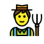 | man_farmer | farmer, gardener, man, rancher |
|  | man_farmer_light_skin_tone |  |
|  | man_farmer_mediumlight_skin_tone |  |
| 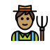 | man_farmer_medium_skin_tone |  |
|  | man_farmer_mediumdark_skin_tone |  |
|  | man_farmer_dark_skin_tone |  |
|  | woman_farmer | farmer, gardener, rancher, woman |
|  | woman_farmer_light_skin_tone |  |
|  | woman_farmer_mediumlight_skin_tone |  |
|  | woman_farmer_medium_skin_tone |  |
|  | woman_farmer_mediumdark_skin_tone |  |
|  | woman_farmer_dark_skin_tone |  |
|  | cook | chef |
|  | cook_light_skin_tone |  |
|  | cook_mediumlight_skin_tone |  |
|  | cook_medium_skin_tone |  |
|  | cook_mediumdark_skin_tone |  |
|  | cook_dark_skin_tone |  |
|  | man_cook | chef, cook, man |
|  | man_cook_light_skin_tone |  |
|  | man_cook_mediumlight_skin_tone |  |
|  | man_cook_medium_skin_tone |  |
|  | man_cook_mediumdark_skin_tone |  |
|  | man_cook_dark_skin_tone |  |
|  | woman_cook | chef, cook, woman |
|  | woman_cook_light_skin_tone |  |
|  | woman_cook_mediumlight_skin_tone |  |
|  | woman_cook_medium_skin_tone |  |
|  | woman_cook_mediumdark_skin_tone |  |
|  | woman_cook_dark_skin_tone |  |
|  | mechanic | electrician, plumber, tradesperson |
|  | mechanic_light_skin_tone |  |
|  | mechanic_mediumlight_skin_tone |  |
|  | mechanic_medium_skin_tone |  |
|  | mechanic_mediumdark_skin_tone |  |
|  | mechanic_dark_skin_tone |  |
| 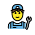 | man_mechanic | electrician, man, mechanic, plumber, tradesperson |
| 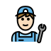 | man_mechanic_light_skin_tone |  |
|  | man_mechanic_mediumlight_skin_tone |  |
|  | man_mechanic_medium_skin_tone |  |
|  | man_mechanic_mediumdark_skin_tone |  |
|  | man_mechanic_dark_skin_tone |  |
| 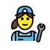 | woman_mechanic | electrician, mechanic, plumber, tradesperson, woman |
|  | woman_mechanic_light_skin_tone |  |
| 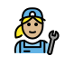 | woman_mechanic_mediumlight_skin_tone |  |
|  | woman_mechanic_medium_skin_tone |  |
|  | woman_mechanic_mediumdark_skin_tone |  |
| 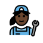 | woman_mechanic_dark_skin_tone |  |
|  | factory_worker | assembly, factory, industrial, worker |
|  | factory_worker_light_skin_tone |  |
|  | factory_worker_mediumlight_skin_tone |  |
|  | factory_worker_medium_skin_tone |  |
|  | factory_worker_mediumdark_skin_tone |  |
|  | factory_worker_dark_skin_tone |  |
|  | man_factory_worker | assembly, factory, industrial, man, worker |
|  | man_factory_worker_light_skin_tone |  |
|  | man_factory_worker_mediumlight_skin_tone |  |
|  | man_factory_worker_medium_skin_tone |  |
|  | man_factory_worker_mediumdark_skin_tone |  |
|  | man_factory_worker_dark_skin_tone |  |
|  | woman_factory_worker | assembly, factory, industrial, woman, worker |
| 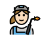 | woman_factory_worker_light_skin_tone |  |
|  | woman_factory_worker_mediumlight_skin_tone |  |
|  | woman_factory_worker_medium_skin_tone |  |
|  | woman_factory_worker_mediumdark_skin_tone |  |
|  | woman_factory_worker_dark_skin_tone |  |
|  | office_worker | architect, business, manager, white-collar |
|  | office_worker_light_skin_tone |  |
|  | office_worker_mediumlight_skin_tone |  |
|  | office_worker_medium_skin_tone |  |
|  | office_worker_mediumdark_skin_tone |  |
|  | office_worker_dark_skin_tone |  |
|  | man_office_worker | architect, business, man, manager, white-collar |
|  | man_office_worker_light_skin_tone |  |
|  | man_office_worker_mediumlight_skin_tone |  |
|  | man_office_worker_medium_skin_tone |  |
|  | man_office_worker_mediumdark_skin_tone |  |
|  | man_office_worker_dark_skin_tone |  |
|  | woman_office_worker | architect, business, manager, white-collar, woman |
|  | woman_office_worker_light_skin_tone |  |
|  | woman_office_worker_mediumlight_skin_tone |  |
|  | woman_office_worker_medium_skin_tone |  |
|  | woman_office_worker_mediumdark_skin_tone |  |
|  | woman_office_worker_dark_skin_tone |  |
|  | scientist | biologist, chemist, engineer, physicist |
|  | scientist_light_skin_tone |  |
|  | scientist_mediumlight_skin_tone |  |
|  | scientist_medium_skin_tone |  |
|  | scientist_mediumdark_skin_tone |  |
|  | scientist_dark_skin_tone |  |
|  | man_scientist | biologist, chemist, engineer, man, physicist, scientist |
|  | man_scientist_light_skin_tone |  |
|  | man_scientist_mediumlight_skin_tone |  |
|  | man_scientist_medium_skin_tone |  |
|  | man_scientist_mediumdark_skin_tone |  |
|  | man_scientist_dark_skin_tone |  |
|  | woman_scientist | biologist, chemist, engineer, physicist, scientist, woman |
|  | woman_scientist_light_skin_tone |  |
|  | woman_scientist_mediumlight_skin_tone |  |
|  | woman_scientist_medium_skin_tone |  |
|  | woman_scientist_mediumdark_skin_tone |  |
|  | woman_scientist_dark_skin_tone |  |
|  | technologist | coder, developer, inventor, software |
|  | technologist_light_skin_tone |  |
|  | technologist_mediumlight_skin_tone |  |
|  | technologist_medium_skin_tone |  |
|  | technologist_mediumdark_skin_tone |  |
|  | technologist_dark_skin_tone |  |
|  | man_technologist | coder, developer, inventor, man, software, technologist |
|  | man_technologist_light_skin_tone |  |
|  | man_technologist_mediumlight_skin_tone |  |
|  | man_technologist_medium_skin_tone |  |
|  | man_technologist_mediumdark_skin_tone |  |
|  | man_technologist_dark_skin_tone |  |
|  | woman_technologist | coder, developer, inventor, software, technologist, woman |
|  | woman_technologist_light_skin_tone |  |
|  | woman_technologist_mediumlight_skin_tone |  |
|  | woman_technologist_medium_skin_tone |  |
|  | woman_technologist_mediumdark_skin_tone |  |
|  | woman_technologist_dark_skin_tone |  |
|  | singer | actor, entertainer, rock, star |
|  | singer_light_skin_tone |  |
|  | singer_mediumlight_skin_tone |  |
|  | singer_medium_skin_tone |  |
|  | singer_mediumdark_skin_tone |  |
|  | singer_dark_skin_tone |  |
|  | man_singer | actor, entertainer, man, rock, singer, star |
|  | man_singer_light_skin_tone |  |
|  | man_singer_mediumlight_skin_tone |  |
|  | man_singer_medium_skin_tone |  |
|  | man_singer_mediumdark_skin_tone |  |
|  | man_singer_dark_skin_tone |  |
|  | woman_singer | actor, entertainer, rock, singer, star, woman |
|  | woman_singer_light_skin_tone |  |
|  | woman_singer_mediumlight_skin_tone |  |
|  | woman_singer_medium_skin_tone |  |
|  | woman_singer_mediumdark_skin_tone |  |
| 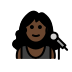 | woman_singer_dark_skin_tone |  |
|  | artist | palette |
|  | artist_light_skin_tone |  |
|  | artist_mediumlight_skin_tone |  |
|  | artist_medium_skin_tone |  |
|  | artist_mediumdark_skin_tone |  |
|  | artist_dark_skin_tone |  |
|  | man_artist | artist, man, palette |
|  | man_artist_light_skin_tone |  |
|  | man_artist_mediumlight_skin_tone |  |
|  | man_artist_medium_skin_tone |  |
|  | man_artist_mediumdark_skin_tone |  |
|  | man_artist_dark_skin_tone |  |
|  | woman_artist | artist, palette, woman |
|  | woman_artist_light_skin_tone |  |
|  | woman_artist_mediumlight_skin_tone |  |
|  | woman_artist_medium_skin_tone |  |
|  | woman_artist_mediumdark_skin_tone |  |
|  | woman_artist_dark_skin_tone |  |
|  | pilot | plane |
|  | pilot_light_skin_tone |  |
|  | pilot_mediumlight_skin_tone |  |
|  | pilot_medium_skin_tone |  |
|  | pilot_mediumdark_skin_tone |  |
|  | pilot_dark_skin_tone |  |
|  | man_pilot | man, pilot, plane |
|  | man_pilot_light_skin_tone |  |
|  | man_pilot_mediumlight_skin_tone |  |
|  | man_pilot_medium_skin_tone |  |
|  | man_pilot_mediumdark_skin_tone |  |
|  | man_pilot_dark_skin_tone |  |
|  | woman_pilot | pilot, plane, woman |
|  | woman_pilot_light_skin_tone |  |
|  | woman_pilot_mediumlight_skin_tone |  |
|  | woman_pilot_medium_skin_tone |  |
|  | woman_pilot_mediumdark_skin_tone |  |
|  | woman_pilot_dark_skin_tone |  |
|  | astronaut | rocket |
|  | astronaut_light_skin_tone |  |
|  | astronaut_mediumlight_skin_tone |  |
|  | astronaut_medium_skin_tone |  |
|  | astronaut_mediumdark_skin_tone |  |
|  | astronaut_dark_skin_tone |  |
|  | man_astronaut | astronaut, man, rocket |
|  | man_astronaut_light_skin_tone |  |
|  | man_astronaut_mediumlight_skin_tone |  |
|  | man_astronaut_medium_skin_tone |  |
|  | man_astronaut_mediumdark_skin_tone |  |
|  | man_astronaut_dark_skin_tone |  |
|  | woman_astronaut | astronaut, rocket, woman |
|  | woman_astronaut_light_skin_tone |  |
|  | woman_astronaut_mediumlight_skin_tone |  |
|  | woman_astronaut_medium_skin_tone |  |
|  | woman_astronaut_mediumdark_skin_tone |  |
|  | woman_astronaut_dark_skin_tone |  |
|  | firefighter | firetruck |
|  | firefighter_light_skin_tone |  |
|  | firefighter_mediumlight_skin_tone |  |
|  | firefighter_medium_skin_tone |  |
| 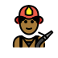 | firefighter_mediumdark_skin_tone |  |
|  | firefighter_dark_skin_tone |  |
|  | man_firefighter | firefighter, firetruck, man |
|  | man_firefighter_light_skin_tone |  |
|  | man_firefighter_mediumlight_skin_tone |  |
|  | man_firefighter_medium_skin_tone |  |
|  | man_firefighter_mediumdark_skin_tone |  |
| 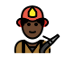 | man_firefighter_dark_skin_tone |  |
|  | woman_firefighter | firefighter, firetruck, woman |
|  | woman_firefighter_light_skin_tone |  |
|  | woman_firefighter_mediumlight_skin_tone |  |
|  | woman_firefighter_medium_skin_tone |  |
|  | woman_firefighter_mediumdark_skin_tone |  |
|  | woman_firefighter_dark_skin_tone |  |
|  | police_officer | cop, officer, police |
|  | police_officer_light_skin_tone |  |
|  | police_officer_mediumlight_skin_tone |  |
|  | police_officer_medium_skin_tone |  |
|  | police_officer_mediumdark_skin_tone |  |
|  | police_officer_dark_skin_tone |  |
|  | man_police_officer | cop, man, officer, police |
|  | man_police_officer_light_skin_tone |  |
|  | man_police_officer_mediumlight_skin_tone |  |
|  | man_police_officer_medium_skin_tone |  |
|  | man_police_officer_mediumdark_skin_tone |  |
|  | man_police_officer_dark_skin_tone |  |
|  | woman_police_officer | cop, officer, police, woman |
|  | woman_police_officer_light_skin_tone |  |
|  | woman_police_officer_mediumlight_skin_tone |  |
|  | woman_police_officer_medium_skin_tone |  |
|  | woman_police_officer_mediumdark_skin_tone |  |
|  | woman_police_officer_dark_skin_tone |  |
|  | detective | sleuth, spy |
|  | detective_light_skin_tone |  |
|  | detective_mediumlight_skin_tone |  |
|  | detective_medium_skin_tone |  |
|  | detective_mediumdark_skin_tone |  |
|  | detective_dark_skin_tone |  |
|  | man_detective | detective, man, sleuth, spy |
|  | man_detective_light_skin_tone |  |
|  | man_detective_mediumlight_skin_tone |  |
|  | man_detective_medium_skin_tone |  |
|  | man_detective_mediumdark_skin_tone |  |
|  | man_detective_dark_skin_tone |  |
|  | woman_detective | detective, sleuth, spy, woman |
|  | woman_detective_light_skin_tone |  |
|  | woman_detective_mediumlight_skin_tone |  |
|  | woman_detective_medium_skin_tone |  |
|  | woman_detective_mediumdark_skin_tone |  |
|  | woman_detective_dark_skin_tone |  |
|  | guard | guard |
|  | guard_light_skin_tone |  |
|  | guard_mediumlight_skin_tone |  |
|  | guard_medium_skin_tone |  |
|  | guard_mediumdark_skin_tone |  |
|  | guard_dark_skin_tone |  |
|  | man_guard | guard, man |
|  | man_guard_light_skin_tone |  |
|  | man_guard_mediumlight_skin_tone |  |
| 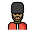 | man_guard_medium_skin_tone |  |
|  | man_guard_mediumdark_skin_tone |  |
| 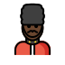 | man_guard_dark_skin_tone |  |
|  | woman_guard | guard, woman |
|  | woman_guard_light_skin_tone |  |
|  | woman_guard_mediumlight_skin_tone |  |
|  | woman_guard_medium_skin_tone |  |
|  | woman_guard_mediumdark_skin_tone |  |
|  | woman_guard_dark_skin_tone |  |
|  | ninja | fighter, hidden, stealth |
|  | ninja_light_skin_tone |  |
|  | ninja_mediumlight_skin_tone |  |
|  | ninja_medium_skin_tone |  |
|  | ninja_mediumdark_skin_tone |  |
|  | ninja_dark_skin_tone |  |
|  | construction_worker | construction, hat, worker |
|  | construction_worker_light_skin_tone |  |
|  | construction_worker_mediumlight_skin_tone |  |
|  | construction_worker_medium_skin_tone |  |
|  | construction_worker_mediumdark_skin_tone |  |
|  | construction_worker_dark_skin_tone |  |
|  | man_construction_worker | construction, man, worker |
|  | man_construction_worker_light_skin_tone |  |
|  | man_construction_worker_mediumlight_skin_tone |  |
|  | man_construction_worker_medium_skin_tone |  |
|  | man_construction_worker_mediumdark_skin_tone |  |
|  | man_construction_worker_dark_skin_tone |  |
|  | woman_construction_worker | construction, woman, worker |
|  | woman_construction_worker_light_skin_tone |  |
|  | woman_construction_worker_mediumlight_skin_tone |  |
|  | woman_construction_worker_medium_skin_tone |  |
|  | woman_construction_worker_mediumdark_skin_tone |  |
|  | woman_construction_worker_dark_skin_tone |  |
|  | person_with_crown | monarch, noble, regal, royalty |
|  | person_with_crown_light_skin_tone |  |
|  | person_with_crown_mediumlight_skin_tone |  |
|  | person_with_crown_medium_skin_tone |  |
|  | person_with_crown_mediumdark_skin_tone |  |
|  | person_with_crown_dark_skin_tone |  |
|  | prince | prince |
|  | prince_light_skin_tone |  |
|  | prince_mediumlight_skin_tone |  |
|  | prince_medium_skin_tone |  |
|  | prince_mediumdark_skin_tone |  |
|  | prince_dark_skin_tone |  |
|  | princess | fairy tale, fantasy |
|  | princess_light_skin_tone |  |
|  | princess_mediumlight_skin_tone |  |
|  | princess_medium_skin_tone |  |
|  | princess_mediumdark_skin_tone |  |
| 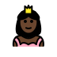 | princess_dark_skin_tone |  |
|  | person_wearing_turban | turban |
|  | person_wearing_turban_light_skin_tone |  |
|  | person_wearing_turban_mediumlight_skin_tone |  |
|  | person_wearing_turban_medium_skin_tone |  |
|  | person_wearing_turban_mediumdark_skin_tone |  |
|  | person_wearing_turban_dark_skin_tone |  |
|  | man_wearing_turban | man, turban |
|  | man_wearing_turban_light_skin_tone |  |
|  | man_wearing_turban_mediumlight_skin_tone |  |
|  | man_wearing_turban_medium_skin_tone |  |
|  | man_wearing_turban_mediumdark_skin_tone |  |
|  | man_wearing_turban_dark_skin_tone |  |
|  | woman_wearing_turban | turban, woman |
|  | woman_wearing_turban_light_skin_tone |  |
|  | woman_wearing_turban_mediumlight_skin_tone |  |
|  | woman_wearing_turban_medium_skin_tone |  |
|  | woman_wearing_turban_mediumdark_skin_tone |  |
|  | woman_wearing_turban_dark_skin_tone |  |
|  | person_with_skullcap | cap, gua pi mao, hat, person, skullcap |
|  | person_with_skullcap_light_skin_tone |  |
|  | person_with_skullcap_mediumlight_skin_tone |  |
|  | person_with_skullcap_medium_skin_tone |  |
|  | person_with_skullcap_mediumdark_skin_tone |  |
|  | person_with_skullcap_dark_skin_tone |  |
|  | woman_with_headscarf | headscarf, hijab, mantilla, tichel |
|  | woman_with_headscarf_light_skin_tone |  |
|  | woman_with_headscarf_mediumlight_skin_tone |  |
|  | woman_with_headscarf_medium_skin_tone |  |
|  | woman_with_headscarf_mediumdark_skin_tone |  |
|  | woman_with_headscarf_dark_skin_tone |  |
|  | person_in_tuxedo | groom, person, tuxedo |
|  | person_in_tuxedo_light_skin_tone |  |
|  | person_in_tuxedo_mediumlight_skin_tone |  |
|  | person_in_tuxedo_medium_skin_tone |  |
|  | person_in_tuxedo_mediumdark_skin_tone |  |
|  | person_in_tuxedo_dark_skin_tone |  |
|  | man_in_tuxedo | man, tuxedo |
|  | man_in_tuxedo_light_skin_tone |  |
|  | man_in_tuxedo_mediumlight_skin_tone |  |
|  | man_in_tuxedo_medium_skin_tone |  |
|  | man_in_tuxedo_mediumdark_skin_tone |  |
|  | man_in_tuxedo_dark_skin_tone |  |
|  | woman_in_tuxedo | tuxedo, woman |
|  | woman_in_tuxedo_light_skin_tone |  |
|  | woman_in_tuxedo_mediumlight_skin_tone |  |
|  | woman_in_tuxedo_medium_skin_tone |  |
|  | woman_in_tuxedo_mediumdark_skin_tone |  |
|  | woman_in_tuxedo_dark_skin_tone |  |
|  | person_with_veil | bride, person, veil, wedding |
|  | person_with_veil_light_skin_tone |  |
|  | person_with_veil_mediumlight_skin_tone |  |
|  | person_with_veil_medium_skin_tone |  |
|  | person_with_veil_mediumdark_skin_tone |  |
|  | person_with_veil_dark_skin_tone |  |
|  | man_with_veil | man, veil |
|  | man_with_veil_light_skin_tone |  |
|  | man_with_veil_mediumlight_skin_tone |  |
|  | man_with_veil_medium_skin_tone |  |
|  | man_with_veil_mediumdark_skin_tone |  |
|  | man_with_veil_dark_skin_tone |  |
|  | woman_with_veil | veil, woman |
|  | woman_with_veil_light_skin_tone |  |
|  | woman_with_veil_mediumlight_skin_tone |  |
|  | woman_with_veil_medium_skin_tone |  |
|  | woman_with_veil_mediumdark_skin_tone |  |
|  | woman_with_veil_dark_skin_tone |  |
|  | pregnant_woman | pregnant, woman |
|  | pregnant_woman_light_skin_tone |  |
|  | pregnant_woman_mediumlight_skin_tone |  |
|  | pregnant_woman_medium_skin_tone |  |
|  | pregnant_woman_mediumdark_skin_tone |  |
|  | pregnant_woman_dark_skin_tone |  |
| 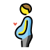 | pregnant_man | belly, bloated, full, pregnant |
|  | pregnant_man_light_skin_tone |  |
|  | pregnant_man_mediumlight_skin_tone |  |
|  | pregnant_man_medium_skin_tone |  |
| 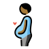 | pregnant_man_mediumdark_skin_tone |  |
|  | pregnant_man_dark_skin_tone |  |
|  | pregnant_person | belly, bloated, full, pregnant |
| 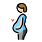 | pregnant_person_light_skin_tone |  |
|  | pregnant_person_mediumlight_skin_tone |  |
|  | pregnant_person_medium_skin_tone |  |
| 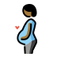 | pregnant_person_mediumdark_skin_tone |  |
|  | pregnant_person_dark_skin_tone |  |
|  | breastfeeding | baby, breast, nursing |
|  | breastfeeding_light_skin_tone |  |
|  | breastfeeding_mediumlight_skin_tone |  |
|  | breastfeeding_medium_skin_tone |  |
|  | breastfeeding_mediumdark_skin_tone |  |
|  | breastfeeding_dark_skin_tone |  |
|  | woman_feeding_baby | baby, feeding, nursing, woman |
|  | woman_feeding_baby_light_skin_tone |  |
|  | woman_feeding_baby_mediumlight_skin_tone |  |
|  | woman_feeding_baby_medium_skin_tone |  |
|  | woman_feeding_baby_mediumdark_skin_tone |  |
|  | woman_feeding_baby_dark_skin_tone |  |
|  | man_feeding_baby | baby, feeding, man, nursing |
|  | man_feeding_baby_light_skin_tone |  |
|  | man_feeding_baby_mediumlight_skin_tone |  |
|  | man_feeding_baby_medium_skin_tone |  |
|  | man_feeding_baby_mediumdark_skin_tone |  |
|  | man_feeding_baby_dark_skin_tone |  |
|  | person_feeding_baby | baby, feeding, nursing, person |
|  | person_feeding_baby_light_skin_tone |  |
|  | person_feeding_baby_mediumlight_skin_tone |  |
|  | person_feeding_baby_medium_skin_tone |  |
|  | person_feeding_baby_mediumdark_skin_tone |  |
|  | person_feeding_baby_dark_skin_tone |  |
|  | baby_angel | angel, baby, face, fairy tale, fantasy |
|  | baby_angel_light_skin_tone |  |
|  | baby_angel_mediumlight_skin_tone |  |
|  | baby_angel_medium_skin_tone |  |
|  | baby_angel_mediumdark_skin_tone |  |
|  | baby_angel_dark_skin_tone |  |
|  | santa_claus | celebration, christmas, claus, father, santa, santa claus |
|  | santa_claus_light_skin_tone |  |
|  | santa_claus_mediumlight_skin_tone |  |
|  | santa_claus_medium_skin_tone |  |
|  | santa_claus_mediumdark_skin_tone |  |
|  | santa_claus_dark_skin_tone |  |
|  | mrs_claus | celebration, christmas, claus, mother, mrs., mrs. claus |
|  | mrs_claus_light_skin_tone |  |
|  | mrs_claus_mediumlight_skin_tone |  |
|  | mrs_claus_medium_skin_tone |  |
|  | mrs_claus_mediumdark_skin_tone |  |
|  | mrs_claus_dark_skin_tone |  |
|  | mx_claus | claus, christmas |
|  | mx_claus_light_skin_tone |  |
|  | mx_claus_mediumlight_skin_tone |  |
|  | mx_claus_medium_skin_tone |  |
|  | mx_claus_mediumdark_skin_tone |  |
|  | mx_claus_dark_skin_tone |  |
|  | superhero | good, hero, heroine, superpower |
|  | superhero_light_skin_tone |  |
|  | superhero_mediumlight_skin_tone |  |
|  | superhero_medium_skin_tone |  |
|  | superhero_mediumdark_skin_tone |  |
|  | superhero_dark_skin_tone |  |
|  | man_superhero | good, hero, man, superpower |
|  | man_superhero_light_skin_tone |  |
|  | man_superhero_mediumlight_skin_tone |  |
|  | man_superhero_medium_skin_tone |  |
|  | man_superhero_mediumdark_skin_tone |  |
|  | man_superhero_dark_skin_tone |  |
|  | woman_superhero | good, hero, heroine, superpower, woman |
|  | woman_superhero_light_skin_tone |  |
|  | woman_superhero_mediumlight_skin_tone |  |
|  | woman_superhero_medium_skin_tone |  |
|  | woman_superhero_mediumdark_skin_tone |  |
|  | woman_superhero_dark_skin_tone |  |
|  | supervillain | criminal, evil, superpower, villain |
|  | supervillain_light_skin_tone |  |
|  | supervillain_mediumlight_skin_tone |  |
|  | supervillain_medium_skin_tone |  |
|  | supervillain_mediumdark_skin_tone |  |
|  | supervillain_dark_skin_tone |  |
|  | man_supervillain | criminal, evil, man, superpower, villain |
|  | man_supervillain_light_skin_tone |  |
|  | man_supervillain_mediumlight_skin_tone |  |
|  | man_supervillain_medium_skin_tone |  |
|  | man_supervillain_mediumdark_skin_tone |  |
|  | man_supervillain_dark_skin_tone |  |
|  | woman_supervillain | criminal, evil, superpower, villain, woman |
|  | woman_supervillain_light_skin_tone |  |
|  | woman_supervillain_mediumlight_skin_tone |  |
|  | woman_supervillain_medium_skin_tone |  |
|  | woman_supervillain_mediumdark_skin_tone |  |
|  | woman_supervillain_dark_skin_tone |  |
|  | mage | sorcerer, sorceress, witch, wizard |
|  | mage_light_skin_tone |  |
|  | mage_mediumlight_skin_tone |  |
|  | mage_medium_skin_tone |  |
|  | mage_mediumdark_skin_tone |  |
|  | mage_dark_skin_tone |  |
|  | man_mage | sorcerer, wizard |
|  | man_mage_light_skin_tone |  |
|  | man_mage_mediumlight_skin_tone |  |
|  | man_mage_medium_skin_tone |  |
|  | man_mage_mediumdark_skin_tone |  |
| 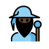 | man_mage_dark_skin_tone |  |
|  | woman_mage | sorceress, witch |
|  | woman_mage_light_skin_tone |  |
|  | woman_mage_mediumlight_skin_tone |  |
|  | woman_mage_medium_skin_tone |  |
|  | woman_mage_mediumdark_skin_tone |  |
|  | woman_mage_dark_skin_tone |  |
|  | fairy | oberon, puck, titania |
|  | fairy_light_skin_tone |  |
|  | fairy_mediumlight_skin_tone |  |
|  | fairy_medium_skin_tone |  |
|  | fairy_mediumdark_skin_tone |  |
|  | fairy_dark_skin_tone |  |
|  | man_fairy | oberon, puck |
|  | man_fairy_light_skin_tone |  |
|  | man_fairy_mediumlight_skin_tone |  |
|  | man_fairy_medium_skin_tone |  |
|  | man_fairy_mediumdark_skin_tone |  |
|  | man_fairy_dark_skin_tone |  |
|  | woman_fairy | titania |
|  | woman_fairy_light_skin_tone |  |
|  | woman_fairy_mediumlight_skin_tone |  |
|  | woman_fairy_medium_skin_tone |  |
|  | woman_fairy_mediumdark_skin_tone |  |
|  | woman_fairy_dark_skin_tone |  |
|  | vampire | dracula, undead |
|  | vampire_light_skin_tone |  |
|  | vampire_mediumlight_skin_tone |  |
|  | vampire_medium_skin_tone |  |
|  | vampire_mediumdark_skin_tone |  |
|  | vampire_dark_skin_tone |  |
|  | man_vampire | dracula, undead |
|  | man_vampire_light_skin_tone |  |
|  | man_vampire_mediumlight_skin_tone |  |
|  | man_vampire_medium_skin_tone |  |
|  | man_vampire_mediumdark_skin_tone |  |
|  | man_vampire_dark_skin_tone |  |
|  | woman_vampire | undead |
|  | woman_vampire_light_skin_tone |  |
|  | woman_vampire_mediumlight_skin_tone |  |
|  | woman_vampire_medium_skin_tone |  |
|  | woman_vampire_mediumdark_skin_tone |  |
|  | woman_vampire_dark_skin_tone |  |
|  | merperson | mermaid, merman, merwoman |
|  | merperson_light_skin_tone |  |
|  | merperson_mediumlight_skin_tone |  |
|  | merperson_medium_skin_tone |  |
|  | merperson_mediumdark_skin_tone |  |
|  | merperson_dark_skin_tone |  |
|  | merman | triton |
|  | merman_light_skin_tone |  |
|  | merman_mediumlight_skin_tone |  |
|  | merman_medium_skin_tone |  |
|  | merman_mediumdark_skin_tone |  |
|  | merman_dark_skin_tone |  |
|  | mermaid | merwoman |
| 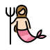 | mermaid_light_skin_tone |  |
| 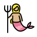 | mermaid_mediumlight_skin_tone |  |
| 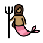 | mermaid_medium_skin_tone |  |
|  | mermaid_mediumdark_skin_tone |  |
|  | mermaid_dark_skin_tone |  |
|  | elf | magical |
|  | elf_light_skin_tone |  |
|  | elf_mediumlight_skin_tone |  |
|  | elf_medium_skin_tone |  |
|  | elf_mediumdark_skin_tone |  |
|  | elf_dark_skin_tone |  |
|  | man_elf | magical |
|  | man_elf_light_skin_tone |  |
|  | man_elf_mediumlight_skin_tone |  |
|  | man_elf_medium_skin_tone |  |
|  | man_elf_mediumdark_skin_tone |  |
|  | man_elf_dark_skin_tone |  |
|  | woman_elf | magical |
| 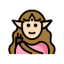 | woman_elf_light_skin_tone |  |
| 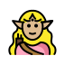 | woman_elf_mediumlight_skin_tone |  |
|  | woman_elf_medium_skin_tone |  |
|  | woman_elf_mediumdark_skin_tone |  |
|  | woman_elf_dark_skin_tone |  |
|  | genie | djinn |
|  | man_genie | djinn |
| 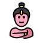 | woman_genie | djinn |
|  | zombie | undead, walking dead |
|  | man_zombie | undead, walking dead |
|  | woman_zombie | undead, walking dead |
|  | troll | fairy tale, fantasy, monster |
|  | person_getting_massage | face, massage, salon |
|  | person_getting_massage_light_skin_tone |  |
|  | person_getting_massage_mediumlight_skin_tone |  |
|  | person_getting_massage_medium_skin_tone |  |
|  | person_getting_massage_mediumdark_skin_tone |  |
|  | person_getting_massage_dark_skin_tone |  |
|  | man_getting_massage | face, man, massage |
|  | man_getting_massage_light_skin_tone |  |
|  | man_getting_massage_mediumlight_skin_tone |  |
|  | man_getting_massage_medium_skin_tone |  |
|  | man_getting_massage_mediumdark_skin_tone |  |
|  | man_getting_massage_dark_skin_tone |  |
|  | woman_getting_massage | face, massage, woman |
|  | woman_getting_massage_light_skin_tone |  |
|  | woman_getting_massage_mediumlight_skin_tone |  |
|  | woman_getting_massage_medium_skin_tone |  |
|  | woman_getting_massage_mediumdark_skin_tone |  |
|  | woman_getting_massage_dark_skin_tone |  |
|  | person_getting_haircut | barber, beauty, haircut, parlor |
|  | person_getting_haircut_light_skin_tone |  |
|  | person_getting_haircut_mediumlight_skin_tone |  |
|  | person_getting_haircut_medium_skin_tone |  |
|  | person_getting_haircut_mediumdark_skin_tone |  |
|  | person_getting_haircut_dark_skin_tone |  |
|  | man_getting_haircut | haircut, man |
|  | man_getting_haircut_light_skin_tone |  |
|  | man_getting_haircut_mediumlight_skin_tone |  |
|  | man_getting_haircut_medium_skin_tone |  |
|  | man_getting_haircut_mediumdark_skin_tone |  |
|  | man_getting_haircut_dark_skin_tone |  |
|  | woman_getting_haircut | haircut, woman |
|  | woman_getting_haircut_light_skin_tone |  |
| 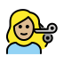 | woman_getting_haircut_mediumlight_skin_tone |  |
|  | woman_getting_haircut_medium_skin_tone |  |
|  | woman_getting_haircut_mediumdark_skin_tone |  |
|  | woman_getting_haircut_dark_skin_tone |  |
|  | person_walking | hike, walk, walking |
|  | person_walking_light_skin_tone |  |
|  | person_walking_mediumlight_skin_tone |  |
|  | person_walking_medium_skin_tone |  |
|  | person_walking_mediumdark_skin_tone |  |
|  | person_walking_dark_skin_tone |  |
|  | man_walking | hike, man, walk |
|  | man_walking_light_skin_tone |  |
|  | man_walking_mediumlight_skin_tone |  |
|  | man_walking_medium_skin_tone |  |
|  | man_walking_mediumdark_skin_tone |  |
|  | man_walking_dark_skin_tone |  |
|  | woman_walking | hike, walk, woman |
|  | woman_walking_light_skin_tone |  |
|  | woman_walking_mediumlight_skin_tone |  |
|  | woman_walking_medium_skin_tone |  |
|  | woman_walking_mediumdark_skin_tone |  |
| 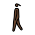 | woman_walking_dark_skin_tone |  |
|  | person_standing | stand, standing |
|  | person_standing_light_skin_tone |  |
|  | person_standing_mediumlight_skin_tone |  |
| 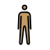 | person_standing_medium_skin_tone |  |
|  | person_standing_mediumdark_skin_tone |  |
|  | person_standing_dark_skin_tone |  |
|  | man_standing | man, standing |
|  | man_standing_light_skin_tone |  |
|  | man_standing_mediumlight_skin_tone |  |
|  | man_standing_medium_skin_tone |  |
|  | man_standing_mediumdark_skin_tone |  |
|  | man_standing_dark_skin_tone |  |
|  | woman_standing | standing, woman |
|  | woman_standing_light_skin_tone |  |
|  | woman_standing_mediumlight_skin_tone |  |
| 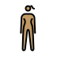 | woman_standing_medium_skin_tone |  |
|  | woman_standing_mediumdark_skin_tone |  |
|  | woman_standing_dark_skin_tone |  |
|  | person_kneeling | kneel, kneeling |
|  | person_kneeling_light_skin_tone |  |
|  | person_kneeling_mediumlight_skin_tone |  |
|  | person_kneeling_medium_skin_tone |  |
|  | person_kneeling_mediumdark_skin_tone |  |
|  | person_kneeling_dark_skin_tone |  |
|  | man_kneeling | kneeling, man |
|  | man_kneeling_light_skin_tone |  |
|  | man_kneeling_mediumlight_skin_tone |  |
|  | man_kneeling_medium_skin_tone |  |
|  | man_kneeling_mediumdark_skin_tone |  |
|  | man_kneeling_dark_skin_tone |  |
|  | woman_kneeling | kneeling, woman |
|  | woman_kneeling_light_skin_tone |  |
|  | woman_kneeling_mediumlight_skin_tone |  |
|  | woman_kneeling_medium_skin_tone |  |
|  | woman_kneeling_mediumdark_skin_tone |  |
|  | woman_kneeling_dark_skin_tone |  |
|  | person_with_white_cane | accessibility, blind |
|  | person_with_white_cane_light_skin_tone |  |
|  | person_with_white_cane_mediumlight_skin_tone |  |
|  | person_with_white_cane_medium_skin_tone |  |
| 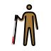 | person_with_white_cane_mediumdark_skin_tone |  |
|  | person_with_white_cane_dark_skin_tone |  |
|  | man_with_white_cane | accessibility, blind, man |
|  | man_with_white_cane_light_skin_tone |  |
|  | man_with_white_cane_mediumlight_skin_tone |  |
|  | man_with_white_cane_medium_skin_tone |  |
|  | man_with_white_cane_mediumdark_skin_tone |  |
|  | man_with_white_cane_dark_skin_tone |  |
|  | woman_with_white_cane | accessibility, blind, woman |
|  | woman_with_white_cane_light_skin_tone |  |
|  | woman_with_white_cane_mediumlight_skin_tone |  |
|  | woman_with_white_cane_medium_skin_tone |  |
|  | woman_with_white_cane_mediumdark_skin_tone |  |
|  | woman_with_white_cane_dark_skin_tone |  |
|  | person_in_motorized_wheelchair | accessibility, wheelchair |
|  | person_in_motorized_wheelchair_light_skin_tone |  |
|  | person_in_motorized_wheelchair_mediumlight_skin_tone |  |
|  | person_in_motorized_wheelchair_medium_skin_tone |  |
|  | person_in_motorized_wheelchair_mediumdark_skin_tone |  |
|  | person_in_motorized_wheelchair_dark_skin_tone |  |
|  | man_in_motorized_wheelchair | accessibility, man, wheelchair |
|  | man_in_motorized_wheelchair_light_skin_tone |  |
|  | man_in_motorized_wheelchair_mediumlight_skin_tone |  |
|  | man_in_motorized_wheelchair_medium_skin_tone |  |
|  | man_in_motorized_wheelchair_mediumdark_skin_tone |  |
|  | man_in_motorized_wheelchair_dark_skin_tone |  |
|  | woman_in_motorized_wheelchair | accessibility, wheelchair, woman |
|  | woman_in_motorized_wheelchair_light_skin_tone |  |
|  | woman_in_motorized_wheelchair_mediumlight_skin_tone |  |
|  | woman_in_motorized_wheelchair_medium_skin_tone |  |
|  | woman_in_motorized_wheelchair_mediumdark_skin_tone |  |
|  | woman_in_motorized_wheelchair_dark_skin_tone |  |
|  | person_in_manual_wheelchair | accessibility, wheelchair |
|  | person_in_manual_wheelchair_light_skin_tone |  |
|  | person_in_manual_wheelchair_mediumlight_skin_tone |  |
|  | person_in_manual_wheelchair_medium_skin_tone |  |
|  | person_in_manual_wheelchair_mediumdark_skin_tone |  |
|  | person_in_manual_wheelchair_dark_skin_tone |  |
|  | man_in_manual_wheelchair | accessibility, man, wheelchair |
|  | man_in_manual_wheelchair_light_skin_tone |  |
|  | man_in_manual_wheelchair_mediumlight_skin_tone |  |
|  | man_in_manual_wheelchair_medium_skin_tone |  |
|  | man_in_manual_wheelchair_mediumdark_skin_tone |  |
|  | man_in_manual_wheelchair_dark_skin_tone |  |
|  | woman_in_manual_wheelchair | accessibility, wheelchair, woman |
|  | woman_in_manual_wheelchair_light_skin_tone |  |
|  | woman_in_manual_wheelchair_mediumlight_skin_tone |  |
|  | woman_in_manual_wheelchair_medium_skin_tone |  |
|  | woman_in_manual_wheelchair_mediumdark_skin_tone |  |
|  | woman_in_manual_wheelchair_dark_skin_tone |  |
|  | person_running | marathon, running |
|  | person_running_light_skin_tone |  |
|  | person_running_mediumlight_skin_tone |  |
|  | person_running_medium_skin_tone |  |
|  | person_running_mediumdark_skin_tone |  |
|  | person_running_dark_skin_tone |  |
|  | man_running | man, marathon, racing, running |
|  | man_running_light_skin_tone |  |
|  | man_running_mediumlight_skin_tone |  |
|  | man_running_medium_skin_tone |  |
|  | man_running_mediumdark_skin_tone |  |
|  | man_running_dark_skin_tone |  |
|  | woman_running | marathon, racing, running, woman |
|  | woman_running_light_skin_tone |  |
|  | woman_running_mediumlight_skin_tone |  |
|  | woman_running_medium_skin_tone |  |
|  | woman_running_mediumdark_skin_tone |  |
|  | woman_running_dark_skin_tone |  |
|  | woman_dancing | dance, dancing, woman |
|  | woman_dancing_light_skin_tone |  |
|  | woman_dancing_mediumlight_skin_tone |  |
|  | woman_dancing_medium_skin_tone |  |
|  | woman_dancing_mediumdark_skin_tone |  |
|  | woman_dancing_dark_skin_tone |  |
|  | man_dancing | dance, dancing, man |
|  | man_dancing_light_skin_tone |  |
|  | man_dancing_mediumlight_skin_tone |  |
|  | man_dancing_medium_skin_tone |  |
|  | man_dancing_mediumdark_skin_tone |  |
|  | man_dancing_dark_skin_tone |  |
|  | person_in_suit_levitating | business, person, suit |
|  | person_in_suit_levitating_light_skin_tone |  |
|  | person_in_suit_levitating_mediumlight_skin_tone |  |
|  | person_in_suit_levitating_medium_skin_tone |  |
|  | person_in_suit_levitating_mediumdark_skin_tone |  |
|  | person_in_suit_levitating_dark_skin_tone |  |
|  | people_with_bunny_ears | bunny ear, dancer, partying |
|  | men_with_bunny_ears | bunny ear, dancer, men, partying |
|  | women_with_bunny_ears | bunny ear, dancer, partying, women |
|  | person_in_steamy_room | sauna, steam room |
|  | person_in_steamy_room_light_skin_tone |  |
|  | person_in_steamy_room_mediumlight_skin_tone |  |
|  | person_in_steamy_room_medium_skin_tone |  |
|  | person_in_steamy_room_mediumdark_skin_tone |  |
|  | person_in_steamy_room_dark_skin_tone |  |
|  | man_in_steamy_room | sauna, steam room |
|  | man_in_steamy_room_light_skin_tone |  |
|  | man_in_steamy_room_mediumlight_skin_tone |  |
|  | man_in_steamy_room_medium_skin_tone |  |
|  | man_in_steamy_room_mediumdark_skin_tone |  |
|  | man_in_steamy_room_dark_skin_tone |  |
|  | woman_in_steamy_room | sauna, steam room |
|  | woman_in_steamy_room_light_skin_tone |  |
|  | woman_in_steamy_room_mediumlight_skin_tone |  |
|  | woman_in_steamy_room_medium_skin_tone |  |
|  | woman_in_steamy_room_mediumdark_skin_tone |  |
|  | woman_in_steamy_room_dark_skin_tone |  |
|  | person_climbing | climber |
|  | person_climbing_light_skin_tone |  |
|  | person_climbing_mediumlight_skin_tone |  |
|  | person_climbing_medium_skin_tone |  |
|  | person_climbing_mediumdark_skin_tone |  |
|  | person_climbing_dark_skin_tone |  |
|  | man_climbing | climber |
|  | man_climbing_light_skin_tone |  |
|  | man_climbing_mediumlight_skin_tone |  |
|  | man_climbing_medium_skin_tone |  |
|  | man_climbing_mediumdark_skin_tone |  |
|  | man_climbing_dark_skin_tone |  |
|  | woman_climbing | climber |
|  | woman_climbing_light_skin_tone |  |
|  | woman_climbing_mediumlight_skin_tone |  |
|  | woman_climbing_medium_skin_tone |  |
|  | woman_climbing_mediumdark_skin_tone |  |
|  | woman_climbing_dark_skin_tone |  |
|  | person_fencing | fencer, fencing, sword |
|  | horse_racing | horse, jockey, racehorse, racing |
|  | horse_racing_light_skin_tone |  |
|  | horse_racing_mediumlight_skin_tone |  |
|  | horse_racing_medium_skin_tone |  |
|  | horse_racing_mediumdark_skin_tone |  |
|  | horse_racing_dark_skin_tone |  |
|  | skier | ski, snow |
|  | snowboarder | ski, snow, snowboard |
|  | snowboarder_light_skin_tone |  |
|  | snowboarder_mediumlight_skin_tone |  |
|  | snowboarder_medium_skin_tone |  |
|  | snowboarder_mediumdark_skin_tone |  |
|  | snowboarder_dark_skin_tone |  |
|  | person_golfing | ball, golf |
|  | person_golfing_light_skin_tone |  |
|  | person_golfing_mediumlight_skin_tone |  |
|  | person_golfing_medium_skin_tone |  |
|  | person_golfing_mediumdark_skin_tone |  |
|  | person_golfing_dark_skin_tone |  |
|  | man_golfing | golf, man |
|  | man_golfing_light_skin_tone |  |
|  | man_golfing_mediumlight_skin_tone |  |
|  | man_golfing_medium_skin_tone |  |
|  | man_golfing_mediumdark_skin_tone |  |
|  | man_golfing_dark_skin_tone |  |
|  | woman_golfing | golf, woman |
|  | woman_golfing_light_skin_tone |  |
|  | woman_golfing_mediumlight_skin_tone |  |
|  | woman_golfing_medium_skin_tone |  |
|  | woman_golfing_mediumdark_skin_tone |  |
|  | woman_golfing_dark_skin_tone |  |
|  | person_surfing | surfing |
|  | person_surfing_light_skin_tone |  |
|  | person_surfing_mediumlight_skin_tone |  |
|  | person_surfing_medium_skin_tone |  |
|  | person_surfing_mediumdark_skin_tone |  |
|  | person_surfing_dark_skin_tone |  |
|  | man_surfing | man, surfing |
|  | man_surfing_light_skin_tone |  |
|  | man_surfing_mediumlight_skin_tone |  |
|  | man_surfing_medium_skin_tone |  |
|  | man_surfing_mediumdark_skin_tone |  |
|  | man_surfing_dark_skin_tone |  |
|  | woman_surfing | surfing, woman |
|  | woman_surfing_light_skin_tone |  |
|  | woman_surfing_mediumlight_skin_tone |  |
|  | woman_surfing_medium_skin_tone |  |
|  | woman_surfing_mediumdark_skin_tone |  |
|  | woman_surfing_dark_skin_tone |  |
|  | person_rowing_boat | boat, rowboat |
|  | person_rowing_boat_light_skin_tone |  |
|  | person_rowing_boat_mediumlight_skin_tone |  |
|  | person_rowing_boat_medium_skin_tone |  |
|  | person_rowing_boat_mediumdark_skin_tone |  |
|  | person_rowing_boat_dark_skin_tone |  |
|  | man_rowing_boat | boat, man, rowboat |
|  | man_rowing_boat_light_skin_tone |  |
|  | man_rowing_boat_mediumlight_skin_tone |  |
|  | man_rowing_boat_medium_skin_tone |  |
|  | man_rowing_boat_mediumdark_skin_tone |  |
|  | man_rowing_boat_dark_skin_tone |  |
|  | woman_rowing_boat | boat, rowboat, woman |
|  | woman_rowing_boat_light_skin_tone |  |
|  | woman_rowing_boat_mediumlight_skin_tone |  |
|  | woman_rowing_boat_medium_skin_tone |  |
|  | woman_rowing_boat_mediumdark_skin_tone |  |
|  | woman_rowing_boat_dark_skin_tone |  |
|  | person_swimming | swim |
|  | person_swimming_light_skin_tone |  |
|  | person_swimming_mediumlight_skin_tone |  |
|  | person_swimming_medium_skin_tone |  |
|  | person_swimming_mediumdark_skin_tone |  |
|  | person_swimming_dark_skin_tone |  |
|  | man_swimming | man, swim |
|  | man_swimming_light_skin_tone |  |
|  | man_swimming_mediumlight_skin_tone |  |
|  | man_swimming_medium_skin_tone |  |
|  | man_swimming_mediumdark_skin_tone |  |
|  | man_swimming_dark_skin_tone |  |
|  | woman_swimming | swim, woman |
|  | woman_swimming_light_skin_tone |  |
|  | woman_swimming_mediumlight_skin_tone |  |
|  | woman_swimming_medium_skin_tone |  |
|  | woman_swimming_mediumdark_skin_tone |  |
|  | woman_swimming_dark_skin_tone |  |
|  | person_bouncing_ball | ball |
|  | person_bouncing_ball_light_skin_tone |  |
|  | person_bouncing_ball_mediumlight_skin_tone |  |
|  | person_bouncing_ball_medium_skin_tone |  |
|  | person_bouncing_ball_mediumdark_skin_tone |  |
|  | person_bouncing_ball_dark_skin_tone |  |
|  | man_bouncing_ball | ball, man |
|  | man_bouncing_ball_light_skin_tone |  |
|  | man_bouncing_ball_mediumlight_skin_tone |  |
|  | man_bouncing_ball_medium_skin_tone |  |
|  | man_bouncing_ball_mediumdark_skin_tone |  |
|  | man_bouncing_ball_dark_skin_tone |  |
|  | woman_bouncing_ball | ball, woman |
|  | woman_bouncing_ball_light_skin_tone |  |
|  | woman_bouncing_ball_mediumlight_skin_tone |  |
|  | woman_bouncing_ball_medium_skin_tone |  |
|  | woman_bouncing_ball_mediumdark_skin_tone |  |
|  | woman_bouncing_ball_dark_skin_tone |  |
|  | person_lifting_weights | lifter, weight |
|  | person_lifting_weights_light_skin_tone |  |
|  | person_lifting_weights_mediumlight_skin_tone |  |
|  | person_lifting_weights_medium_skin_tone |  |
|  | person_lifting_weights_mediumdark_skin_tone |  |
|  | person_lifting_weights_dark_skin_tone |  |
|  | man_lifting_weights | man, weight lifter |
|  | man_lifting_weights_light_skin_tone |  |
|  | man_lifting_weights_mediumlight_skin_tone |  |
|  | man_lifting_weights_medium_skin_tone |  |
|  | man_lifting_weights_mediumdark_skin_tone |  |
|  | man_lifting_weights_dark_skin_tone |  |
|  | woman_lifting_weights | weight lifter, woman |
|  | woman_lifting_weights_light_skin_tone |  |
|  | woman_lifting_weights_mediumlight_skin_tone |  |
|  | woman_lifting_weights_medium_skin_tone |  |
|  | woman_lifting_weights_mediumdark_skin_tone |  |
|  | woman_lifting_weights_dark_skin_tone |  |
|  | person_biking | bicycle, biking, cyclist |
|  | person_biking_light_skin_tone |  |
|  | person_biking_mediumlight_skin_tone |  |
|  | person_biking_medium_skin_tone |  |
|  | person_biking_mediumdark_skin_tone |  |
|  | person_biking_dark_skin_tone |  |
|  | man_biking | bicycle, biking, cyclist, man |
|  | man_biking_light_skin_tone |  |
|  | man_biking_mediumlight_skin_tone |  |
|  | man_biking_medium_skin_tone |  |
|  | man_biking_mediumdark_skin_tone |  |
|  | man_biking_dark_skin_tone |  |
|  | woman_biking | bicycle, biking, cyclist, woman |
|  | woman_biking_light_skin_tone |  |
|  | woman_biking_mediumlight_skin_tone |  |
|  | woman_biking_medium_skin_tone |  |
|  | woman_biking_mediumdark_skin_tone |  |
|  | woman_biking_dark_skin_tone |  |
|  | person_mountain_biking | bicycle, bicyclist, bike, cyclist, mountain |
|  | person_mountain_biking_light_skin_tone |  |
|  | person_mountain_biking_mediumlight_skin_tone |  |
|  | person_mountain_biking_medium_skin_tone |  |
|  | person_mountain_biking_mediumdark_skin_tone |  |
|  | person_mountain_biking_dark_skin_tone |  |
|  | man_mountain_biking | bicycle, bike, cyclist, man, mountain |
|  | man_mountain_biking_light_skin_tone |  |
|  | man_mountain_biking_mediumlight_skin_tone |  |
|  | man_mountain_biking_medium_skin_tone |  |
|  | man_mountain_biking_mediumdark_skin_tone |  |
|  | man_mountain_biking_dark_skin_tone |  |
|  | woman_mountain_biking | bicycle, bike, biking, cyclist, mountain, woman |
|  | woman_mountain_biking_light_skin_tone |  |
|  | woman_mountain_biking_mediumlight_skin_tone |  |
|  | woman_mountain_biking_medium_skin_tone |  |
|  | woman_mountain_biking_mediumdark_skin_tone |  |
|  | woman_mountain_biking_dark_skin_tone |  |
|  | person_cartwheeling | cartwheel, gymnastics |
|  | person_cartwheeling_light_skin_tone |  |
|  | person_cartwheeling_mediumlight_skin_tone |  |
|  | person_cartwheeling_medium_skin_tone |  |
|  | person_cartwheeling_mediumdark_skin_tone |  |
|  | person_cartwheeling_dark_skin_tone |  |
|  | man_cartwheeling | cartwheel, gymnastics, man |
|  | man_cartwheeling_light_skin_tone |  |
|  | man_cartwheeling_mediumlight_skin_tone |  |
|  | man_cartwheeling_medium_skin_tone |  |
|  | man_cartwheeling_mediumdark_skin_tone |  |
|  | man_cartwheeling_dark_skin_tone |  |
|  | woman_cartwheeling | cartwheel, gymnastics, woman |
|  | woman_cartwheeling_light_skin_tone |  |
|  | woman_cartwheeling_mediumlight_skin_tone |  |
|  | woman_cartwheeling_medium_skin_tone |  |
|  | woman_cartwheeling_mediumdark_skin_tone |  |
|  | woman_cartwheeling_dark_skin_tone |  |
|  | people_wrestling | wrestle, wrestler |
|  | men_wrestling | men, wrestle |
|  | women_wrestling | women, wrestle |
|  | person_playing_water_polo | polo, water |
|  | person_playing_water_polo_light_skin_tone |  |
|  | person_playing_water_polo_mediumlight_skin_tone |  |
|  | person_playing_water_polo_medium_skin_tone |  |
|  | person_playing_water_polo_mediumdark_skin_tone |  |
|  | person_playing_water_polo_dark_skin_tone |  |
|  | man_playing_water_polo | man, water polo |
|  | man_playing_water_polo_light_skin_tone |  |
|  | man_playing_water_polo_mediumlight_skin_tone |  |
|  | man_playing_water_polo_medium_skin_tone |  |
|  | man_playing_water_polo_mediumdark_skin_tone |  |
|  | man_playing_water_polo_dark_skin_tone |  |
|  | woman_playing_water_polo | water polo, woman |
|  | woman_playing_water_polo_light_skin_tone |  |
|  | woman_playing_water_polo_mediumlight_skin_tone |  |
|  | woman_playing_water_polo_medium_skin_tone |  |
|  | woman_playing_water_polo_mediumdark_skin_tone |  |
|  | woman_playing_water_polo_dark_skin_tone |  |
|  | person_playing_handball | ball, handball |
|  | person_playing_handball_light_skin_tone |  |
|  | person_playing_handball_mediumlight_skin_tone |  |
|  | person_playing_handball_medium_skin_tone |  |
|  | person_playing_handball_mediumdark_skin_tone |  |
|  | person_playing_handball_dark_skin_tone |  |
|  | man_playing_handball | handball, man |
|  | man_playing_handball_light_skin_tone |  |
|  | man_playing_handball_mediumlight_skin_tone |  |
|  | man_playing_handball_medium_skin_tone |  |
|  | man_playing_handball_mediumdark_skin_tone |  |
|  | man_playing_handball_dark_skin_tone |  |
|  | woman_playing_handball | handball, woman |
|  | woman_playing_handball_light_skin_tone |  |
|  | woman_playing_handball_mediumlight_skin_tone |  |
|  | woman_playing_handball_medium_skin_tone |  |
|  | woman_playing_handball_mediumdark_skin_tone |  |
|  | woman_playing_handball_dark_skin_tone |  |
|  | person_juggling | balance, juggle, multitask, skill |
|  | person_juggling_light_skin_tone |  |
|  | person_juggling_mediumlight_skin_tone |  |
|  | person_juggling_medium_skin_tone |  |
|  | person_juggling_mediumdark_skin_tone |  |
|  | person_juggling_dark_skin_tone |  |
|  | man_juggling | juggling, man, multitask |
|  | man_juggling_light_skin_tone |  |
|  | man_juggling_mediumlight_skin_tone |  |
|  | man_juggling_medium_skin_tone |  |
|  | man_juggling_mediumdark_skin_tone |  |
|  | man_juggling_dark_skin_tone |  |
|  | woman_juggling | juggling, multitask, woman |
|  | woman_juggling_light_skin_tone |  |
|  | woman_juggling_mediumlight_skin_tone |  |
|  | woman_juggling_medium_skin_tone |  |
|  | woman_juggling_mediumdark_skin_tone |  |
|  | woman_juggling_dark_skin_tone |  |
|  | person_in_lotus_position | meditation, yoga |
|  | person_in_lotus_position_light_skin_tone |  |
|  | person_in_lotus_position_mediumlight_skin_tone |  |
|  | person_in_lotus_position_medium_skin_tone |  |
|  | person_in_lotus_position_mediumdark_skin_tone |  |
|  | person_in_lotus_position_dark_skin_tone |  |
|  | man_in_lotus_position | meditation, yoga |
|  | man_in_lotus_position_light_skin_tone |  |
|  | man_in_lotus_position_mediumlight_skin_tone |  |
|  | man_in_lotus_position_medium_skin_tone |  |
|  | man_in_lotus_position_mediumdark_skin_tone |  |
|  | man_in_lotus_position_dark_skin_tone |  |
|  | woman_in_lotus_position | meditation, yoga |
|  | woman_in_lotus_position_light_skin_tone |  |
|  | woman_in_lotus_position_mediumlight_skin_tone |  |
|  | woman_in_lotus_position_medium_skin_tone |  |
|  | woman_in_lotus_position_mediumdark_skin_tone |  |
|  | woman_in_lotus_position_dark_skin_tone |  |
|  | person_taking_bath | bath, bathtub |
|  | person_taking_bath_light_skin_tone |  |
|  | person_taking_bath_mediumlight_skin_tone |  |
|  | person_taking_bath_medium_skin_tone |  |
|  | person_taking_bath_mediumdark_skin_tone |  |
|  | person_taking_bath_dark_skin_tone |  |
|  | person_in_bed | good night, hotel, sleep |
|  | person_in_bed_light_skin_tone |  |
|  | person_in_bed_mediumlight_skin_tone |  |
|  | person_in_bed_medium_skin_tone |  |
|  | person_in_bed_mediumdark_skin_tone |  |
|  | person_in_bed_dark_skin_tone |  |
|  | people_holding_hands | couple, hand, hold, holding hands, person |
|  | people_holding_hands_light_skin_tone |  |
|  | people_holding_hands_light_skin_tone_mediumlight_skin_tone |  |
|  | people_holding_hands_light_skin_tone_medium_skin_tone |  |
|  | people_holding_hands_light_skin_tone_mediumdark_skin_tone |  |
|  | people_holding_hands_light_skin_tone_dark_skin_tone |  |
|  | people_holding_hands_mediumlight_skin_tone_light_skin_tone |  |
|  | people_holding_hands_mediumlight_skin_tone |  |
|  | people_holding_hands_mediumlight_skin_tone_medium_skin_tone |  |
|  | people_holding_hands_mediumlight_skin_tone_mediumdark_skin_tone |  |
|  | people_holding_hands_mediumlight_skin_tone_dark_skin_tone |  |
|  | people_holding_hands_medium_skin_tone_light_skin_tone |  |
|  | people_holding_hands_medium_skin_tone_mediumlight_skin_tone |  |
|  | people_holding_hands_medium_skin_tone |  |
|  | people_holding_hands_medium_skin_tone_mediumdark_skin_tone |  |
|  | people_holding_hands_medium_skin_tone_dark_skin_tone |  |
|  | people_holding_hands_mediumdark_skin_tone_light_skin_tone |  |
|  | people_holding_hands_mediumdark_skin_tone_mediumlight_skin_tone |  |
|  | people_holding_hands_mediumdark_skin_tone_medium_skin_tone |  |
|  | people_holding_hands_mediumdark_skin_tone |  |
|  | people_holding_hands_mediumdark_skin_tone_dark_skin_tone |  |
|  | people_holding_hands_dark_skin_tone_light_skin_tone |  |
|  | people_holding_hands_dark_skin_tone_mediumlight_skin_tone |  |
|  | people_holding_hands_dark_skin_tone_medium_skin_tone |  |
|  | people_holding_hands_dark_skin_tone_mediumdark_skin_tone |  |
|  | people_holding_hands_dark_skin_tone |  |
|  | women_holding_hands | couple, hand, holding hands, women |
|  | women_holding_hands_light_skin_tone |  |
|  | women_holding_hands_light_skin_tone_mediumlight_skin_tone |  |
|  | women_holding_hands_light_skin_tone_medium_skin_tone |  |
|  | women_holding_hands_light_skin_tone_mediumdark_skin_tone |  |
|  | women_holding_hands_light_skin_tone_dark_skin_tone |  |
|  | women_holding_hands_mediumlight_skin_tone_light_skin_tone |  |
|  | women_holding_hands_mediumlight_skin_tone |  |
|  | women_holding_hands_mediumlight_skin_tone_medium_skin_tone |  |
|  | women_holding_hands_mediumlight_skin_tone_mediumdark_skin_tone |  |
|  | women_holding_hands_mediumlight_skin_tone_dark_skin_tone |  |
|  | women_holding_hands_medium_skin_tone_light_skin_tone |  |
|  | women_holding_hands_medium_skin_tone_mediumlight_skin_tone |  |
|  | women_holding_hands_medium_skin_tone |  |
|  | women_holding_hands_medium_skin_tone_mediumdark_skin_tone |  |
|  | women_holding_hands_medium_skin_tone_dark_skin_tone |  |
|  | women_holding_hands_mediumdark_skin_tone_light_skin_tone |  |
|  | women_holding_hands_mediumdark_skin_tone_mediumlight_skin_tone |  |
|  | women_holding_hands_mediumdark_skin_tone_medium_skin_tone |  |
|  | women_holding_hands_mediumdark_skin_tone |  |
|  | women_holding_hands_mediumdark_skin_tone_dark_skin_tone |  |
|  | women_holding_hands_dark_skin_tone_light_skin_tone |  |
|  | women_holding_hands_dark_skin_tone_mediumlight_skin_tone |  |
|  | women_holding_hands_dark_skin_tone_medium_skin_tone |  |
|  | women_holding_hands_dark_skin_tone_mediumdark_skin_tone |  |
|  | women_holding_hands_dark_skin_tone |  |
|  | woman_and_man_holding_hands | couple, hand, hold, holding hands, man, woman |
|  | woman_and_man_holding_hands_light_skin_tone |  |
|  | woman_and_man_holding_hands_light_skin_tone_mediumlight_skin_tone |  |
|  | woman_and_man_holding_hands_light_skin_tone_medium_skin_tone |  |
|  | woman_and_man_holding_hands_light_skin_tone_mediumdark_skin_tone |  |
|  | woman_and_man_holding_hands_light_skin_tone_dark_skin_tone |  |
|  | woman_and_man_holding_hands_mediumlight_skin_tone_light_skin_tone |  |
|  | woman_and_man_holding_hands_mediumlight_skin_tone |  |
|  | woman_and_man_holding_hands_mediumlight_skin_tone_medium_skin_tone |  |
|  | woman_and_man_holding_hands_mediumlight_skin_tone_mediumdark_skin_tone |  |
|  | woman_and_man_holding_hands_mediumlight_skin_tone_dark_skin_tone |  |
|  | woman_and_man_holding_hands_medium_skin_tone_light_skin_tone |  |
|  | woman_and_man_holding_hands_medium_skin_tone_mediumlight_skin_tone |  |
|  | woman_and_man_holding_hands_medium_skin_tone |  |
|  | woman_and_man_holding_hands_medium_skin_tone_mediumdark_skin_tone |  |
|  | woman_and_man_holding_hands_medium_skin_tone_dark_skin_tone |  |
|  | woman_and_man_holding_hands_mediumdark_skin_tone_light_skin_tone |  |
|  | woman_and_man_holding_hands_mediumdark_skin_tone_mediumlight_skin_tone |  |
|  | woman_and_man_holding_hands_mediumdark_skin_tone_medium_skin_tone |  |
|  | woman_and_man_holding_hands_mediumdark_skin_tone |  |
|  | woman_and_man_holding_hands_mediumdark_skin_tone_dark_skin_tone |  |
|  | woman_and_man_holding_hands_dark_skin_tone_light_skin_tone |  |
|  | woman_and_man_holding_hands_dark_skin_tone_mediumlight_skin_tone |  |
|  | woman_and_man_holding_hands_dark_skin_tone_medium_skin_tone |  |
|  | woman_and_man_holding_hands_dark_skin_tone_mediumdark_skin_tone |  |
|  | woman_and_man_holding_hands_dark_skin_tone |  |
|  | men_holding_hands | couple, gemini, holding hands, man, men, twins, zodiac |
|  | men_holding_hands_light_skin_tone |  |
|  | men_holding_hands_light_skin_tone_mediumlight_skin_tone |  |
|  | men_holding_hands_light_skin_tone_medium_skin_tone |  |
|  | men_holding_hands_light_skin_tone_mediumdark_skin_tone |  |
|  | men_holding_hands_light_skin_tone_dark_skin_tone |  |
|  | men_holding_hands_mediumlight_skin_tone_light_skin_tone |  |
|  | men_holding_hands_mediumlight_skin_tone |  |
|  | men_holding_hands_mediumlight_skin_tone_medium_skin_tone |  |
|  | men_holding_hands_mediumlight_skin_tone_mediumdark_skin_tone |  |
|  | men_holding_hands_mediumlight_skin_tone_dark_skin_tone |  |
|  | men_holding_hands_medium_skin_tone_light_skin_tone |  |
|  | men_holding_hands_medium_skin_tone_mediumlight_skin_tone |  |
|  | men_holding_hands_medium_skin_tone |  |
|  | men_holding_hands_medium_skin_tone_mediumdark_skin_tone |  |
|  | men_holding_hands_medium_skin_tone_dark_skin_tone |  |
|  | men_holding_hands_mediumdark_skin_tone_light_skin_tone |  |
|  | men_holding_hands_mediumdark_skin_tone_mediumlight_skin_tone |  |
|  | men_holding_hands_mediumdark_skin_tone_medium_skin_tone |  |
|  | men_holding_hands_mediumdark_skin_tone |  |
|  | men_holding_hands_mediumdark_skin_tone_dark_skin_tone |  |
|  | men_holding_hands_dark_skin_tone_light_skin_tone |  |
|  | men_holding_hands_dark_skin_tone_mediumlight_skin_tone |  |
|  | men_holding_hands_dark_skin_tone_medium_skin_tone |  |
|  | men_holding_hands_dark_skin_tone_mediumdark_skin_tone |  |
|  | men_holding_hands_dark_skin_tone |  |
|  | kiss | couple |
|  | kiss_light_skin_tone |  |
|  | kiss_mediumlight_skin_tone |  |
|  | kiss_medium_skin_tone |  |
|  | kiss_mediumdark_skin_tone |  |
|  | kiss_dark_skin_tone |  |
|  | kiss_person_person_light_skin_tone_mediumlight_skin_tone |  |
|  | kiss_person_person_light_skin_tone_medium_skin_tone |  |
|  | kiss_person_person_light_skin_tone_mediumdark_skin_tone |  |
|  | kiss_person_person_light_skin_tone_dark_skin_tone |  |
|  | kiss_person_person_mediumlight_skin_tone_light_skin_tone |  |
|  | kiss_person_person_mediumlight_skin_tone_medium_skin_tone |  |
|  | kiss_person_person_mediumlight_skin_tone_mediumdark_skin_tone |  |
|  | kiss_person_person_mediumlight_skin_tone_dark_skin_tone |  |
|  | kiss_person_person_medium_skin_tone_light_skin_tone |  |
|  | kiss_person_person_medium_skin_tone_mediumlight_skin_tone |  |
|  | kiss_person_person_medium_skin_tone_mediumdark_skin_tone |  |
|  | kiss_person_person_medium_skin_tone_dark_skin_tone |  |
|  | kiss_person_person_mediumdark_skin_tone_light_skin_tone |  |
|  | kiss_person_person_mediumdark_skin_tone_mediumlight_skin_tone |  |
|  | kiss_person_person_mediumdark_skin_tone_medium_skin_tone |  |
|  | kiss_person_person_mediumdark_skin_tone_dark_skin_tone |  |
|  | kiss_person_person_dark_skin_tone_light_skin_tone |  |
|  | kiss_person_person_dark_skin_tone_mediumlight_skin_tone |  |
|  | kiss_person_person_dark_skin_tone_medium_skin_tone |  |
|  | kiss_person_person_dark_skin_tone_mediumdark_skin_tone |  |
|  | kiss_woman_man | couple, kiss, man, woman |
|  | kiss_woman_man_light_skin_tone |  |
|  | kiss_woman_man_light_skin_tone_mediumlight_skin_tone |  |
|  | kiss_woman_man_light_skin_tone_medium_skin_tone |  |
|  | kiss_woman_man_light_skin_tone_mediumdark_skin_tone |  |
|  | kiss_woman_man_light_skin_tone_dark_skin_tone |  |
|  | kiss_woman_man_mediumlight_skin_tone_light_skin_tone |  |
|  | kiss_woman_man_mediumlight_skin_tone |  |
|  | kiss_woman_man_mediumlight_skin_tone_medium_skin_tone |  |
|  | kiss_woman_man_mediumlight_skin_tone_mediumdark_skin_tone |  |
|  | kiss_woman_man_mediumlight_skin_tone_dark_skin_tone |  |
|  | kiss_woman_man_medium_skin_tone_light_skin_tone |  |
|  | kiss_woman_man_medium_skin_tone_mediumlight_skin_tone |  |
|  | kiss_woman_man_medium_skin_tone |  |
|  | kiss_woman_man_medium_skin_tone_mediumdark_skin_tone |  |
|  | kiss_woman_man_medium_skin_tone_dark_skin_tone |  |
|  | kiss_woman_man_mediumdark_skin_tone_light_skin_tone |  |
|  | kiss_woman_man_mediumdark_skin_tone_mediumlight_skin_tone |  |
|  | kiss_woman_man_mediumdark_skin_tone_medium_skin_tone |  |
|  | kiss_woman_man_mediumdark_skin_tone |  |
|  | kiss_woman_man_mediumdark_skin_tone_dark_skin_tone |  |
|  | kiss_woman_man_dark_skin_tone_light_skin_tone |  |
|  | kiss_woman_man_dark_skin_tone_mediumlight_skin_tone |  |
|  | kiss_woman_man_dark_skin_tone_medium_skin_tone |  |
|  | kiss_woman_man_dark_skin_tone_mediumdark_skin_tone |  |
|  | kiss_woman_man_dark_skin_tone |  |
|  | kiss_man_man | couple, kiss, man |
|  | kiss_man_man_light_skin_tone |  |
|  | kiss_man_man_light_skin_tone_mediumlight_skin_tone |  |
|  | kiss_man_man_light_skin_tone_medium_skin_tone |  |
|  | kiss_man_man_light_skin_tone_mediumdark_skin_tone |  |
|  | kiss_man_man_light_skin_tone_dark_skin_tone |  |
|  | kiss_man_man_mediumlight_skin_tone_light_skin_tone |  |
|  | kiss_man_man_mediumlight_skin_tone |  |
|  | kiss_man_man_mediumlight_skin_tone_medium_skin_tone |  |
|  | kiss_man_man_mediumlight_skin_tone_mediumdark_skin_tone |  |
|  | kiss_man_man_mediumlight_skin_tone_dark_skin_tone |  |
|  | kiss_man_man_medium_skin_tone_light_skin_tone |  |
|  | kiss_man_man_medium_skin_tone_mediumlight_skin_tone |  |
|  | kiss_man_man_medium_skin_tone |  |
|  | kiss_man_man_medium_skin_tone_mediumdark_skin_tone |  |
|  | kiss_man_man_medium_skin_tone_dark_skin_tone |  |
|  | kiss_man_man_mediumdark_skin_tone_light_skin_tone |  |
|  | kiss_man_man_mediumdark_skin_tone_mediumlight_skin_tone |  |
|  | kiss_man_man_mediumdark_skin_tone_medium_skin_tone |  |
|  | kiss_man_man_mediumdark_skin_tone |  |
|  | kiss_man_man_mediumdark_skin_tone_dark_skin_tone |  |
|  | kiss_man_man_dark_skin_tone_light_skin_tone |  |
|  | kiss_man_man_dark_skin_tone_mediumlight_skin_tone |  |
|  | kiss_man_man_dark_skin_tone_medium_skin_tone |  |
|  | kiss_man_man_dark_skin_tone_mediumdark_skin_tone |  |
|  | kiss_man_man_dark_skin_tone |  |
|  | kiss_woman_woman | couple, kiss, woman |
|  | kiss_woman_woman_light_skin_tone |  |
|  | kiss_woman_woman_light_skin_tone_mediumlight_skin_tone |  |
|  | kiss_woman_woman_light_skin_tone_medium_skin_tone |  |
|  | kiss_woman_woman_light_skin_tone_mediumdark_skin_tone |  |
|  | kiss_woman_woman_light_skin_tone_dark_skin_tone |  |
|  | kiss_woman_woman_mediumlight_skin_tone_light_skin_tone |  |
|  | kiss_woman_woman_mediumlight_skin_tone |  |
|  | kiss_woman_woman_mediumlight_skin_tone_medium_skin_tone |  |
|  | kiss_woman_woman_mediumlight_skin_tone_mediumdark_skin_tone |  |
|  | kiss_woman_woman_mediumlight_skin_tone_dark_skin_tone |  |
|  | kiss_woman_woman_medium_skin_tone_light_skin_tone |  |
|  | kiss_woman_woman_medium_skin_tone_mediumlight_skin_tone |  |
|  | kiss_woman_woman_medium_skin_tone |  |
|  | kiss_woman_woman_medium_skin_tone_mediumdark_skin_tone |  |
|  | kiss_woman_woman_medium_skin_tone_dark_skin_tone |  |
|  | kiss_woman_woman_mediumdark_skin_tone_light_skin_tone |  |
|  | kiss_woman_woman_mediumdark_skin_tone_mediumlight_skin_tone |  |
|  | kiss_woman_woman_mediumdark_skin_tone_medium_skin_tone |  |
|  | kiss_woman_woman_mediumdark_skin_tone |  |
|  | kiss_woman_woman_mediumdark_skin_tone_dark_skin_tone |  |
|  | kiss_woman_woman_dark_skin_tone_light_skin_tone |  |
|  | kiss_woman_woman_dark_skin_tone_mediumlight_skin_tone |  |
|  | kiss_woman_woman_dark_skin_tone_medium_skin_tone |  |
|  | kiss_woman_woman_dark_skin_tone_mediumdark_skin_tone |  |
|  | kiss_woman_woman_dark_skin_tone |  |
|  | couple_with_heart | couple, love |
|  | couple_with_heart_light_skin_tone |  |
|  | couple_with_heart_mediumlight_skin_tone |  |
|  | couple_with_heart_medium_skin_tone |  |
|  | couple_with_heart_mediumdark_skin_tone |  |
|  | couple_with_heart_dark_skin_tone |  |
|  | couple_with_heart_person_person_light_skin_tone_mediumlight_skin_tone |  |
|  | couple_with_heart_person_person_light_skin_tone_medium_skin_tone |  |
|  | couple_with_heart_person_person_light_skin_tone_mediumdark_skin_tone |  |
|  | couple_with_heart_person_person_light_skin_tone_dark_skin_tone |  |
|  | couple_with_heart_person_person_mediumlight_skin_tone_light_skin_tone |  |
|  | couple_with_heart_person_person_mediumlight_skin_tone_medium_skin_tone |  |
|  | couple_with_heart_person_person_mediumlight_skin_tone_mediumdark_skin_tone |  |
|  | couple_with_heart_person_person_mediumlight_skin_tone_dark_skin_tone |  |
|  | couple_with_heart_person_person_medium_skin_tone_light_skin_tone |  |
|  | couple_with_heart_person_person_medium_skin_tone_mediumlight_skin_tone |  |
|  | couple_with_heart_person_person_medium_skin_tone_mediumdark_skin_tone |  |
|  | couple_with_heart_person_person_medium_skin_tone_dark_skin_tone |  |
|  | couple_with_heart_person_person_mediumdark_skin_tone_light_skin_tone |  |
|  | couple_with_heart_person_person_mediumdark_skin_tone_mediumlight_skin_tone |  |
|  | couple_with_heart_person_person_mediumdark_skin_tone_medium_skin_tone |  |
|  | couple_with_heart_person_person_mediumdark_skin_tone_dark_skin_tone |  |
|  | couple_with_heart_person_person_dark_skin_tone_light_skin_tone |  |
|  | couple_with_heart_person_person_dark_skin_tone_mediumlight_skin_tone |  |
|  | couple_with_heart_person_person_dark_skin_tone_medium_skin_tone |  |
|  | couple_with_heart_person_person_dark_skin_tone_mediumdark_skin_tone |  |
|  | couple_with_heart_woman_man | couple, couple with heart, love, man, woman |
|  | couple_with_heart_woman_man_light_skin_tone |  |
|  | couple_with_heart_woman_man_light_skin_tone_mediumlight_skin_tone |  |
|  | couple_with_heart_woman_man_light_skin_tone_medium_skin_tone |  |
|  | couple_with_heart_woman_man_light_skin_tone_mediumdark_skin_tone |  |
|  | couple_with_heart_woman_man_light_skin_tone_dark_skin_tone |  |
|  | couple_with_heart_woman_man_mediumlight_skin_tone_light_skin_tone |  |
|  | couple_with_heart_woman_man_mediumlight_skin_tone |  |
|  | couple_with_heart_woman_man_mediumlight_skin_tone_medium_skin_tone |  |
|  | couple_with_heart_woman_man_mediumlight_skin_tone_mediumdark_skin_tone |  |
|  | couple_with_heart_woman_man_mediumlight_skin_tone_dark_skin_tone |  |
|  | couple_with_heart_woman_man_medium_skin_tone_light_skin_tone |  |
|  | couple_with_heart_woman_man_medium_skin_tone_mediumlight_skin_tone |  |
|  | couple_with_heart_woman_man_medium_skin_tone |  |
|  | couple_with_heart_woman_man_medium_skin_tone_mediumdark_skin_tone |  |
|  | couple_with_heart_woman_man_medium_skin_tone_dark_skin_tone |  |
|  | couple_with_heart_woman_man_mediumdark_skin_tone_light_skin_tone |  |
|  | couple_with_heart_woman_man_mediumdark_skin_tone_mediumlight_skin_tone |  |
|  | couple_with_heart_woman_man_mediumdark_skin_tone_medium_skin_tone |  |
|  | couple_with_heart_woman_man_mediumdark_skin_tone |  |
|  | couple_with_heart_woman_man_mediumdark_skin_tone_dark_skin_tone |  |
|  | couple_with_heart_woman_man_dark_skin_tone_light_skin_tone |  |
|  | couple_with_heart_woman_man_dark_skin_tone_mediumlight_skin_tone |  |
|  | couple_with_heart_woman_man_dark_skin_tone_medium_skin_tone |  |
|  | couple_with_heart_woman_man_dark_skin_tone_mediumdark_skin_tone |  |
|  | couple_with_heart_woman_man_dark_skin_tone |  |
|  | couple_with_heart_man_man | couple, couple with heart, love, man |
|  | couple_with_heart_man_man_light_skin_tone |  |
|  | couple_with_heart_man_man_light_skin_tone_mediumlight_skin_tone |  |
|  | couple_with_heart_man_man_light_skin_tone_medium_skin_tone |  |
|  | couple_with_heart_man_man_light_skin_tone_mediumdark_skin_tone |  |
|  | couple_with_heart_man_man_light_skin_tone_dark_skin_tone |  |
|  | couple_with_heart_man_man_mediumlight_skin_tone_light_skin_tone |  |
|  | couple_with_heart_man_man_mediumlight_skin_tone |  |
|  | couple_with_heart_man_man_mediumlight_skin_tone_medium_skin_tone |  |
|  | couple_with_heart_man_man_mediumlight_skin_tone_mediumdark_skin_tone |  |
|  | couple_with_heart_man_man_mediumlight_skin_tone_dark_skin_tone |  |
|  | couple_with_heart_man_man_medium_skin_tone_light_skin_tone |  |
|  | couple_with_heart_man_man_medium_skin_tone_mediumlight_skin_tone |  |
|  | couple_with_heart_man_man_medium_skin_tone |  |
|  | couple_with_heart_man_man_medium_skin_tone_mediumdark_skin_tone |  |
|  | couple_with_heart_man_man_medium_skin_tone_dark_skin_tone |  |
|  | couple_with_heart_man_man_mediumdark_skin_tone_light_skin_tone |  |
|  | couple_with_heart_man_man_mediumdark_skin_tone_mediumlight_skin_tone |  |
|  | couple_with_heart_man_man_mediumdark_skin_tone_medium_skin_tone |  |
|  | couple_with_heart_man_man_mediumdark_skin_tone |  |
|  | couple_with_heart_man_man_mediumdark_skin_tone_dark_skin_tone |  |
|  | couple_with_heart_man_man_dark_skin_tone_light_skin_tone |  |
|  | couple_with_heart_man_man_dark_skin_tone_mediumlight_skin_tone |  |
|  | couple_with_heart_man_man_dark_skin_tone_medium_skin_tone |  |
|  | couple_with_heart_man_man_dark_skin_tone_mediumdark_skin_tone |  |
|  | couple_with_heart_man_man_dark_skin_tone |  |
|  | couple_with_heart_woman_woman | couple, couple with heart, love, woman |
|  | couple_with_heart_woman_woman_light_skin_tone |  |
|  | couple_with_heart_woman_woman_light_skin_tone_mediumlight_skin_tone |  |
|  | couple_with_heart_woman_woman_light_skin_tone_medium_skin_tone |  |
|  | couple_with_heart_woman_woman_light_skin_tone_mediumdark_skin_tone |  |
|  | couple_with_heart_woman_woman_light_skin_tone_dark_skin_tone |  |
|  | couple_with_heart_woman_woman_mediumlight_skin_tone_light_skin_tone |  |
|  | couple_with_heart_woman_woman_mediumlight_skin_tone |  |
|  | couple_with_heart_woman_woman_mediumlight_skin_tone_medium_skin_tone |  |
|  | couple_with_heart_woman_woman_mediumlight_skin_tone_mediumdark_skin_tone |  |
|  | couple_with_heart_woman_woman_mediumlight_skin_tone_dark_skin_tone |  |
|  | couple_with_heart_woman_woman_medium_skin_tone_light_skin_tone |  |
|  | couple_with_heart_woman_woman_medium_skin_tone_mediumlight_skin_tone |  |
|  | couple_with_heart_woman_woman_medium_skin_tone |  |
|  | couple_with_heart_woman_woman_medium_skin_tone_mediumdark_skin_tone |  |
|  | couple_with_heart_woman_woman_medium_skin_tone_dark_skin_tone |  |
|  | couple_with_heart_woman_woman_mediumdark_skin_tone_light_skin_tone |  |
|  | couple_with_heart_woman_woman_mediumdark_skin_tone_mediumlight_skin_tone |  |
|  | couple_with_heart_woman_woman_mediumdark_skin_tone_medium_skin_tone |  |
|  | couple_with_heart_woman_woman_mediumdark_skin_tone |  |
|  | couple_with_heart_woman_woman_mediumdark_skin_tone_dark_skin_tone |  |
|  | couple_with_heart_woman_woman_dark_skin_tone_light_skin_tone |  |
|  | couple_with_heart_woman_woman_dark_skin_tone_mediumlight_skin_tone |  |
|  | couple_with_heart_woman_woman_dark_skin_tone_medium_skin_tone |  |
|  | couple_with_heart_woman_woman_dark_skin_tone_mediumdark_skin_tone |  |
|  | couple_with_heart_woman_woman_dark_skin_tone |  |
|  | family | family |
|  | family_man_woman_boy | boy, family, man, woman |
|  | family_man_woman_girl | family, girl, man, woman |
|  | family_man_woman_girl_boy | boy, family, girl, man, woman |
|  | family_man_woman_boy_boy | boy, family, man, woman |
|  | family_man_woman_girl_girl | family, girl, man, woman |
|  | family_man_man_boy | boy, family, man |
|  | family_man_man_girl | family, girl, man |
|  | family_man_man_girl_boy | boy, family, girl, man |
|  | family_man_man_boy_boy | boy, family, man |
|  | family_man_man_girl_girl | family, girl, man |
|  | family_woman_woman_boy | boy, family, woman |
|  | family_woman_woman_girl | family, girl, woman |
|  | family_woman_woman_girl_boy | boy, family, girl, woman |
|  | family_woman_woman_boy_boy | boy, family, woman |
|  | family_woman_woman_girl_girl | family, girl, woman |
|  | family_man_boy | boy, family, man |
|  | family_man_boy_boy | boy, family, man |
|  | family_man_girl | family, girl, man |
|  | family_man_girl_boy | boy, family, girl, man |
|  | family_man_girl_girl | family, girl, man |
|  | family_woman_boy | boy, family, woman |
|  | family_woman_boy_boy | boy, family, woman |
|  | family_woman_girl | family, girl, woman |
|  | family_woman_girl_boy | boy, family, girl, woman |
|  | family_woman_girl_girl | family, girl, woman |
|  | speaking_head | face, head, silhouette, speak, speaking |
|  | bust_in_silhouette | bust, silhouette |
|  | busts_in_silhouette | bust, silhouette |
|  | people_hugging | goodbye, hello, hug, thanks |
|  | footprints | clothing, footprint, print |
|  | light_skin_tone | skin tone, type 12 |
|  | mediumlight_skin_tone | skin tone, type 3 |
|  | medium_skin_tone | skin tone, type 4 |
|  | mediumdark_skin_tone | skin tone, type 5 |
|  | dark_skin_tone | skin tone, type 6 |
|  | red_hair | ginger, redhead |
|  | curly_hair | afro, curly, ringlets |
|  | white_hair | gray, hair, old, white |
|  | bald | chemotherapy, hairless, no hair, shaven |
|  | monkey_face | face, monkey |
|  | monkey | monkey |
|  | gorilla | gorilla |
|  | orangutan | ape |
|  | dog_face | dog, face, pet |
|  | dog | pet |
|  | guide_dog | accessibility, blind, guide |
|  | service_dog | accessibility, assistance, dog, service |
|  | poodle | dog |
|  | wolf | face |
|  | fox | face |
|  | raccoon | curious, sly |
|  | cat_face | cat, face, pet |
|  | cat | pet |
|  | black_cat | black, cat, unlucky |
|  | lion | face, leo, zodiac |
|  | tiger_face | face, tiger |
|  | tiger | tiger |
|  | leopard | leopard |
|  | horse_face | face, horse |
|  | moose | animal, antlers, elk, mammal |
|  | horse | equestrian, racehorse, racing |
|  | unicorn | face |
|  | zebra | stripe |
|  | deer | deer |
|  | bison | buffalo, herd, wisent |
|  | cow_face | cow, face |
|  | ox | bull, taurus, zodiac |
|  | water_buffalo | buffalo, water |
|  | cow | cow |
|  | pig_face | face, pig |
|  | pig | sow |
|  | boar | pig |
|  | pig_nose | face, nose, pig |
|  | ram | aries, male, sheep, zodiac |
|  | ewe | female, sheep |
|  | goat | capricorn, zodiac |
|  | camel | dromedary, hump |
|  | twohump_camel | bactrian, camel, hump |
|  | llama | alpaca, guanaco, vicua, wool |
|  | giraffe | spots |
|  | elephant | elephant |
|  | mammoth | extinction, large, tusk, woolly |
|  | rhinoceros | rhinoceros |
|  | hippopotamus | hippo |
|  | mouse_face | face, mouse |
|  | mouse | mouse |
|  | rat | rat |
|  | hamster | face, pet |
|  | rabbit_face | bunny, face, pet, rabbit |
|  | rabbit | bunny, pet |
|  | chipmunk | squirrel |
|  | beaver | dam |
|  | hedgehog | spiny |
|  | bat | vampire |
|  | bear | face |
|  | polar_bear | arctic, bear, white |
|  | koala | face, marsupial |
|  | panda | face |
|  | sloth | lazy, slow |
|  | otter | fishing, playful |
|  | skunk | stink |
|  | kangaroo | joey, jump, marsupial |
|  | badger | honey badger, pester |
|  | paw_prints | feet, paw, print |
|  | turkey | bird |
|  | chicken | bird |
|  | rooster | bird |
|  | hatching_chick | baby, bird, chick, hatching |
|  | baby_chick | baby, bird, chick |
|  | frontfacing_baby_chick | baby, bird, chick |
|  | bird | bird |
|  | penguin | bird |
|  | dove | bird, fly, peace |
|  | eagle | bird |
|  | duck | bird |
|  | swan | bird, cygnet, ugly duckling |
|  | owl | bird, wise |
|  | dodo | extinction, large, mauritius |
|  | feather | bird, flight, light, plumage |
|  | flamingo | flamboyant, tropical |
|  | peacock | bird, ostentatious, peahen, proud |
|  | parrot | bird, pirate, talk |
|  | black_bird | bird, black, crow, raven, rook |
|  | frog | face |
|  | crocodile | crocodile |
|  | turtle | terrapin, tortoise |
|  | lizard | reptile |
|  | snake | bearer, ophiuchus, serpent, zodiac |
|  | dragon_face | dragon, face, fairy tale |
|  | dragon | fairy tale |
|  | sauropod | brachiosaurus, brontosaurus, diplodocus |
|  | trex | t-rex, tyrannosaurus rex |
|  | spouting_whale | face, spouting, whale |
|  | whale | whale |
|  | dolphin | flipper |
|  | seal | sea lion |
|  | fish | pisces, zodiac |
|  | tropical_fish | fish, tropical |
|  | blowfish | fish |
|  | shark | fish |
|  | octopus | octopus |
|  | spiral_shell | shell, spiral |
|  | coral | ocean, reef |
|  | snail | snail |
|  | butterfly | insect, pretty |
|  | bug | insect |
|  | ant | insect |
|  | honeybee | bee, insect |
|  | beetle | bug, insect |
|  | lady_beetle | beetle, insect, ladybird, ladybug |
|  | cricket | grasshopper |
|  | cockroach | insect, pest, roach |
|  | spider | insect |
|  | spider_web | spider, web |
|  | scorpion | scorpio, zodiac |
|  | mosquito | disease, fever, malaria, pest, virus |
|  | fly | disease, maggot, pest, rotting |
|  | worm | annelid, earthworm, parasite |
|  | microbe | amoeba, bacteria, virus |
|  | bouquet | flower |
|  | cherry_blossom | blossom, cherry, flower |
|  | white_flower | flower |
|  | lotus | buddhism, flower, hinduism, purity |
|  | rosette | plant |
|  | rose | flower |
|  | wilted_flower | flower, wilted |
|  | hibiscus | flower |
|  | sunflower | flower, sun |
|  | blossom | flower |
|  | tulip | flower |
|  | seedling | young |
|  | potted_plant | boring, grow, house, nurturing, plant, useless |
|  | evergreen_tree | tree |
|  | deciduous_tree | deciduous, shedding, tree |
|  | palm_tree | palm, tree |
|  | cactus | plant |
|  | sheaf_of_rice | ear, grain, rice |
|  | herb | leaf |
|  | shamrock | plant |
|  | four_leaf_clover | 4, clover, four, four-leaf clover, leaf |
|  | maple_leaf | falling, leaf, maple |
|  | fallen_leaf | falling, leaf |
|  | leaf_fluttering_in_wind | blow, flutter, leaf, wind |
|  | empty_nest | nesting |
|  | nest_with_eggs | nesting |
|  | mushroom | toadstool |
|  | grapes | fruit, grape |
|  | melon | fruit |
|  | watermelon | fruit |
|  | tangerine | fruit, orange |
|  | lemon | citrus, fruit |
|  | banana | fruit |
|  | pineapple | fruit |
|  | mango | fruit, tropical |
|  | red_apple | apple, fruit, red |
|  | green_apple | apple, fruit, green |
|  | pear | fruit |
|  | peach | fruit |
|  | cherries | berries, cherry, fruit, red |
|  | strawberry | berry, fruit |
|  | blueberries | berry, bilberry, blue, blueberry |
|  | kiwi_fruit | food, fruit, kiwi |
|  | tomato | fruit, vegetable |
|  | olive | food |
|  | coconut | palm, pia colada |
|  | avocado | food, fruit |
|  | eggplant | aubergine, vegetable |
|  | potato | food, vegetable |
|  | carrot | food, vegetable |
|  | ear_of_corn | corn, ear, maize, maze |
|  | hot_pepper | hot, pepper |
|  | bell_pepper | capsicum, pepper, vegetable |
|  | cucumber | food, pickle, vegetable |
|  | leafy_green | bok choy, cabbage, kale, lettuce |
|  | broccoli | wild cabbage |
|  | garlic | flavoring |
|  | onion | flavoring |
|  | peanuts | food, nut, peanut, vegetable |
|  | beans | food, kidney, legume |
|  | chestnut | plant |
|  | bread | loaf |
|  | croissant | bread, breakfast, food, french, roll |
|  | baguette_bread | baguette, bread, food, french |
|  | flatbread | arepa, lavash, naan, pita |
|  | pretzel | twisted |
|  | bagel | bakery, breakfast, schmear |
|  | pancakes | breakfast, crpe, food, hotcake, pancake |
|  | waffle | breakfast, indecisive, iron |
|  | cheese_wedge | cheese |
|  | meat_on_bone | bone, meat |
|  | poultry_leg | bone, chicken, drumstick, leg, poultry |
|  | cut_of_meat | chop, lambchop, porkchop, steak |
|  | bacon | breakfast, food, meat |
|  | hamburger | burger |
|  | french_fries | french, fries |
|  | pizza | cheese, slice |
|  | hot_dog | frankfurter, hotdog, sausage |
|  | sandwich | bread |
|  | taco | mexican |
|  | burrito | mexican, wrap |
|  | tamale | mexican, wrapped |
|  | stuffed_flatbread | falafel, flatbread, food, gyro, kebab, stuffed |
|  | falafel | chickpea, meatball |
|  | egg | breakfast, food |
|  | cooking | breakfast, egg, frying, pan |
|  | shallow_pan_of_food | casserole, food, paella, pan, shallow |
|  | pot_of_food | pot, stew |
|  | fondue | cheese, chocolate, melted, pot, swiss |
|  | bowl_with_spoon | breakfast, cereal, congee |
|  | green_salad | food, green, salad |
|  | popcorn | popcorn |
|  | butter | dairy |
|  | salt | condiment, shaker |
|  | canned_food | can |
|  | bento_box | bento, box |
|  | rice_cracker | cracker, rice |
|  | rice_ball | ball, japanese, rice |
|  | cooked_rice | cooked, rice |
|  | curry_rice | curry, rice |
|  | steaming_bowl | bowl, noodle, ramen, steaming |
|  | spaghetti | pasta |
|  | roasted_sweet_potato | potato, roasted, sweet |
|  | oden | kebab, seafood, skewer, stick |
|  | sushi | sushi |
|  | fried_shrimp | fried, prawn, shrimp, tempura |
|  | fish_cake_with_swirl | cake, fish, pastry, swirl |
|  | moon_cake | autumn, festival, yubng |
|  | dango | dessert, japanese, skewer, stick, sweet |
|  | dumpling | empanada, gyza, jiaozi, pierogi, potsticker |
|  | fortune_cookie | prophecy |
|  | takeout_box | oyster pail |
|  | crab | cancer, zodiac |
|  | lobster | bisque, claws, seafood |
|  | shrimp | food, shellfish, small |
|  | squid | food, molusc |
|  | oyster | diving, pearl |
|  | soft_ice_cream | cream, dessert, ice, icecream, soft, sweet |
|  | shaved_ice | dessert, ice, shaved, sweet |
|  | ice_cream | cream, dessert, ice, sweet |
|  | doughnut | breakfast, dessert, donut, sweet |
|  | cookie | dessert, sweet |
|  | birthday_cake | birthday, cake, celebration, dessert, pastry, sweet |
|  | shortcake | cake, dessert, pastry, slice, sweet |
|  | cupcake | bakery, sweet |
|  | pie | filling, pastry |
|  | chocolate_bar | bar, chocolate, dessert, sweet |
|  | candy | dessert, sweet |
|  | lollipop | candy, dessert, sweet |
|  | custard | dessert, pudding, sweet |
|  | honey_pot | honey, honeypot, pot, sweet |
|  | baby_bottle | baby, bottle, drink, milk |
|  | glass_of_milk | drink, glass, milk |
|  | hot_beverage | beverage, coffee, drink, hot, steaming, tea |
|  | teapot | drink, pot, tea |
|  | teacup_without_handle | beverage, cup, drink, tea, teacup |
|  | sake | bar, beverage, bottle, cup, drink |
|  | bottle_with_popping_cork | bar, bottle, cork, drink, popping |
|  | wine_glass | bar, beverage, drink, glass, wine |
|  | cocktail_glass | bar, cocktail, drink, glass |
|  | tropical_drink | bar, drink, tropical |
|  | beer_mug | bar, beer, drink, mug |
|  | clinking_beer_mugs | bar, beer, clink, drink, mug |
|  | clinking_glasses | celebrate, clink, drink, glass |
|  | tumbler_glass | glass, liquor, shot, tumbler, whisky |
|  | pouring_liquid | drink, empty, glass, spill |
|  | cup_with_straw | juice, soda |
|  | bubble_tea | bubble, milk, pearl, tea |
|  | beverage_box | beverage, box, juice, straw, sweet |
|  | mate | drink |
|  | ice | cold, ice cube, iceberg |
|  | chopsticks | hashi |
|  | fork_and_knife_with_plate | cooking, fork, knife, plate |
|  | fork_and_knife | cooking, cutlery, fork, knife |
|  | spoon | tableware |
|  | kitchen_knife | cooking, hocho, knife, tool, weapon |
|  | jar | condiment, container, empty, sauce, store |
|  | amphora | aquarius, cooking, drink, jug, zodiac |
|  | globe_showing_europeafrica | africa, earth, europe, globe, globe showing europe-africa, world |
|  | globe_showing_americas | americas, earth, globe, globe showing americas, world |
|  | globe_showing_asiaaustralia | asia, australia, earth, globe, globe showing asia-australia, world |
|  | globe_with_meridians | earth, globe, meridians, world |
|  | world_map | map, world |
|  | map_of_japan | japan, map, map of japan |
|  | compass | magnetic, navigation, orienteering |
|  | snowcapped_mountain | cold, mountain, snow |
|  | mountain | mountain |
|  | volcano | eruption, mountain |
|  | mount_fuji | fuji, mountain |
|  | camping | camping |
|  | beach_with_umbrella | beach, umbrella |
|  | desert | desert |
|  | desert_island | desert, island |
|  | national_park | park |
|  | stadium | stadium |
|  | classical_building | classical |
|  | building_construction | construction |
|  | brick | bricks, clay, mortar, wall |
|  | rock | boulder, heavy, solid, stone |
|  | wood | log, lumber, timber |
|  | hut | house, roundhouse, yurt |
|  | houses | houses |
|  | derelict_house | derelict, house |
|  | house | home |
|  | house_with_garden | garden, home, house |
|  | office_building | building |
|  | japanese_post_office | japanese, japanese post office, post |
|  | post_office | european, post |
|  | hospital | doctor, medicine |
|  | bank | building |
|  | hotel | building |
|  | love_hotel | hotel, love |
|  | convenience_store | convenience, store |
|  | school | building |
|  | department_store | department, store |
|  | factory | building |
|  | japanese_castle | castle, japanese |
|  | castle | european |
|  | wedding | chapel, romance |
|  | tokyo_tower | tokyo, tower |
|  | statue_of_liberty | liberty, statue, statue of liberty |
|  | church | christian, cross, religion |
|  | mosque | islam, muslim, religion |
|  | hindu_temple | hindu, temple |
|  | synagogue | jew, jewish, religion, temple |
|  | shinto_shrine | religion, shinto, shrine |
|  | kaaba | islam, muslim, religion |
|  | fountain | fountain |
|  | tent | camping |
|  | foggy | fog |
|  | night_with_stars | night, star |
|  | cityscape | city |
|  | sunrise_over_mountains | morning, mountain, sun, sunrise |
|  | sunrise | morning, sun |
|  | cityscape_at_dusk | city, dusk, evening, landscape, sunset |
|  | sunset | dusk, sun |
|  | bridge_at_night | bridge, night |
|  | hot_springs | hot, hotsprings, springs, steaming |
|  | carousel_horse | carousel, horse |
|  | playground_slide | amusement park, play |
|  | ferris_wheel | amusement park, ferris, wheel |
|  | roller_coaster | amusement park, coaster, roller |
|  | barber_pole | barber, haircut, pole |
|  | circus_tent | circus, tent |
|  | locomotive | engine, railway, steam, train |
|  | railway_car | car, electric, railway, train, tram, trolleybus |
|  | highspeed_train | railway, shinkansen, speed, train |
|  | bullet_train | bullet, railway, shinkansen, speed, train |
|  | train | railway |
|  | metro | subway |
|  | light_rail | railway |
|  | station | railway, train |
|  | tram | trolleybus |
|  | monorail | vehicle |
|  | mountain_railway | car, mountain, railway |
|  | tram_car | car, tram, trolleybus |
|  | bus | vehicle |
|  | oncoming_bus | bus, oncoming |
|  | trolleybus | bus, tram, trolley |
|  | minibus | bus |
|  | ambulance | vehicle |
|  | fire_engine | engine, fire, truck |
|  | police_car | car, patrol, police |
|  | oncoming_police_car | car, oncoming, police |
|  | taxi | vehicle |
|  | oncoming_taxi | oncoming, taxi |
|  | automobile | car |
|  | oncoming_automobile | automobile, car, oncoming |
|  | sport_utility_vehicle | recreational, sport utility |
|  | pickup_truck | pick-up, pickup, truck |
|  | delivery_truck | delivery, truck |
|  | articulated_lorry | lorry, semi, truck |
|  | tractor | vehicle |
|  | racing_car | car, racing |
|  | motorcycle | racing |
|  | motor_scooter | motor, scooter |
|  | manual_wheelchair | accessibility |
|  | motorized_wheelchair | accessibility |
|  | auto_rickshaw | tuk tuk |
|  | bicycle | bike |
|  | kick_scooter | kick, scooter |
|  | skateboard | board |
|  | roller_skate | roller, skate |
|  | bus_stop | bus, stop |
|  | motorway | highway, road |
|  | railway_track | railway, train |
|  | oil_drum | drum, oil |
|  | fuel_pump | diesel, fuel, fuelpump, gas, pump, station |
|  | wheel | circle, tire, turn |
|  | police_car_light | beacon, car, light, police, revolving |
|  | horizontal_traffic_light | light, signal, traffic |
|  | vertical_traffic_light | light, signal, traffic |
|  | stop_sign | octagonal, sign, stop |
|  | construction | barrier |
|  | anchor | ship, tool |
|  | ring_buoy | float, life preserver, life saver, rescue, safety |
|  | sailboat | boat, resort, sea, yacht |
|  | canoe | boat |
|  | speedboat | boat |
|  | passenger_ship | passenger, ship |
|  | ferry | boat, passenger |
|  | motor_boat | boat, motorboat |
|  | ship | boat, passenger |
|  | airplane | aeroplane |
|  | small_airplane | aeroplane, airplane |
|  | airplane_departure | aeroplane, airplane, check-in, departure, departures |
|  | airplane_arrival | aeroplane, airplane, arrivals, arriving, landing |
|  | parachute | hang-glide, parasail, skydive |
|  | seat | chair |
|  | helicopter | vehicle |
|  | suspension_railway | railway, suspension |
|  | mountain_cableway | cable, gondola, mountain |
|  | aerial_tramway | aerial, cable, car, gondola, tramway |
|  | satellite | space |
|  | rocket | space |
|  | flying_saucer | ufo |
|  | bellhop_bell | bell, bellhop, hotel |
|  | luggage | packing, travel |
|  | hourglass_done | sand, timer |
|  | hourglass_not_done | hourglass, sand, timer |
|  | watch | clock |
|  | alarm_clock | alarm, clock |
|  | stopwatch | clock |
|  | timer_clock | clock, timer |
|  | mantelpiece_clock | clock |
|  | twelve_oclock | 00, 12, 12:00, clock, oclock, twelve |
|  | twelvethirty | 12, 12:30, clock, thirty, twelve |
|  | one_oclock | 00, 1, 1:00, clock, one, oclock |
|  | onethirty | 1, 1:30, clock, one, thirty |
|  | two_oclock | 00, 2, 2:00, clock, oclock, two |
|  | twothirty | 2, 2:30, clock, thirty, two |
|  | three_oclock | 00, 3, 3:00, clock, oclock, three |
|  | threethirty | 3, 3:30, clock, thirty, three |
|  | four_oclock | 00, 4, 4:00, clock, four, oclock |
|  | fourthirty | 4, 4:30, clock, four, thirty |
|  | five_oclock | 00, 5, 5:00, clock, five, oclock |
|  | fivethirty | 5, 5:30, clock, five, thirty |
|  | six_oclock | 00, 6, 6:00, clock, oclock, six |
|  | sixthirty | 6, 6:30, clock, six, thirty |
|  | seven_oclock | 00, 7, 7:00, clock, oclock, seven |
|  | seventhirty | 7, 7:30, clock, seven, thirty |
|  | eight_oclock | 00, 8, 8:00, clock, eight, oclock |
|  | eightthirty | 8, 8:30, clock, eight, thirty |
|  | nine_oclock | 00, 9, 9:00, clock, nine, oclock |
|  | ninethirty | 9, 9:30, clock, nine, thirty |
|  | ten_oclock | 00, 10, 10:00, clock, oclock, ten |
|  | tenthirty | 10, 10:30, clock, ten, thirty |
|  | eleven_oclock | 00, 11, 11:00, clock, eleven, oclock |
|  | eleventhirty | 11, 11:30, clock, eleven, thirty |
|  | new_moon | dark, moon |
|  | waxing_crescent_moon | crescent, moon, waxing |
|  | first_quarter_moon | moon, quarter |
|  | waxing_gibbous_moon | gibbous, moon, waxing |
|  | full_moon | full, moon |
|  | waning_gibbous_moon | gibbous, moon, waning |
|  | last_quarter_moon | moon, quarter |
|  | waning_crescent_moon | crescent, moon, waning |
|  | crescent_moon | crescent, moon |
|  | new_moon_face | face, moon |
|  | first_quarter_moon_face | face, moon, quarter |
|  | last_quarter_moon_face | face, moon, quarter |
|  | thermometer | weather |
|  | sun | bright, rays, sunny |
|  | full_moon_face | bright, face, full, moon |
|  | sun_with_face | bright, face, sun |
|  | ringed_planet | saturn, saturnine |
|  | star | star |
|  | glowing_star | glittery, glow, shining, sparkle, star |
|  | shooting_star | falling, shooting, star |
|  | milky_way | space |
|  | cloud | weather |
|  | sun_behind_cloud | cloud, sun |
|  | cloud_with_lightning_and_rain | cloud, rain, thunder |
|  | sun_behind_small_cloud | cloud, sun |
|  | sun_behind_large_cloud | cloud, sun |
|  | sun_behind_rain_cloud | cloud, rain, sun |
|  | cloud_with_rain | cloud, rain |
|  | cloud_with_snow | cloud, cold, snow |
|  | cloud_with_lightning | cloud, lightning |
|  | tornado | cloud, whirlwind |
|  | fog | cloud |
|  | wind_face | blow, cloud, face, wind |
|  | cyclone | dizzy, hurricane, twister, typhoon |
|  | rainbow | rain |
|  | closed_umbrella | clothing, rain, umbrella |
|  | umbrella | clothing, rain |
|  | umbrella_with_rain_drops | clothing, drop, rain, umbrella |
|  | umbrella_on_ground | rain, sun, umbrella |
|  | high_voltage | danger, electric, lightning, voltage, zap |
|  | snowflake | cold, snow |
|  | snowman | cold, snow |
|  | snowman_without_snow | cold, snow, snowman |
|  | comet | space |
|  | fire | flame, tool |
|  | droplet | cold, comic, drop, sweat |
|  | water_wave | ocean, water, wave |
|  | jackolantern | celebration, halloween, jack, lantern |
|  | christmas_tree | celebration, christmas, tree |
|  | fireworks | celebration |
|  | sparkler | celebration, fireworks, sparkle |
|  | firecracker | dynamite, explosive, fireworks |
|  | sparkles | *, sparkle, star |
|  | balloon | celebration |
|  | party_popper | celebration, party, popper, tada |
|  | confetti_ball | ball, celebration, confetti |
|  | tanabata_tree | banner, celebration, japanese, tree |
|  | pine_decoration | bamboo, celebration, japanese, pine |
|  | japanese_dolls | celebration, doll, festival, japanese, japanese dolls |
|  | carp_streamer | carp, celebration, streamer |
|  | wind_chime | bell, celebration, chime, wind |
|  | moon_viewing_ceremony | celebration, ceremony, moon |
|  | red_envelope | gift, good luck, hngbo, lai see, money |
|  | ribbon | celebration |
|  | wrapped_gift | box, celebration, gift, present, wrapped |
|  | reminder_ribbon | celebration, reminder, ribbon |
|  | admission_tickets | admission, ticket |
|  | ticket | admission |
|  | military_medal | celebration, medal, military |
|  | trophy | prize |
|  | sports_medal | medal |
|  | 1st_place_medal | first, gold, medal |
|  | 2nd_place_medal | medal, second, silver |
|  | 3rd_place_medal | bronze, medal, third |
|  | soccer_ball | ball, football, soccer |
|  | baseball | ball |
|  | softball | ball, glove, underarm |
|  | basketball | ball, hoop |
|  | volleyball | ball, game |
|  | american_football | american, ball, football |
|  | rugby_football | ball, football, rugby |
|  | tennis | ball, racquet |
|  | flying_disc | ultimate |
|  | bowling | ball, game |
|  | cricket_game | ball, bat, game |
|  | field_hockey | ball, field, game, hockey, stick |
|  | ice_hockey | game, hockey, ice, puck, stick |
|  | lacrosse | ball, goal, stick |
|  | ping_pong | ball, bat, game, paddle, table tennis |
|  | badminton | birdie, game, racquet, shuttlecock |
|  | boxing_glove | boxing, glove |
|  | martial_arts_uniform | judo, karate, martial arts, taekwondo, uniform |
|  | goal_net | goal, net |
|  | flag_in_hole | golf, hole |
|  | ice_skate | ice, skate |
|  | fishing_pole | fish, pole |
|  | diving_mask | diving, scuba, snorkeling |
|  | running_shirt | athletics, running, sash, shirt |
|  | skis | ski, snow |
|  | sled | sledge, sleigh |
|  | curling_stone | game, rock |
|  | bullseye | dart, direct hit, game, hit, target |
|  | yoyo | fluctuate, toy |
|  | kite | fly, soar |
|  | water_pistol | gun, handgun, pistol, revolver, tool, water, weapon |
|  | pool_8_ball | 8, ball, billiard, eight, game |
|  | crystal_ball | ball, crystal, fairy tale, fantasy, fortune, tool |
|  | magic_wand | magic, witch, wizard |
|  | video_game | controller, game |
|  | joystick | game, video game |
|  | slot_machine | game, slot |
|  | game_die | dice, die, game |
|  | puzzle_piece | clue, interlocking, jigsaw, piece, puzzle |
|  | teddy_bear | plaything, plush, stuffed, toy |
|  | piata | celebration, party |
|  | mirror_ball | dance, disco, glitter, party |
|  | nesting_dolls | doll, nesting, russia |
|  | spade_suit | card, game |
|  | heart_suit | card, game |
|  | diamond_suit | card, game |
|  | club_suit | card, game |
|  | chess_pawn | chess, dupe, expendable |
|  | joker | card, game, wildcard |
|  | mahjong_red_dragon | game, mahjong, red |
|  | flower_playing_cards | card, flower, game, japanese, playing |
|  | performing_arts | art, mask, performing, theater, theatre |
|  | framed_picture | art, frame, museum, painting, picture |
|  | artist_palette | art, museum, painting, palette |
|  | thread | needle, sewing, spool, string |
|  | sewing_needle | embroidery, needle, sewing, stitches, sutures, tailoring |
|  | yarn | ball, crochet, knit |
|  | knot | rope, tangled, tie, twine, twist |
|  | glasses | clothing, eye, eyeglasses, eyewear |
|  | sunglasses | dark, eye, eyewear, glasses |
|  | goggles | eye protection, swimming, welding |
|  | lab_coat | doctor, experiment, scientist |
|  | safety_vest | emergency, safety, vest |
|  | necktie | clothing, tie |
|  | tshirt | clothing, shirt, tshirt |
|  | jeans | clothing, pants, trousers |
|  | scarf | neck |
|  | gloves | hand |
|  | coat | jacket |
|  | socks | stocking |
|  | dress | clothing |
|  | kimono | clothing |
|  | sari | clothing, dress |
|  | onepiece_swimsuit | bathing suit |
|  | briefs | bathing suit, one-piece, swimsuit, underwear |
|  | shorts | bathing suit, pants, underwear |
|  | bikini | clothing, swim |
|  | womans_clothes | clothing, woman |
|  | purse | clothing, coin |
|  | handbag | bag, clothing, purse |
|  | clutch_bag | bag, clothing, pouch |
|  | shopping_bags | bag, hotel, shopping |
|  | backpack | bag, rucksack, satchel, school |
|  | thong_sandal | beach sandals, sandals, thong sandals, thongs, zri |
|  | mans_shoe | clothing, man, shoe |
|  | running_shoe | athletic, clothing, shoe, sneaker |
|  | hiking_boot | backpacking, boot, camping, hiking |
|  | flat_shoe | ballet flat, slip-on, slipper |
|  | highheeled_shoe | clothing, heel, shoe, woman |
|  | womans_sandal | clothing, sandal, shoe, woman |
|  | ballet_shoes | ballet, dance |
|  | womans_boot | boot, clothing, shoe, woman |
|  | crown | clothing, king, queen |
|  | womans_hat | clothing, hat, woman |
|  | top_hat | clothing, hat, top, tophat |
|  | graduation_cap | cap, celebration, clothing, graduation, hat |
|  | billed_cap | baseball cap |
|  | military_helmet | army, helmet, military, soldier, warrior |
|  | rescue_workers_helmet | aid, cross, face, hat, helmet |
|  | prayer_beads | beads, clothing, necklace, prayer, religion |
|  | lipstick | cosmetics, makeup |
|  | ring | diamond |
|  | gem_stone | diamond, gem, jewel |
|  | muted_speaker | mute, quiet, silent, speaker |
|  | speaker_low_volume | soft |
|  | speaker_medium_volume | medium |
|  | speaker_high_volume | loud |
|  | loudspeaker | loud, public address |
|  | megaphone | cheering |
|  | postal_horn | horn, post, postal |
|  | bell | bell |
|  | bell_with_slash | bell, forbidden, mute, quiet, silent |
|  | musical_score | music, score |
|  | musical_note | music, note |
|  | musical_notes | music, note, notes |
|  | studio_microphone | mic, microphone, music, studio |
|  | level_slider | level, music, slider |
|  | control_knobs | control, knobs, music |
|  | microphone | karaoke, mic |
|  | headphone | earbud |
|  | radio | video |
|  | saxophone | instrument, music, sax |
|  | accordion | concertina, squeeze box |
|  | guitar | instrument, music |
|  | musical_keyboard | instrument, keyboard, music, piano |
|  | trumpet | instrument, music |
|  | violin | instrument, music |
|  | banjo | music, stringed |
|  | drum | drumsticks, music |
|  | long_drum | beat, conga, drum, rhythm |
|  | mobile_phone | cell, mobile, phone, telephone |
|  | mobile_phone_with_arrow | arrow, cell, mobile, phone, receive |
|  | telephone | phone |
|  | telephone_receiver | phone, receiver, telephone |
|  | pager | pager |
|  | fax_machine | fax |
|  | battery | battery |
|  | low_battery | electronic, low energy |
|  | electric_plug | electric, electricity, plug |
|  | laptop | computer, pc, personal |
|  | desktop_computer | computer, desktop |
|  | printer | computer |
|  | keyboard | computer |
|  | computer_mouse | computer |
|  | trackball | computer |
|  | computer_disk | computer, disk, minidisk, optical |
|  | floppy_disk | computer, disk, floppy |
|  | optical_disk | cd, computer, disk, optical |
|  | dvd | blu-ray, computer, disk, optical |
|  | abacus | calculation |
|  | movie_camera | camera, cinema, movie |
|  | film_frames | cinema, film, frames, movie |
|  | film_projector | cinema, film, movie, projector, video |
|  | clapper_board | clapper, movie |
|  | television | tv, video |
|  | camera | video |
|  | camera_with_flash | camera, flash, video |
|  | video_camera | camera, video |
|  | videocassette | tape, vhs, video |
|  | magnifying_glass_tilted_left | glass, magnifying, search, tool |
|  | magnifying_glass_tilted_right | glass, magnifying, search, tool |
|  | candle | light |
|  | light_bulb | bulb, comic, electric, idea, light |
|  | flashlight | electric, light, tool, torch |
|  | red_paper_lantern | bar, lantern, light, red |
|  | diya_lamp | diya, lamp, oil |
|  | notebook_with_decorative_cover | book, cover, decorated, notebook |
|  | closed_book | book, closed |
|  | open_book | book, open |
|  | green_book | book, green |
|  | blue_book | blue, book |
|  | orange_book | book, orange |
|  | books | book |
|  | notebook | notebook |
|  | ledger | notebook |
|  | page_with_curl | curl, document, page |
|  | scroll | paper |
|  | page_facing_up | document, page |
|  | newspaper | news, paper |
|  | rolledup_newspaper | news, newspaper, paper, rolled |
|  | bookmark_tabs | bookmark, mark, marker, tabs |
|  | bookmark | mark |
|  | label | label |
|  | money_bag | bag, dollar, money, moneybag |
|  | coin | gold, metal, money, silver, treasure |
|  | yen_banknote | banknote, bill, currency, money, note, yen |
|  | dollar_banknote | banknote, bill, currency, dollar, money, note |
|  | euro_banknote | banknote, bill, currency, euro, money, note |
|  | pound_banknote | banknote, bill, currency, money, note, pound |
|  | money_with_wings | banknote, bill, fly, money, wings |
|  | credit_card | card, credit, money |
|  | receipt | accounting, bookkeeping, evidence, proof |
|  | chart_increasing_with_yen | chart, graph, growth, money, yen |
|  | envelope | email, letter |
|  | email | email, letter, mail |
|  | incoming_envelope | e-mail, email, envelope, incoming, letter, receive |
|  | envelope_with_arrow | arrow, e-mail, email, envelope, outgoing |
|  | outbox_tray | box, letter, mail, outbox, sent, tray |
|  | inbox_tray | box, inbox, letter, mail, receive, tray |
|  | package | box, parcel |
|  | closed_mailbox_with_raised_flag | closed, mail, mailbox, postbox |
|  | closed_mailbox_with_lowered_flag | closed, lowered, mail, mailbox, postbox |
|  | open_mailbox_with_raised_flag | mail, mailbox, open, postbox |
|  | open_mailbox_with_lowered_flag | lowered, mail, mailbox, open, postbox |
|  | postbox | mail, mailbox |
|  | ballot_box_with_ballot | ballot, box |
|  | pencil | pencil |
|  | black_nib | nib, pen |
|  | fountain_pen | fountain, pen |
|  | pen | ballpoint |
|  | paintbrush | painting |
|  | crayon | crayon |
|  | memo | pencil |
|  | briefcase | briefcase |
|  | file_folder | file, folder |
|  | open_file_folder | file, folder, open |
|  | card_index_dividers | card, dividers, index |
|  | calendar | date |
|  | tearoff_calendar | calendar |
|  | spiral_notepad | note, pad, spiral |
|  | spiral_calendar | calendar, pad, spiral |
|  | card_index | card, index, rolodex |
|  | chart_increasing | chart, graph, growth, trend, upward |
|  | chart_decreasing | chart, down, graph, trend |
|  | bar_chart | bar, chart, graph |
|  | clipboard | clipboard |
|  | pushpin | pin |
|  | round_pushpin | pin, pushpin |
|  | paperclip | paperclip |
|  | linked_paperclips | link, paperclip |
|  | straight_ruler | ruler, straight edge |
|  | triangular_ruler | ruler, set, triangle |
|  | scissors | cutting, tool |
|  | card_file_box | box, card, file |
|  | file_cabinet | cabinet, file, filing |
|  | wastebasket | wastebasket |
|  | locked | closed |
|  | unlocked | lock, open, unlock |
|  | locked_with_pen | ink, lock, nib, pen, privacy |
|  | locked_with_key | closed, key, lock, secure |
|  | key | lock, password |
|  | old_key | clue, key, lock, old |
|  | hammer | tool |
|  | axe | chop, hatchet, split, wood |
|  | pick | mining, tool |
|  | hammer_and_pick | hammer, pick, tool |
|  | hammer_and_wrench | hammer, spanner, tool, wrench |
|  | dagger | knife, weapon |
|  | crossed_swords | crossed, swords, weapon |
|  | bomb | comic |
|  | boomerang | rebound, repercussion |
|  | bow_and_arrow | archer, arrow, bow, sagittarius, zodiac |
|  | shield | weapon |
|  | carpentry_saw | carpenter, lumber, saw, tool |
|  | wrench | spanner, tool |
|  | screwdriver | screw, tool |
|  | nut_and_bolt | bolt, nut, tool |
|  | gear | cog, cogwheel, tool |
|  | clamp | compress, tool, vice |
|  | balance_scale | balance, justice, libra, scale, zodiac |
|  | white_cane | accessibility, blind |
|  | link | link |
|  | chains | chain |
|  | hook | catch, crook, curve, ensnare, selling point |
|  | toolbox | chest, mechanic, tool |
|  | magnet | attraction, horseshoe, magnetic |
|  | ladder | climb, rung, step |
|  | alembic | chemistry, tool |
|  | test_tube | chemist, chemistry, experiment, lab, science |
|  | petri_dish | bacteria, biologist, biology, culture, lab |
|  | dna | biologist, evolution, gene, genetics, life |
|  | microscope | science, tool |
|  | telescope | science, tool |
|  | satellite_antenna | antenna, dish, satellite |
|  | syringe | medicine, needle, shot, sick |
|  | drop_of_blood | bleed, blood donation, injury, medicine, menstruation |
|  | pill | doctor, medicine, sick |
|  | adhesive_bandage | bandage |
|  | crutch | cane, disability, hurt, mobility aid, stick |
|  | stethoscope | doctor, heart, medicine |
|  | xray | bones, doctor, medical, skeleton |
|  | door | door |
|  | elevator | accessibility, hoist, lift |
|  | mirror | reflection, reflector, speculum |
|  | window | frame, fresh air, opening, transparent, view |
|  | bed | hotel, sleep |
|  | couch_and_lamp | couch, hotel, lamp |
|  | chair | seat, sit |
|  | toilet | toilet |
|  | plunger | force cup, plumber, suction, toilet |
|  | shower | water |
|  | bathtub | bath |
|  | mouse_trap | bait, mousetrap, snare, trap |
|  | razor | sharp, shave |
|  | lotion_bottle | lotion, moisturizer, shampoo, sunscreen |
|  | safety_pin | diaper, punk rock |
|  | broom | cleaning, sweeping, witch |
|  | basket | farming, laundry, picnic |
|  | roll_of_paper | paper towels, toilet paper |
|  | bucket | cask, pail, vat |
|  | soap | bar, bathing, cleaning, lather, soapdish |
|  | bubbles | burp, clean, soap, underwater |
|  | toothbrush | bathroom, brush, clean, dental, hygiene, teeth |
|  | sponge | absorbing, cleaning, porous |
|  | fire_extinguisher | extinguish, fire, quench |
|  | shopping_cart | cart, shopping, trolley |
|  | cigarette | smoking |
|  | coffin | death |
|  | headstone | cemetery, grave, graveyard, tombstone |
|  | funeral_urn | ashes, death, funeral, urn |
|  | nazar_amulet | bead, charm, evil-eye, nazar, talisman |
|  | hamsa | amulet, fatima, hand, mary, miriam, protection |
|  | moai | face, moyai, statue |
|  | placard | demonstration, picket, protest, sign |
|  | identification_card | credentials, id, license, security |
|  | atm_sign | atm, atm sign, automated, bank, teller |
|  | litter_in_bin_sign | litter, litter bin |
|  | potable_water | drinking, potable, water |
|  | wheelchair_symbol | access |
|  | mens_room | bathroom, lavatory, man, restroom, toilet, wc |
|  | womens_room | bathroom, lavatory, restroom, toilet, wc, woman |
|  | restroom | bathroom, lavatory, toilet, wc |
|  | baby_symbol | baby, changing |
|  | water_closet | bathroom, closet, lavatory, restroom, toilet, water, wc |
|  | passport_control | control, passport |
|  | customs | customs |
|  | baggage_claim | baggage, claim |
|  | left_luggage | baggage, locker, luggage |
|  | warning | warning |
|  | children_crossing | child, crossing, pedestrian, traffic |
|  | no_entry | entry, forbidden, no, not, prohibited, traffic |
|  | prohibited | entry, forbidden, no, not |
|  | no_bicycles | bicycle, bike, forbidden, no, prohibited |
|  | no_smoking | forbidden, no, not, prohibited, smoking |
|  | no_littering | forbidden, litter, no, not, prohibited |
|  | nonpotable_water | non-drinking, non-potable, water |
|  | no_pedestrians | forbidden, no, not, pedestrian, prohibited |
|  | no_mobile_phones | cell, forbidden, mobile, no, phone |
|  | no_one_under_eighteen | 18, age restriction, eighteen, prohibited, underage |
|  | radioactive | sign |
|  | biohazard | sign |
|  | up_arrow | arrow, cardinal, direction, north |
|  | upright_arrow | arrow, direction, intercardinal, northeast |
|  | right_arrow | arrow, cardinal, direction, east |
|  | downright_arrow | arrow, direction, intercardinal, southeast |
|  | down_arrow | arrow, cardinal, direction, down, south |
|  | downleft_arrow | arrow, direction, intercardinal, southwest |
|  | left_arrow | arrow, cardinal, direction, west |
|  | upleft_arrow | arrow, direction, intercardinal, northwest |
|  | updown_arrow | arrow |
|  | leftright_arrow | arrow |
|  | right_arrow_curving_left | arrow |
|  | left_arrow_curving_right | arrow |
|  | right_arrow_curving_up | arrow |
|  | right_arrow_curving_down | arrow, down |
|  | clockwise_vertical_arrows | arrow, clockwise, reload |
|  | counterclockwise_arrows_button | anticlockwise, arrow, counterclockwise, withershins |
|  | back_arrow | arrow, back |
|  | end_arrow | arrow, end |
|  | on_arrow | arrow, mark, on, on! |
|  | soon_arrow | arrow, soon |
|  | top_arrow | arrow, top, up |
|  | place_of_worship | religion, worship |
|  | atom_symbol | atheist, atom |
|  | om | hindu, religion |
|  | star_of_david | david, jew, jewish, religion, star, star of david |
|  | wheel_of_dharma | buddhist, dharma, religion, wheel |
|  | yin_yang | religion, tao, taoist, yang, yin |
|  | latin_cross | christian, cross, religion |
|  | orthodox_cross | christian, cross, religion |
|  | star_and_crescent | islam, muslim, religion |
|  | peace_symbol | peace |
|  | menorah | candelabrum, candlestick, religion |
|  | dotted_sixpointed_star | fortune, star |
|  | aries | aries, ram, zodiac |
|  | taurus | bull, ox, taurus, zodiac |
|  | gemini | gemini, twins, zodiac |
|  | cancer | cancer, crab, zodiac |
|  | leo | leo, lion, zodiac |
|  | virgo | virgo, zodiac |
|  | libra | balance, justice, libra, scales, zodiac |
|  | scorpio | scorpio, scorpion, scorpius, zodiac |
|  | sagittarius | archer, sagittarius, zodiac |
|  | capricorn | capricorn, goat, zodiac |
|  | aquarius | aquarius, bearer, water, zodiac |
|  | pisces | fish, pisces, zodiac |
|  | ophiuchus | bearer, ophiuchus, serpent, snake, zodiac |
|  | shuffle_tracks_button | arrow, crossed |
|  | repeat_button | arrow, clockwise, repeat |
|  | repeat_single_button | arrow, clockwise, once |
|  | play_button | arrow, play, right, triangle |
|  | fastforward_button | arrow, double, fast, forward |
|  | next_track_button | arrow, next scene, next track, triangle |
|  | play_or_pause_button | arrow, pause, play, right, triangle |
|  | reverse_button | arrow, left, reverse, triangle |
|  | fast_reverse_button | arrow, double, rewind |
|  | last_track_button | arrow, previous scene, previous track, triangle |
|  | upwards_button | arrow, button |
|  | fast_up_button | arrow, double |
|  | downwards_button | arrow, button, down |
|  | fast_down_button | arrow, double, down |
|  | pause_button | bar, double, pause, vertical |
|  | stop_button | square, stop |
|  | record_button | circle, record |
|  | eject_button | eject |
|  | cinema | camera, film, movie |
|  | dim_button | brightness, dim, low |
|  | bright_button | bright, brightness |
|  | antenna_bars | antenna, bar, cell, mobile, phone |
|  | vibration_mode | cell, mobile, mode, phone, telephone, vibration |
|  | mobile_phone_off | cell, mobile, off, phone, telephone |
|  | female_sign | woman |
|  | male_sign | man |
|  | transgender_symbol | transgender |
|  | multiply | cancel, multiplication, sign, x,  |
|  | plus | +, math, sign |
|  | minus | -, math, sign,  |
|  | divide | division, math, sign,  |
|  | heavy_equals_sign | equality, math |
|  | infinity | forever, unbounded, universal |
|  | double_exclamation_mark | !, !!, bangbang, exclamation, mark |
|  | exclamation_question_mark | !, !?, ?, exclamation, interrobang, mark, punctuation, question |
|  | red_question_mark | ?, mark, punctuation, question |
|  | white_question_mark | ?, mark, outlined, punctuation, question |
|  | white_exclamation_mark | !, exclamation, mark, outlined, punctuation |
|  | red_exclamation_mark | !, exclamation, mark, punctuation |
|  | wavy_dash | dash, punctuation, wavy |
|  | currency_exchange | bank, currency, exchange, money |
|  | heavy_dollar_sign | currency, dollar, money |
|  | medical_symbol | aesculapius, medicine, staff |
|  | recycling_symbol | recycle |
|  | fleurdelis | fleur-de-lis |
|  | trident_emblem | anchor, emblem, ship, tool, trident |
|  | name_badge | badge, name |
|  | japanese_symbol_for_beginner | beginner, chevron, japanese, japanese symbol for beginner, leaf |
|  | hollow_red_circle | circle, large, o, red |
|  | check_mark_button | button, check, mark,  |
|  | check_box_with_check | box, check,  |
|  | check_mark | check, mark,  |
|  | cross_mark | cancel, cross, mark, multiplication, multiply, x,  |
|  | cross_mark_button | mark, square, x,  |
|  | curly_loop | curl, loop |
|  | double_curly_loop | curl, double, loop |
|  | part_alternation_mark | mark, part |
|  | eightspoked_asterisk | *, asterisk |
|  | eightpointed_star | *, star |
|  | sparkle | * |
|  | copyright | c |
|  | registered | r |
|  | trade_mark | mark, tm, trademark |
|  | keycap_ | keycap |
|  | keycap_ | keycap |
|  | keycap_0 | keycap |
|  | keycap_1 | keycap |
|  | keycap_2 | keycap |
|  | keycap_3 | keycap |
|  | keycap_4 | keycap |
|  | keycap_5 | keycap |
|  | keycap_6 | keycap |
|  | keycap_7 | keycap |
|  | keycap_8 | keycap |
|  | keycap_9 | keycap |
|  | keycap_10 | keycap |
|  | input_latin_uppercase | abcd, input, latin, letters, uppercase |
|  | input_latin_lowercase | abcd, input, latin, letters, lowercase |
|  | input_numbers | 1234, input, numbers |
|  | input_symbols | input, &% |
|  | input_latin_letters | abc, alphabet, input, latin, letters |
|  | a_button_blood_type | a, a button (blood type), blood type |
|  | ab_button_blood_type | ab, ab button (blood type), blood type |
|  | b_button_blood_type | b, b button (blood type), blood type |
|  | cl_button | cl, cl button |
|  | cool_button | cool, cool button |
|  | free_button | free, free button |
|  | information | i |
|  | id_button | id, id button, identity |
|  | circled_m | circle, circled m, m |
|  | new_button | new, new button |
|  | ng_button | ng, ng button |
|  | o_button_blood_type | blood type, o, o button (blood type) |
|  | ok_button | ok, ok button |
|  | p_button | p, p button, parking |
|  | sos_button | help, sos, sos button |
|  | up_button | mark, up, up!, up! button |
|  | vs_button | versus, vs, vs button |
|  | japanese_here_button | japanese, japanese here button, katakana, here,  |
|  | japanese_service_charge_button | japanese, japanese service charge button, katakana, service charge,  |
|  | japanese_monthly_amount_button | ideograph, japanese, japanese monthly amount button, monthly amount,  |
|  | japanese_not_free_of_charge_button | ideograph, japanese, japanese not free of charge button, not free of charge,  |
|  | japanese_reserved_button | ideograph, japanese, japanese reserved button, reserved,  |
|  | japanese_bargain_button | ideograph, japanese, japanese bargain button, bargain,  |
|  | japanese_discount_button | ideograph, japanese, japanese discount button, discount,  |
|  | japanese_free_of_charge_button | ideograph, japanese, japanese free of charge button, free of charge,  |
|  | japanese_prohibited_button | ideograph, japanese, japanese prohibited button, prohibited,  |
|  | japanese_acceptable_button | ideograph, japanese, japanese acceptable button, acceptable,  |
|  | japanese_application_button | ideograph, japanese, japanese application button, application,  |
|  | japanese_passing_grade_button | ideograph, japanese, japanese passing grade button, passing grade,  |
|  | japanese_vacancy_button | ideograph, japanese, japanese vacancy button, vacancy,  |
|  | japanese_congratulations_button | ideograph, japanese, japanese congratulations button, congratulations,  |
|  | japanese_secret_button | ideograph, japanese, japanese secret button, secret,  |
|  | japanese_open_for_business_button | ideograph, japanese, japanese open for business button, open for business,  |
|  | japanese_no_vacancy_button | ideograph, japanese, japanese no vacancy button, no vacancy,  |
|  | red_circle | circle, geometric, red |
|  | orange_circle | circle, orange |
|  | yellow_circle | circle, yellow |
|  | green_circle | circle, green |
|  | blue_circle | blue, circle, geometric |
|  | purple_circle | circle, purple |
|  | brown_circle | brown, circle |
|  | black_circle | circle, geometric |
|  | white_circle | circle, geometric |
|  | red_square | red, square |
|  | orange_square | orange, square |
|  | yellow_square | square, yellow |
|  | green_square | green, square |
|  | blue_square | blue, square |
|  | purple_square | purple, square |
|  | brown_square | brown, square |
|  | black_large_square | geometric, square |
|  | white_large_square | geometric, square |
|  | black_medium_square | geometric, square |
|  | white_medium_square | geometric, square |
|  | black_mediumsmall_square | geometric, square |
|  | white_mediumsmall_square | geometric, square |
|  | black_small_square | geometric, square |
|  | white_small_square | geometric, square |
|  | large_orange_diamond | diamond, geometric, orange |
|  | large_blue_diamond | blue, diamond, geometric |
|  | small_orange_diamond | diamond, geometric, orange |
|  | small_blue_diamond | blue, diamond, geometric |
|  | red_triangle_pointed_up | geometric, red |
|  | red_triangle_pointed_down | down, geometric, red |
|  | diamond_with_a_dot | comic, diamond, geometric, inside |
|  | radio_button | button, geometric, radio |
|  | white_square_button | button, geometric, outlined, square |
|  | black_square_button | button, geometric, square |
|  | chequered_flag | checkered, chequered, racing |
|  | triangular_flag | post |
|  | crossed_flags | celebration, cross, crossed, japanese |
|  | black_flag | waving |
|  | white_flag | waving |
|  | rainbow_flag | pride, rainbow |
|  | transgender_flag | flag, light blue, pink, transgender, white |
|  | pirate_flag | jolly roger, pirate, plunder, treasure |
|  | flag_ascension_island | AC, flag |
|  | flag_andorra | AD, flag |
|  | flag_united_arab_emirates | AE, flag |
|  | flag_afghanistan | AF, flag |
|  | flag_antigua__barbuda | AG, flag |
|  | flag_anguilla | AI, flag |
|  | flag_albania | AL, flag |
|  | flag_armenia | AM, flag |
|  | flag_angola | AO, flag |
|  | flag_antarctica | AQ, flag |
|  | flag_argentina | AR, flag |
|  | flag_american_samoa | AS, flag |
|  | flag_austria | AT, flag |
|  | flag_australia | AU, flag |
|  | flag_aruba | AW, flag |
|  | flag_land_islands | AX, flag |
|  | flag_azerbaijan | AZ, flag |
|  | flag_bosnia__herzegovina | BA, flag |
|  | flag_barbados | BB, flag |
|  | flag_bangladesh | BD, flag |
|  | flag_belgium | BE, flag |
|  | flag_burkina_faso | BF, flag |
|  | flag_bulgaria | BG, flag |
|  | flag_bahrain | BH, flag |
|  | flag_burundi | BI, flag |
|  | flag_benin | BJ, flag |
|  | flag_st_barthlemy | BL, flag |
|  | flag_bermuda | BM, flag |
|  | flag_brunei | BN, flag |
|  | flag_bolivia | BO, flag |
|  | flag_caribbean_netherlands | BQ, flag |
|  | flag_brazil | BR, flag |
|  | flag_bahamas | BS, flag |
|  | flag_bhutan | BT, flag |
|  | flag_bouvet_island | BV, flag |
|  | flag_botswana | BW, flag |
|  | flag_belarus | BY, flag |
|  | flag_belize | BZ, flag |
|  | flag_canada | CA, flag |
|  | flag_cocos_keeling_islands | CC, flag |
|  | flag_congo__kinshasa | CD, flag |
|  | flag_central_african_republic | CF, flag |
|  | flag_congo__brazzaville | CG, flag |
|  | flag_switzerland | CH, flag |
|  | flag_cte_divoire | CI, flag |
|  | flag_cook_islands | CK, flag |
|  | flag_chile | CL, flag |
|  | flag_cameroon | CM, flag |
|  | flag_china | CN, flag |
|  | flag_colombia | CO, flag |
|  | flag_clipperton_island | CP, flag |
|  | flag_costa_rica | CR, flag |
|  | flag_cuba | CU, flag |
|  | flag_cape_verde | CV, flag |
|  | flag_curaao | CW, flag |
|  | flag_christmas_island | CX, flag |
|  | flag_cyprus | CY, flag |
|  | flag_czechia | CZ, flag |
|  | flag_germany | DE, flag |
|  | flag_diego_garcia | DG, flag |
|  | flag_djibouti | DJ, flag |
|  | flag_denmark | DK, flag |
|  | flag_dominica | DM, flag |
|  | flag_dominican_republic | DO, flag |
|  | flag_algeria | DZ, flag |
|  | flag_ceuta__melilla | EA, flag |
|  | flag_ecuador | EC, flag |
|  | flag_estonia | EE, flag |
|  | flag_egypt | EG, flag |
|  | flag_western_sahara | EH, flag |
|  | flag_eritrea | ER, flag |
|  | flag_spain | ES, flag |
|  | flag_ethiopia | ET, flag |
|  | flag_european_union | EU, flag |
|  | flag_finland | FI, flag |
|  | flag_fiji | FJ, flag |
|  | flag_falkland_islands | FK, flag |
|  | flag_micronesia | FM, flag |
|  | flag_faroe_islands | FO, flag |
|  | flag_france | FR, flag |
|  | flag_gabon | GA, flag |
|  | flag_united_kingdom | GB, flag |
|  | flag_grenada | GD, flag |
|  | flag_georgia | GE, flag |
|  | flag_french_guiana | GF, flag |
|  | flag_guernsey | GG, flag |
|  | flag_ghana | GH, flag |
|  | flag_gibraltar | GI, flag |
|  | flag_greenland | GL, flag |
|  | flag_gambia | GM, flag |
|  | flag_guinea | GN, flag |
|  | flag_guadeloupe | GP, flag |
|  | flag_equatorial_guinea | GQ, flag |
|  | flag_greece | GR, flag |
|  | flag_south_georgia__south_sandwich_islands | GS, flag |
|  | flag_guatemala | GT, flag |
|  | flag_guam | GU, flag |
|  | flag_guineabissau | GW, flag |
|  | flag_guyana | GY, flag |
|  | flag_hong_kong_sar_china | HK, flag |
|  | flag_heard__mcdonald_islands | HM, flag |
|  | flag_honduras | HN, flag |
|  | flag_croatia | HR, flag |
|  | flag_haiti | HT, flag |
|  | flag_hungary | HU, flag |
|  | flag_canary_islands | IC, flag |
|  | flag_indonesia | ID, flag |
|  | flag_ireland | IE, flag |
|  | flag_israel | IL, flag |
|  | flag_isle_of_man | IM, flag |
|  | flag_india | IN, flag |
|  | flag_british_indian_ocean_territory | IO, flag |
|  | flag_iraq | IQ, flag |
|  | flag_iran | IR, flag |
|  | flag_iceland | IS, flag |
|  | flag_italy | IT, flag |
|  | flag_jersey | JE, flag |
|  | flag_jamaica | JM, flag |
|  | flag_jordan | JO, flag |
|  | flag_japan | JP, flag |
|  | flag_kenya | KE, flag |
|  | flag_kyrgyzstan | KG, flag |
|  | flag_cambodia | KH, flag |
|  | flag_kiribati | KI, flag |
|  | flag_comoros | KM, flag |
|  | flag_st_kitts__nevis | KN, flag |
|  | flag_north_korea | KP, flag |
|  | flag_south_korea | KR, flag |
|  | flag_kuwait | KW, flag |
|  | flag_cayman_islands | KY, flag |
|  | flag_kazakhstan | KZ, flag |
|  | flag_laos | LA, flag |
|  | flag_lebanon | LB, flag |
|  | flag_st_lucia | LC, flag |
|  | flag_liechtenstein | LI, flag |
|  | flag_sri_lanka | LK, flag |
|  | flag_liberia | LR, flag |
|  | flag_lesotho | LS, flag |
|  | flag_lithuania | LT, flag |
|  | flag_luxembourg | LU, flag |
|  | flag_latvia | LV, flag |
|  | flag_libya | LY, flag |
|  | flag_morocco | MA, flag |
|  | flag_monaco | MC, flag |
|  | flag_moldova | MD, flag |
|  | flag_montenegro | ME, flag |
|  | flag_st_martin | MF, flag |
|  | flag_madagascar | MG, flag |
|  | flag_marshall_islands | MH, flag |
|  | flag_north_macedonia | MK, flag |
|  | flag_mali | ML, flag |
|  | flag_myanmar_burma | MM, flag |
|  | flag_mongolia | MN, flag |
|  | flag_macao_sar_china | MO, flag |
|  | flag_northern_mariana_islands | MP, flag |
|  | flag_martinique | MQ, flag |
|  | flag_mauritania | MR, flag |
|  | flag_montserrat | MS, flag |
|  | flag_malta | MT, flag |
|  | flag_mauritius | MU, flag |
|  | flag_maldives | MV, flag |
|  | flag_malawi | MW, flag |
|  | flag_mexico | MX, flag |
|  | flag_malaysia | MY, flag |
|  | flag_mozambique | MZ, flag |
|  | flag_namibia | NA, flag |
|  | flag_new_caledonia | NC, flag |
|  | flag_niger | NE, flag |
|  | flag_norfolk_island | NF, flag |
|  | flag_nigeria | NG, flag |
|  | flag_nicaragua | NI, flag |
|  | flag_netherlands | NL, flag |
|  | flag_norway | NO, flag |
|  | flag_nepal | NP, flag |
|  | flag_nauru | NR, flag |
|  | flag_niue | NU, flag |
|  | flag_new_zealand | NZ, flag |
|  | flag_oman | OM, flag |
|  | flag_panama | PA, flag |
|  | flag_peru | PE, flag |
|  | flag_french_polynesia | PF, flag |
|  | flag_papua_new_guinea | PG, flag |
|  | flag_philippines | PH, flag |
|  | flag_pakistan | PK, flag |
|  | flag_poland | PL, flag |
|  | flag_st_pierre__miquelon | PM, flag |
|  | flag_pitcairn_islands | PN, flag |
|  | flag_puerto_rico | PR, flag |
|  | flag_palestinian_territories | PS, flag |
|  | flag_portugal | PT, flag |
|  | flag_palau | PW, flag |
|  | flag_paraguay | PY, flag |
|  | flag_qatar | QA, flag |
|  | flag_runion | RE, flag |
|  | flag_romania | RO, flag |
|  | flag_serbia | RS, flag |
|  | flag_russia | RU, flag |
|  | flag_rwanda | RW, flag |
|  | flag_saudi_arabia | SA, flag |
|  | flag_solomon_islands | SB, flag |
|  | flag_seychelles | SC, flag |
|  | flag_sudan | SD, flag |
|  | flag_sweden | SE, flag |
|  | flag_singapore | SG, flag |
|  | flag_st_helena | SH, flag |
|  | flag_slovenia | SI, flag |
|  | flag_svalbard__jan_mayen | SJ, flag |
|  | flag_slovakia | SK, flag |
|  | flag_sierra_leone | SL, flag |
|  | flag_san_marino | SM, flag |
|  | flag_senegal | SN, flag |
|  | flag_somalia | SO, flag |
|  | flag_suriname | SR, flag |
|  | flag_south_sudan | SS, flag |
|  | flag_so_tom__prncipe | ST, flag |
|  | flag_el_salvador | SV, flag |
|  | flag_sint_maarten | SX, flag |
|  | flag_syria | SY, flag |
|  | flag_eswatini | SZ, flag |
|  | flag_tristan_da_cunha | TA, flag |
|  | flag_turks__caicos_islands | TC, flag |
|  | flag_chad | TD, flag |
|  | flag_french_southern_territories | TF, flag |
|  | flag_togo | TG, flag |
|  | flag_thailand | TH, flag |
|  | flag_tajikistan | TJ, flag |
|  | flag_tokelau | TK, flag |
|  | flag_timorleste | TL, flag |
|  | flag_turkmenistan | TM, flag |
|  | flag_tunisia | TN, flag |
|  | flag_tonga | TO, flag |
|  | flag_turkey | TR, flag |
|  | flag_trinidad__tobago | TT, flag |
|  | flag_tuvalu | TV, flag |
|  | flag_taiwan | TW, flag |
|  | flag_tanzania | TZ, flag |
|  | flag_ukraine | UA, flag |
|  | flag_uganda | UG, flag |
|  | flag_us_outlying_islands | UM, flag |
|  | flag_united_nations | UN, flag |
|  | flag_united_states | US, flag |
|  | flag_uruguay | UY, flag |
|  | flag_uzbekistan | UZ, flag |
|  | flag_vatican_city | VA, flag |
|  | flag_st_vincent__grenadines | VC, flag |
|  | flag_venezuela | VE, flag |
|  | flag_british_virgin_islands | VG, flag |
|  | flag_us_virgin_islands | VI, flag |
|  | flag_vietnam | VN, flag |
|  | flag_vanuatu | VU, flag |
|  | flag_wallis__futuna | WF, flag |
|  | flag_samoa | WS, flag |
|  | flag_kosovo | XK, flag |
|  | flag_yemen | YE, flag |
|  | flag_mayotte | YT, flag |
|  | flag_south_africa | ZA, flag |
|  | flag_zambia | ZM, flag |
|  | flag_zimbabwe | ZW, flag |
|  | flag_england | flag, gbeng |
|  | flag_scotland | flag, gbsct |
|  | flag_wales | flag, gbwls |
|  | goldfish |  |
|  | donkey |  |
|  | poppy |  |
|  | doe |  |
|  | spoutingorca |  |
|  | orca |  |
|  | narwhal |  |
|  | beluga |  |
|  | porpoise |  |
|  | pigeon |  |
|  | macaw |  |
|  | microbe |  |
|  | twitter |  |
|  | pinterest |  |
|  | facebook |  |
|  | instagram |  |
|  | youtube |  |
|  | github |  |
|  | linkedin |  |
|  | android |  |
|  | musicbrainz |  |
|  | openfoodfact |  |
|  | openstreetmap |  |
|  | wikidata |  |
|  | firefox |  |
|  | safari |  |
|  | opera |  |
|  | chromium |  |
|  | chrome |  |
|  | netscape_navigator |  |
|  | internet_explorer |  |
|  | edge |  |
|  | inaturalist |  |
|  | gitlab |  |
|  | mastodon |  |
|  | peertube |  |
|  | pixelfed |  |
|  | signal |  |
|  | element |  |
|  | jellyfin |  |
|  | reddit |  |
|  | discord |  |
|  | ubuntu |  |
|  | windows |  |
|  | artstation |  |
|  | apple |  |
|  | iceberg |  |
|  | floating_ice |  |
|  | floating_ice_broken |  |
|  | polar_research_station |  |
|  | ice_core_sample |  |
|  | ice_shelf |  |
|  | ice_shelf_melting |  |
|  | polar_explorer |  |
|  | polar_explorer_man |  |
|  | polar_explorer_woman |  |
|  | oil_spill |  |
|  | exhaust_gases_factory |  |
|  | solar_energy |  |
|  | meat_consumption |  |
|  | exhaust_gases_car |  |
|  | sea_level_rise |  |
|  | wind_energy |  |
|  | reusable_bag |  |
|  | radioactive_waste |  |
|  | nuclear_power_plant |  |
|  | nuclear_power_plant_ruin |  |
|  | geiger_counter |  |
|  | nuclear_worker_man |  |
|  | nuclear_worker_woman |  |
|  | nuclear_protection |  |
|  | atom_bomb |  |
|  | assembly_point |  |
|  | assembly_group |  |
|  | authority_instruction |  |
|  | help_others |  |
|  | drop_cover_hold |  |
|  | evacuate |  |
|  | evacuate_vertical |  |
|  | evacuate_downstairs |  |
|  | evacuate_to_shelter |  |
|  | structural_fire |  |
|  | wild_fire |  |
|  | evacuate_fire |  |
|  | warning_tsunami |  |
|  | warning_volcano |  |
|  | warning_fire |  |
|  | authority |  |
|  | first_aid |  |
|  | flagged_point |  |
|  | flagged_building |  |
|  | authority_building |  |
|  | signpost |  |
|  | mobile_info |  |
|  | mobile_message |  |
|  | charge_plug |  |
|  | shelter |  |
|  | volcano_eruption |  |
|  | volcano_ashes |  |
|  | tsunami |  |
|  | earthquake |  |
|  | landslide |  |
|  | avalanche |  |
|  | flood |  |
|  | north |  |
|  | transmission |  |
|  | sos_stencil |  |
|  | ok_stencil |  |
|  | no_stencil |  |
|  | warning_strip |  |
|  | warning_strip_right |  |
|  | arrow_turn_right |  |
|  | emergency_exit_door |  |
|  | location_indicator_red |  |
|  | electric_plug_red |  |
|  | timer |  |
|  | person_with_medical_mask |  |
|  | woman_with_medical_mask |  |
|  | man_with_medical_mask |  |
|  | person_sneezing_into_elbow |  |
|  | woman_sneezing_into_elbow |  |
|  | man_sneezing_into_elbow |  |
|  | disinfect_surface |  |
|  | quarantine |  |
|  | social_distancing |  |
|  | sanitizer_spray |  |
|  | wash_hands |  |
|  | temperature_taking |  |
|  | medical_gloves |  |
|  | true_south_antarctica_flag |  |
|  | berber_flag |  |
|  | white_flag |  |
|  | nail_and_gear_flag |  |
|  | red_flag |  |
|  | blue_flag |  |
|  | united_federation_of_planets_flag_star_trek |  |
|  | orange_flag |  |
|  | yellow_flag |  |
|  | green_flag |  |
|  | esperanto_flag |  |
|  | purple_flag |  |
|  | brown_flag |  |
|  | red_and_black_flag |  |
|  | deep_red_flag |  |
|  | deep_blue_flag |  |
|  | deep_orange_flag |  |
|  | deep_yellow_flag |  |
|  | deep_green_flag |  |
|  | browncoat_flag |  |
|  | deep_purple_flag |  |
|  | deep_brown_flag |  |
|  | half_orange_fruit |  |
|  | maultasche |  |
|  | lentils_with_spaetzle |  |
|  | pretzel |  |
|  | pomegranate |  |
|  | latte_macchiato |  |
|  | roasted_coffee_bean |  |
|  | cake |  |
|  | champignon_brown |  |
|  | champignon_white |  |
|  | boule_bread |  |
|  | glass_bottle |  |
|  | plastic_bottle |  |
|  | gardener_man |  |
|  | gardener_woman |  |
|  | gardening_gloves |  |
|  | lawn_mower |  |
|  | wheelbarrow |  |
|  | spade |  |
|  | trowel |  |
|  | axe |  |
|  | saw |  |
|  | female_doctor |  |
|  | male_doctor |  |
|  | female_nurse |  |
|  | male_nurse |  |
|  | pills |  |
|  | plaster |  |
|  | medication |  |
|  | ecg_waves |  |
|  | first_aid_bag |  |
|  | patient_file |  |
|  | patient_clipboard |  |
|  | saline_drip |  |
|  | blood_transfusion |  |
|  | swab_pliers |  |
|  | hotwater_bottle |  |
|  | liver |  |
|  | stomach |  |
|  | large_intestine |  |
|  | intestine |  |
|  | kidney |  |
|  | forceps |  |
|  | brain |  |
|  | bed_linen |  |
|  | bandage_change |  |
|  | eye_pain |  |
|  | headache |  |
|  | earache |  |
|  | fracture_leg |  |
|  | knee_pain |  |
|  | backache |  |
|  | joint_pain |  |
|  | clinical_thermometer |  |
|  | bandage_scissors |  |
|  | crutches |  |
|  | wheel_chair |  |
|  | stretcher |  |
|  | ct_scan |  |
|  | scales |  |
|  | tap |  |
|  | double_tap |  |
|  | three_finger_operation |  |
|  | move |  |
|  | scroll |  |
|  | swipe |  |
|  | scroll_horizontal |  |
|  | page_move |  |
|  | swipe_left |  |
|  | swipe_up |  |
|  | swipe_right |  |
|  | swipe_down |  |
|  | finger_pushing_button |  |
|  | exit |  |
|  | first_aid_kit |  |
|  | armchair |  |
|  | picture |  |
|  | lighter |  |
|  | outlet |  |
|  | sptzlepresse |  |
|  | european_name_badge |  |
|  | kehrwoche |  |
|  | tardis |  |
|  | espresso_machine |  |
|  | french_press |  |
|  | moka_pot |  |
|  | milk_jug |  |
|  | electric_coffee_percolator |  |
|  | drip_coffee_maker |  |
|  | coffee_grinder |  |
|  | horse_jumping_hurdle |  |
|  | dj_man |  |
|  | dj_woman |  |
|  | dj |  |
|  | drunk_person |  |
|  | person_with_dog |  |
|  | trump |  |
|  | horse_riding |  |
|  | barista |  |
|  | man_barista |  |
|  | woman_barista |  |
|  | greta_thunberg |  |
|  | windsurfing |  |
|  | exhausted_face |  |
|  | incredulous_face |  |
|  | dejected_face |  |
|  | annoyed_face_with_tongue |  |
|  | stick_figure_with_dress_and_arms_raised |  |
|  | stick_figure_with_dress_leaning_left |  |
|  | stick_figure_with_dress_leaning_right |  |
|  | rainbow_hexagon |  |
|  | red_hexagon |  |
|  | blue_hexagon |  |
|  | orange_hexagon |  |
|  | yellow_hexagon |  |
|  | green_hexagon |  |
|  | purple_hexagon |  |
|  | brown_hexagon |  |
|  | no_handshaking |  |
|  | web_syndication |  |
|  | red_eye |  |
|  | hal_9000 |  |
|  | wireframes |  |
|  | code_editor |  |
|  | autonomous_car |  |
|  | switch |  |
|  | surveillance |  |
|  | augmented_reality |  |
|  | led |  |
|  | motor |  |
|  | raspberry_pi |  |
|  | virtual_reality |  |
|  | cable |  |
|  | tablet |  |
|  | gps |  |
|  | smartwatch |  |
|  | washing_machine |  |
|  | ibeacon |  |
|  | keyboard |  |
|  | drone |  |
|  | arduino |  |
|  | wire |  |
|  | potentiometer |  |
|  | solar_cell |  |
|  | circuit |  |
|  | qr_code |  |
|  | barcode |  |
|  | cafeteria |  |
|  | emergency_exit |  |
|  | stairway |  |
|  | town |  |
|  | elevator |  |
|  | eiffel_tower |  |
|  | parking_garage |  |
|  | schwbisch_gmnd_forum_gold_und_silber |  |
|  | schwbisch_gmnd_fnfknopfturm |  |
|  | schwbisch_gmnd_ratshaus |  |
|  | stuttgart_fernsehturm |  |
|  | space_shuttle |  |
|  | viennese_coffee_house |  |
|  | black_hole |  |
|  | foggy_mountain |  |
|  | great_pyramid_of_giza |  |
|  | colossus_of_rhodes |  |
|  | hanging_gardens_of_babylon |  |
|  | lighthouse_of_alexandria |  |
|  | mausoleum_at_halicarnassus |  |
|  | statue_of_zeus_at_olympia |  |
|  | temple_of_artemis_at_ephesus |  |
|  | moai |  |
|  | mark |  |
|  | toggle_button |  |
|  | location_indicator |  |
|  | scale |  |
|  | locomotion |  |
|  | toggle_button_state_b |  |
|  | people_dialogue |  |
|  | safety |  |
|  | chats |  |
|  | collaboration |  |
|  | interview |  |
|  | intricate |  |
|  | simple |  |
|  | return |  |
|  | close |  |
|  | forward |  |
|  | hamburger_menu |  |
|  | upload |  |
|  | download |  |
|  | share |  |
|  | wifi |  |
|  | copy |  |
|  | contacts |  |
|  | filter |  |
|  | cursor |  |
|  | details |  |
|  | hold |  |
|  | duplicate |  |
|  | save |  |
|  | edit |  |
|  | home_button |  |
|  | add_button |  |
|  | archive |  |
|  | overview |  |
|  | delete |  |
|  | comment |  |
|  | more_information |  |
|  | sort |  |
|  | inbox |  |
|  | compose |  |
|  | add_contact |  |
|  | link |  |
|  | jar_with_red_content |  |
|  | jar_with_blue_content |  |
|  | jar_with_orange_content |  |
|  | jar_with_yellow_content |  |
|  | jar_with_green_content |  |
|  | jar_with_purple_content |  |
|  | jar_with_brown_content |  |
|  | regional_indicator_a |  |
|  | regional_indicator_b |  |
|  | regional_indicator_c |  |
|  | regional_indicator_d |  |
|  | regional_indicator_e |  |
|  | regional_indicator_f |  |
|  | regional_indicator_g |  |
|  | regional_indicator_h |  |
|  | regional_indicator_i |  |
|  | regional_indicator_j |  |
|  | regional_indicator_k |  |
|  | regional_indicator_l |  |
|  | regional_indicator_m |  |
|  | regional_indicator_n |  |
|  | regional_indicator_o |  |
|  | regional_indicator_p |  |
|  | regional_indicator_q |  |
|  | regional_indicator_r |  |
|  | regional_indicator_s |  |
|  | regional_indicator_t |  |
|  | regional_indicator_u |  |
|  | regional_indicator_v |  |
|  | regional_indicator_w |  |
|  | regional_indicator_x |  |
|  | regional_indicator_y |  |
|  | regional_indicator_z |  |
|  | quebec_flag |  |
|  | berlin_flag |  |
|  | bavaria_flag |  |
|  | asturian_flag |  |
|  | catalonia_flag |  |
|  | basque_flag |  |
|  | bretagne_flag |  |
|  | california_flag |  |
|  | texas_flag |  |
|  | hyphenminus |  |
|  | circled_zero_with_slash |  |
|  | circled_anticlockwise_arrow |  |
|  | circled_dollar_sign_with_overlaid_backslash |  |
|  | copyleft_symbol |  |
|  | circled_cc |  |
|  | circled_c_with_overlaid_backslash |  |
|  | circled_human_figure |  |
|  | rounded_symbol_for_fu |  |
|  | rounded_symbol_for_lu |  |
|  | rounded_symbol_for_shou |  |
|  | rounded_symbol_for_xi |  |
|  | rounded_symbol_for_shuangxi |  |
|  | rounded_symbol_for_cai |  |
|  | hacker_cat |  |
|  | stick_figure |  |
|  | stick_figure_with_arms_raised |  |
|  | stick_figure_leaning_left |  |
|  | stick_figure_leaning_right |  |
|  | stick_figure_with_dress |  |
|  | sound_recording_copyright |  |
|  | service_mark |  |
|  | circled_equals |  |
|  | power_symbol |  |
|  | power_onoff_symbol |  |
|  | power_on_symbol |  |
|  | power_sleep_symbol |  |
|  | white_square |  |
|  | black_rectangle |  |
|  | white_rectangle |  |
|  | black_vertical_rectangle |  |
|  | fisheye |  |
|  | circle_with_left_half_black |  |
|  | circle_with_right_half_black |  |
|  | square_with_left_half_black |  |
|  | square_with_right_half_black |  |
|  | square_with_upper_left_diagonal_black |  |
|  | square_with_lower_right_diagonal_black |  |
|  | uppointing_triangle_with_left_half_black |  |
|  | uppointing_triangle_with_right_half_black |  |
|  | black_star |  |
|  | left_right_black_arrow |  |
|  | up_down_black_arrow |  |
|  | black_pentagon |  |
|  | white_pentagon |  |
|  | white_hexagon |  |
|  | black_hexagon |  |
|  | horizontal_black_hexagon_ |  |
|  | black_large_circle |  |
|  | black_vertical_ellipse |  |
|  | white_vertical_ellipse |  |
|  | heavy_circle |  |
|  | anticlockwise_triangleheaded_top_ushaped_arrow |  |
|  | overlapping_white_squares |  |
|  | overlapping_white_and_black_squares |  |
|  | overlapping_black_squares |  |
|  | horizontal_black_octagon |  |
|  | black_octagon |  |
|  | star_with_left_half_black |  |
|  | star_with_right_half_black |  |
